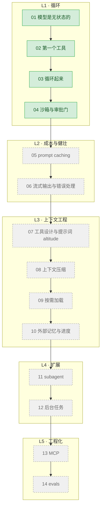

# Learn-agent

从零手写一个 agent。每一课解决一个具体问题，代码可以直接跑。

面向从没接触过 agent 实现的开发者。你需要会 JavaScript/TypeScript 和命令行，
不需要任何 agent、大模型 API 的基础。

---

## 什么是 agent

一句话：**一个 while 循环，加一组你自己写的函数。**

模型不能执行任何东西——它只能告诉你"我想执行 ls"。真正执行的是你的代码。
你把执行结果发回去，它再决定下一步。这个来回反复，直到它说"做完了"。

就这些。剩下的全是工程细节：怎么让它别把上下文撑爆、怎么别让它删你的文件、
怎么知道它有没有变笨。这套教程讲的就是这些细节。

---

## 环境准备

三步：

    # 1. 装 Bun（已经有就跳过）
    curl -fsSL https://bun.sh/install | bash

    # 2. 装唯一的依赖
    bun install

    # 3. 配置端点和密钥
    cp .env.example .env
    # 然后编辑 .env 填入你的 key

跑第一课：

    bun run examples/01-first-call/index.ts

`.env` 里三个变量：

- **`ANTHROPIC_BASE_URL`**：请求发去哪个地址。留空走 Anthropic 官方地址；填一个中转代理的地址，
  就走中转。本教程的主线代码默认假设你用的是公司中转——所有课程只用 `model` / `max_tokens` /
  `messages` / `system` / `tools` 这几个两边都稳定支持的参数，官方独有的能力（比如 `thinking`）
  单独放在各课第 6 节，带 ⚠️ 标注，不影响主线能不能跑通。
- **`ANTHROPIC_API_KEY`**：鉴权用的 key。中转代理和官方地址各自发各自的 key，不能混用。
- **`MODEL_ID`**：具体调用哪个模型，代码里永远不写死，只从这个变量读。中转端点上通常有便宜和
  贵两档模型可选（比如把 `MODEL_ID` 换成成本更低的型号），跑教程示例这种量级的调用，选便宜档
  完全够用，没必要为了几次工具调用去烧贵的模型。

---

## 路线图



| # | 课程 | 讲什么 | 状态 |
|---|---|---|---|
| 01 | [模型是无状态的](examples/01-first-call/) | messages 数组、stop_reason、为什么每轮要重发历史 | ✅ |
| 02 | [第一个工具](examples/02-first-tool/) | tool schema、tool_use、tool_result 回填 | ✅ |
| 03 | [循环起来](examples/03-tool-loop/) | while 循环、分发表、并行工具调用 | ✅ |
| 04 | [沙箱与审批门](examples/04-sandbox-approval/) | 路径逃逸、白名单、人在回路 | ✅ |
| 05 | prompt caching | agent 每轮重发历史，缓存怎么救命 | 规划中 |
| 06 | 流式输出与错误处理 | 长输出超时、429 重试、工具失败回传 | 规划中 |
| 07 | 工具设计与提示词 altitude | 为什么 30 个工具的 agent 比 5 个的更蠢 | 规划中 |
| 08 | 上下文压缩 | 20 轮之后上下文爆了怎么办 | 规划中 |
| 09 | 按需加载 | 知识全塞进 system prompt 太贵 | 规划中 |
| 10 | 外部记忆与进度 | 会话结束就失忆 | 规划中 |
| 11 | subagent | 一次搜索把主上下文塞满垃圾 | 规划中 |
| 12 | 后台任务 | 起个 dev server 就把主循环卡死 | 规划中 |
| 13 | MCP | 每接一个服务都要自己写一遍工具 | 规划中 |
| 14 | evals | 改了提示词，agent 是变好还是变坏 | 规划中 |

---

## 术语表

- **token**：模型读写文本的最小计量单位，大致可以理解成"半个到一个汉字，或者一个英文单词的
  一部分"。API 按 token 计费和计量，不按字符或字数。
- **上下文窗口（context window）**：模型一次能接收的 token 总数上限。历史堆得越多，离这个上限
  越近，超过之后要么请求报错，要么必须先精简历史。
- **system prompt**：随每次请求一起发送的一段说明，用来设定模型的角色、行为规则和边界，跟
  `messages` 里的具体对话内容分开传。
- **tool use（工具调用）**：模型在回复里说"我想用某个工具、传这些参数"，而不是直接给出最终答案。
  模型只是描述意图，真正执行工具的是调用方的代码。
- **stop_reason**：模型这次回复为什么停下来。常见取值有 `end_turn`（自然说完）、
  `tool_use`（等着工具结果）、`max_tokens`（被长度截断）。
- **agent loop（agent 循环）**：反复"发请求给模型 → 检查 stop_reason → 如果要工具就执行并回填结果 →
  再发请求"，直到模型给出最终答案为止的那个 while 循环。
- **上下文压缩（compaction）**：把变长的历史（尤其是早期的工具输出）总结或裁剪成更短的形式，
  既省 token 又避免撑爆上下文窗口。
- **MCP（Model Context Protocol）**：一套约定好的协议，让工具/数据源以统一的方式接入不同的
  agent，不用每接一个新服务就重新写一遍工具定义和调用逻辑。

---

## 跑不通怎么办

**症状**：命令返回 HTTP 400，响应体是一段 HTML，不是 JSON。

**原因**：机器上设了 `http_proxy` / `https_proxy`（公司网络常见配置）。Bun 的 `fetch` 会把请求
转发给这个代理，而代理不放行你配置的模型端点，于是代理自己吐出一个错误页面（HTML），
被当成了 API 的响应。

**解法**：在命令前面临时清空代理变量：

```bash
http_proxy= https_proxy= all_proxy= bun run examples/01-first-call/index.ts
```

或者在当前终端会话里直接取消设置，之后这个终端里跑的命令都不会再受影响：

```bash
unset http_proxy https_proxy all_proxy
```

**`NO_PROXY` 不管用**：实测把目标域名加进 `NO_PROXY`、在 `.env` 里把代理变量置空、在代码里
`delete process.env.http_proxy`，这三种办法**都没用**——Bun 在进程启动的那一刻就已经固定了
要不要走代理，启动之后再怎么改环境变量都不生效。唯一有效的办法是在启动 Bun **之前**就把这几个
变量清掉，也就是上面两种写法。

**怎么区分"网络被代理拦了"和"配置本身填错了"**：

- 代理拦截：HTTP 400，响应体是 HTML。
- `ANTHROPIC_API_KEY` 填错：HTTP 401。
- `MODEL_ID` 填错：HTTP 404，但响应体是正常的 JSON（不是 HTML）。

后两种是配置问题，跟代理无关，回去检查 `.env` 就行；只有第一种才需要用上面的代理前缀。

---

## 关于本教程的代码

1. **每课代码完全自包含。** 任何一课都可以单独拷走独立运行，代价是循环骨架、工具分发这些代码
   在多课之间重复出现，不做跨课抽取。每课 README 的第 7 节会说明相比上一课具体改了哪几行，
   想看差异不用去 diff 整个文件。
2. **主线代码只用任何 Anthropic 兼容端都支持的能力。** 参数只涉及 `model` / `max_tokens` /
   `messages` / `system` / `tools`，所以你拿一个公司中转 key 就能把全部课程跑完，不需要
   Anthropic 官方账号。凡是用到官方独有能力（比如 `thinking`、`output_config`、Tool Runner、
   Managed Agents）的内容，都单独放在各课的第 6 节「官方现在怎么做」，并带有 ⚠️ 标注，
   不影响主线代码在中转端点上跑通。
3. **这套教程不是从 lite-agent 切出来的。** 仓库里的 `lite-agent` 是本教程配套的完整参考实现，
   两者是独立的代码：教程里的每一课都是为了讲清楚某一个具体概念专门重写的最小版本，
   有意省掉跟当课主题无关的部分；`lite-agent` 才是可以直接拿来当骨架用的完整项目。
