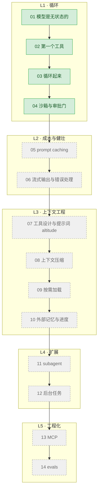

# Learn-agent

从零手写一个 agent，每一课解决一个具体问题，代码可以直接跑。面向没接触过 agent 实现的
开发者——需要会 JavaScript/TypeScript 和命令行，不需要 agent 或大模型 API 基础。

---

## 什么是 agent

一句话：**一个 while 循环，加一组你自己写的函数。**

模型不能执行任何东西，只能说"我想执行 ls"；真正执行、把结果发回去的是你的代码，如此反复
直到它说"做完了"。剩下的全是工程细节——怎么不撑爆上下文、怎么不让它删你的文件、怎么知道它
有没有变笨——这套教程讲的就是这些。

---

## 环境准备

三步：

    # 1. 装 Bun（已经有就跳过）
    curl -fsSL https://bun.sh/install | bash

    # 2. 装唯一的依赖
    bun install

    # 3. 配置端点和密钥
    cp .env.example .env
    # 然后编辑 .env 填入你的 key

跑第一课：

    bun run examples/01-first-call/index.ts

`.env` 里三个变量：

- **`ANTHROPIC_BASE_URL`**：请求地址。留空走官方；填第三方兼容端点（有些是代理型端点）就
  走那个端点。主线只用两边都支持的参数（`model`/`max_tokens`/`messages`/`system`/`tools`），
  官方独有能力放在各课第 6 节，带 ⚠️ 标注。
- **`ANTHROPIC_API_KEY`**：鉴权用的 key，官方和第三方端点不能混用。
- **`MODEL_ID`**：调用哪个模型，代码里不写死。第三方端点通常有几档模型可选，教程这种量级
  选便宜档就够。

---

## 路线图



| # | 课程 | 讲什么 | 状态 |
|---|---|---|---|
| 01 | [模型是无状态的](examples/01-first-call/) | messages 数组、stop_reason、为什么每轮要重发历史 | ✅ |
| 02 | [第一个工具](examples/02-first-tool/) | tool schema、tool_use、tool_result 回填 | ✅ |
| 03 | [循环起来](examples/03-tool-loop/) | while 循环、分发表、并行工具调用 | ✅ |
| 04 | [沙箱与审批门](examples/04-sandbox-approval/) | 路径逃逸、白名单、人在回路 | ✅ |
| 05 | prompt caching | agent 每轮重发历史，缓存怎么救命 | 规划中 |
| 06 | 流式输出与错误处理 | 长输出超时、429 重试、工具失败回传 | 规划中 |
| 07 | 工具设计与提示词 altitude | 为什么 30 个工具的 agent 比 5 个的更蠢 | 规划中 |
| 08 | 上下文压缩 | 20 轮之后上下文爆了怎么办 | 规划中 |
| 09 | 按需加载 | 知识全塞进 system prompt 太贵 | 规划中 |
| 10 | 外部记忆与进度 | 会话结束就失忆 | 规划中 |
| 11 | subagent | 一次搜索把主上下文塞满垃圾 | 规划中 |
| 12 | 后台任务 | 起个 dev server 就把主循环卡死 | 规划中 |
| 13 | MCP | 每接一个服务都要自己写一遍工具 | 规划中 |
| 14 | evals | 改了提示词，agent 是变好还是变坏 | 规划中 |

---

## 术语表

- **token**：模型读写文本的最小计量单位，约等于半个到一个汉字，API 按 token 计费。
- **上下文窗口（context window）**：模型一次能接收的 token 总数上限，超过要么报错要么需精简历史。
- **system prompt**：随请求发送的角色/行为设定，跟 `messages` 里的对话内容分开传。
- **tool use（工具调用）**：模型说"我想用某个工具、传这些参数"，真正执行的是调用方代码。
- **stop_reason**：为什么停下来：`end_turn`（说完了）、`tool_use`（等工具结果）、`max_tokens`（截断）。
- **agent loop（agent 循环）**：反复"发请求 → 检查 stop_reason → 需要就执行工具回填 → 再发请求"，直到给出最终答案。
- **上下文压缩（compaction）**：把变长历史（尤其早期工具输出）总结或裁剪短，省 token 也防止撑爆窗口。
- **MCP（Model Context Protocol）**：让工具/数据源统一接入不同 agent 的协议，不用每接一个服务就重写一遍工具定义。

---

## 跑不通怎么办

**症状**：命令返回 HTTP 400，响应体是一段 HTML，不是 JSON。

**原因**：机器上设了 `http_proxy` / `https_proxy`（某些网络环境常见配置），代理不放行你
配置的模型端点，把自己吐出的错误页面（HTML）当成了 API 响应。

**解法**：临时清空代理变量再跑，或者当前终端 `unset http_proxy https_proxy all_proxy`：

```bash
http_proxy= https_proxy= all_proxy= bun run examples/01-first-call/index.ts
```

**`NO_PROXY` 不管用**：实测把域名加进 `NO_PROXY`、`.env` 里置空代理变量、代码里
`delete process.env.http_proxy`，三种办法**都没用**——Bun 在进程启动那一刻就固定了要不要
走代理，之后再改环境变量不生效。唯一有效的办法是在启动 Bun **之前**清掉这几个变量。

区分"代理拦了"还是"配置填错了"：HTTP 400+HTML 是代理拦截；401 是 `ANTHROPIC_API_KEY` 填
错；404+正常 JSON 是 `MODEL_ID` 填错。后两种回去检查 `.env`，只有第一种要用代理前缀。

---

## 你跑出来的结果会和实录不一样

每课「跑一遍」都贴了真实终端输出，但你跑出来几乎不会逐字相同——模型的措辞、命令、轮数都
可能不同。这是 agent 和普通程序最根本的区别：**同样的输入不保证同样的执行路径。**

判断有没有跑对，看**关键现象**而不是逐字输出，每课第 4 节实录后的点评会指出该看什么。
只有一种情况说明真出问题了：**程序抛未捕获异常，或返回 HTTP 400 加一段 HTML**——见上面的
「跑不通怎么办」。

---

## 关于本教程的代码

1. **每课代码完全自包含。** 可以单独拷走独立运行，代价是循环骨架、工具分发在多课间重复
   出现，不做跨课抽取。每课第 7 节会说明相比上一课改了哪几行。
2. **主线只用任何 Anthropic 兼容端都支持的能力**（`model`/`max_tokens`/`messages`/`system`/
   `tools`），不需要官方账号，任何第三方兼容端点的 key 就能跑完全部课程。官方独有能力放在
   各课第 6 节「官方现在怎么做」，带 ⚠️ 标注。
3. **这套教程不是从 lite-agent 切出来的。** `lite-agent` 是配套的完整参考实现，两者独立：
   每一课是为讲清楚某个概念专门重写的最小版本；`lite-agent` 才是能直接当骨架用的完整项目。
