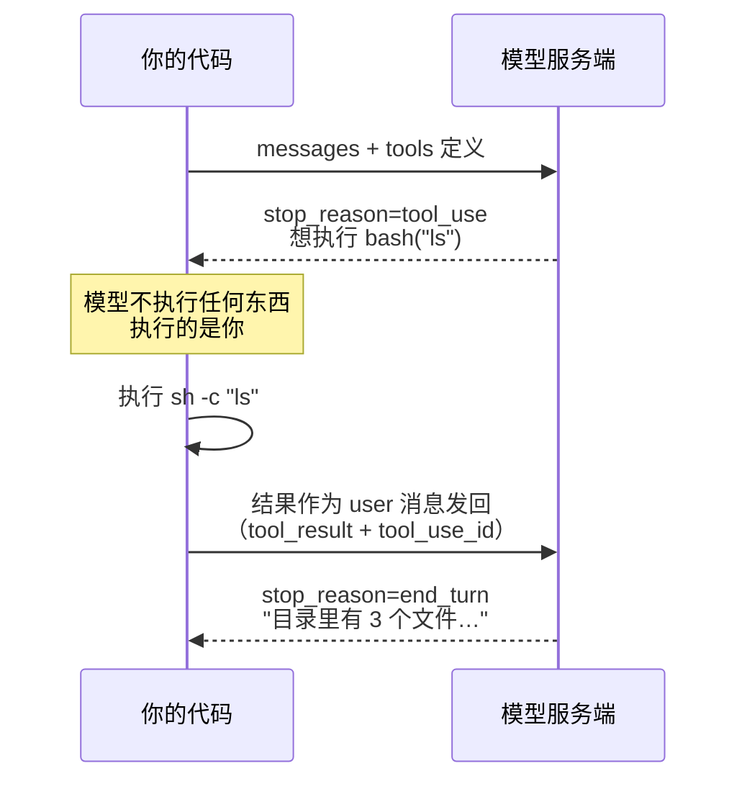

# Learn-agent 第一批（骨架 + L1 四课）实施计划

> **For agentic workers:** REQUIRED SUB-SKILL: Use superpowers:subagent-driven-development (recommended) or superpowers:executing-plans to implement this plan task-by-task. Steps use checkbox (`- [ ]`) syntax for tracking.

**Goal:** 建立 Learn-agent 仓库骨架，并交付 L1 四课（01 first-call → 04 sandbox-approval）的可运行代码、README 与真实输出实录。

**Architecture:** 单仓多示例。根目录一个 `package.json`（唯一依赖 `@anthropic-ai/sdk`），`bun install` 一次；每课是 `examples/NN-name/` 下的自包含 `index.ts` + `README.md`。课与课之间不共享代码——重复的 agent loop 靠 README 的「相比上一课新增了什么」一节做导航补偿。

**Tech Stack:** TypeScript + Bun 1.3.5，`@anthropic-ai/sdk`，工具层用 Bun 原生 API（`Bun.$` / `Bun.file` / `Bun.write`）。

**依据规格：** `docs/superpowers/specs/2026-08-18-learn-agent-tutorial-design.md`

---

## Global Constraints

以下约束适用于**每一个** task，不再重复声明。

1. **模型 ID 只能来自 `process.env.MODEL_ID`**，任何示例都不得硬编码模型名。
2. **API key 只存在于 `.env`**（已被 `.gitignore` 忽略）。`.env.example`、README、代码、输出实录里一律占位符或脱敏。
3. **主线代码只用兼容端确认可用的参数**：`model` / `max_tokens` / `messages` / `system` / `tools`。
   **禁止**在主线代码里用 `thinking`、`output_config`、`cache_control`、任何 `betas` / `context_management` —— 兼容端不支持（实测 400 或字段被剥离）。这些只能出现在 README 的「官方现在怎么做」一节，且必须带警示行：
   `> ⚠️ 本节需要 Anthropic 官方 key，中转端点通常不支持。`
4. **`max_tokens` 统一 16000。**
5. **TypeScript 避开高级类型**：不用泛型、条件类型、mapped types。用 SDK 自带类型（`Anthropic.MessageParam`、`Anthropic.Tool`、`Anthropic.ToolResultBlockParam`、`Anthropic.Message`），不自定义等价 interface。
6. **中文讲解 + 中文代码注释。** 术语首次出现给英文原词。
7. **每课 README 固定七节**，顺序与标题必须一模一样：
   `## 1. 你会遇到的问题` / `## 2. 心智模型` / `## 3. 关键代码` / `## 4. 跑一遍` /
   `## 5. 代价与边界` / `## 6. 官方现在怎么做` / `## 7. 相比上一课新增了什么`
   （01 课没有上一课，第 7 节写「这是第一课，从这里开始」。）
8. **每课 README 至少一张 mermaid 图**，放在第 2 节。
9. **README 顶部两行元信息**：一句话概述 + `预计消耗：N 次 API 调用`。
10. **输出实录必须真跑**——第 4 节里贴的是实际终端输出，禁止编造。
11. **不加 lint / prettier / CI。** `tsconfig.json` 例外，只为编辑器类型提示。
12. **每个 task 结束时 commit。** 提交信息中文，格式 `feat: ...` / `docs: ...`。
13. **本机有公司代理，直接 `bun run` 会被拦。** 已实测：`http_proxy=http://127.0.0.1:8118`
    存在时，Bun 的 `fetch` 走该代理并被 aTrust 网关拒绝（HTTP 400 + HTML 页面）。
    `NO_PROXY`、`.env` 置空、运行时 `delete process.env.http_proxy` **三种办法都无效**——
    Bun 在进程启动时就固定了代理配置。**唯一可行的是启动前清空：**

    ```bash
    http_proxy= https_proxy= all_proxy= bun run examples/NN-xxx/index.ts
    ```

    **抓输出实录时一律用这个前缀形式**，且必须跑仓库里的真实代码——
    禁止为了跑通而临时改 `index.ts`，那样实录和代码就对不上了。
    **README 第 4 节展示的命令保持不带前缀的干净形式**（对多数读者是对的），
    紧接着加一段引用块提示公司代理情况，格式照抄 `examples/01-first-call/README.md` 第 4 节。

---

## File Structure

| 路径 | 职责 |
|---|---|
| `package.json` | 唯一依赖声明；无 scripts（直接 `bun run <路径>`） |
| `tsconfig.json` | 仅供编辑器类型提示，`bun init` 生成 |
| `.env.example` | 三个变量模板：`ANTHROPIC_API_KEY` / `ANTHROPIC_BASE_URL` / `MODEL_ID` |
| `.env` | 本地真实配置，**不提交** |
| `.gitignore` | 忽略 `node_modules/`、`.env` |
| `README.md` | 入口：什么是 agent、三步环境准备、路线总览图、术语表 |
| `examples/01-first-call/index.ts` | 演示模型无状态：三次调用对照 |
| `examples/01-first-call/README.md` | 七节讲解 |
| `examples/02-first-tool/index.ts` | 单次工具往返：tool_use → 执行 → tool_result |
| `examples/02-first-tool/README.md` | 七节讲解 |
| `examples/03-tool-loop/index.ts` | while 循环 + 三个工具 + 并行结果合并 |
| `examples/03-tool-loop/README.md` | 七节讲解 |
| `examples/04-sandbox-approval/index.ts` | safePath 沙箱 + 人在回路审批门 |
| `examples/04-sandbox-approval/README.md` | 七节讲解 |

---

### Task 1: 仓库骨架

**Files:**
- Create: `package.json`, `tsconfig.json`, `.gitignore`, `.env.example`, `.env`

**Interfaces:**
- Consumes: 无
- Produces: 一个能 `bun run` 任意 `.ts` 并读到 `process.env.MODEL_ID` 的工作环境；
  后续所有 task 依赖 `.env` 中的 `ANTHROPIC_API_KEY` / `ANTHROPIC_BASE_URL` / `MODEL_ID`。

- [ ] **Step 1: 初始化并安装唯一依赖**

在仓库根目录 `/Users/yangjie.ugreen/webCode/hazel/Learn-agent` 执行：

```bash
bun init -y
bun add @anthropic-ai/sdk
```

- [ ] **Step 2: 覆盖 package.json**

`bun init` 生成的内容需要改名和去噪。写入：

```json
{
  "name": "learn-agent",
  "version": "1.0.0",
  "private": true,
  "type": "module",
  "description": "从零实现 agent 的递进式教程",
  "dependencies": {
    "@anthropic-ai/sdk": "^0.80.0"
  },
  "devDependencies": {
    "@types/bun": "latest"
  }
}
```

注意：`dependencies` 里的版本号要用 `bun add` 实际装上的版本，不要照抄 `^0.80.0`。
先 `cat package.json` 看实际版本再写。

- [ ] **Step 3: 写 .gitignore**

```
node_modules/
.env
*.log
```

`bun.lock` 不忽略——教程仓库应该锁定依赖版本。

- [ ] **Step 4: 写 .env.example**

```bash
# ---- 三选一：填你能用的端点 ----

# A. 公司中转（本教程默认，主线全部课程可跑）
ANTHROPIC_BASE_URL=http://your-proxy.example.com
ANTHROPIC_API_KEY=your-proxy-key-here
MODEL_ID=ugreen-ai-model

# B. Anthropic 官方（额外支持缓存、压缩、tool search 等原生特性）
# ANTHROPIC_BASE_URL=
# ANTHROPIC_API_KEY=sk-ant-xxxxxxxx
# MODEL_ID=claude-opus-5

# 说明：
# - MODEL_ID 在中转端点上还可以换成 claude-sonnet-4-6 / claude-haiku-4-5 降低成本
# - ANTHROPIC_BASE_URL 留空则走 Anthropic 官方地址
# - Bun 会自动加载本文件，不需要 dotenv
```

- [ ] **Step 5: 确认本地 .env 已存在**

`.env` 已由主会话预先创建，**不要重写它，也不要打印它的内容**（里面有真实 key）。

Run: `sed 's/^\(ANTHROPIC_API_KEY=\).*/\1<已设置>/' .env`

Expected:
```
ANTHROPIC_BASE_URL=http://aiproxy.ugreencloud.com
ANTHROPIC_API_KEY=<已设置>
MODEL_ID=ugreen-ai-model
```

如果文件不存在，停下来告诉主会话，不要自己编一个 key。

- [ ] **Step 6: 验证环境可用**

创建临时文件 `/tmp/envcheck.ts`：

```ts
console.log("MODEL_ID =", process.env.MODEL_ID);
console.log("BASE_URL =", process.env.ANTHROPIC_BASE_URL);
console.log("KEY 是否存在 =", Boolean(process.env.ANTHROPIC_API_KEY));
```

Run: `cd /Users/yangjie.ugreen/webCode/hazel/Learn-agent && bun run /tmp/envcheck.ts`

Expected 输出（key 只打印布尔值，不打印明文）：
```
MODEL_ID = ugreen-ai-model
BASE_URL = http://aiproxy.ugreencloud.com
KEY 是否存在 = true
```

验证后删除 `/tmp/envcheck.ts`。

- [ ] **Step 7: 确认 .env 不会被提交**

Run: `git status --short`
Expected: 输出中**不能出现** `.env`（只能出现 `.env.example`）。

- [ ] **Step 8: 首次提交**

```bash
git add package.json tsconfig.json .gitignore .env.example bun.lock
git commit -m "chore: 初始化仓库骨架（Bun + @anthropic-ai/sdk）"
```

---

### Task 2: 01-first-call —— 模型是无状态的

**Files:**
- Create: `examples/01-first-call/index.ts`
- Create: `examples/01-first-call/README.md`

**Interfaces:**
- Consumes: Task 1 的 `.env` 与已安装的 `@anthropic-ai/sdk`
- Produces: 仅本课使用的 `printReply(res: Anthropic.Message, label: string): void`。
  后续课程因为要打印工具调用过程，不再复用这个函数——不要为了"统一"去改后面几课。

**这一课的教学目标：** 让零基础读者亲眼看到——不传历史，模型就真的不认识你。
这是后面所有课（压缩、subagent、消息总线）的认知地基。

- [ ] **Step 1: 写 index.ts**

```ts
import Anthropic from "@anthropic-ai/sdk";

// Bun 会自动加载 .env，不需要 dotenv
const client = new Anthropic({
  apiKey: process.env.ANTHROPIC_API_KEY,
  baseURL: process.env.ANTHROPIC_BASE_URL,
});

const MODEL = process.env.MODEL_ID as string;
const MAX_TOKENS = 16000;

// 打印模型回复的文字部分，外加这次调用的元信息
function printReply(res: Anthropic.Message, label: string) {
  console.log(`\n===== ${label} =====`);
  for (const block of res.content) {
    if (block.type === "text") console.log(block.text);
  }
  console.log(
    `  ↑ stop_reason=${res.stop_reason}` +
      ` 输入 ${res.usage.input_tokens} tokens` +
      ` / 输出 ${res.usage.output_tokens} tokens`,
  );
}

// ---------- 第 1 次：告诉它我的名字 ----------
const first = await client.messages.create({
  model: MODEL,
  max_tokens: MAX_TOKENS,
  messages: [{ role: "user", content: "我叫 hongaah。请记住我的名字。" }],
});
printReply(first, "第 1 次：告诉它我的名字");

// ---------- 第 2 次：不带历史地问它 ----------
// 这次只发新问题，不发上面那轮对话
const forgetful = await client.messages.create({
  model: MODEL,
  max_tokens: MAX_TOKENS,
  messages: [{ role: "user", content: "我叫什么名字？" }],
});
printReply(forgetful, "第 2 次：不带历史地问（它不记得）");

// ---------- 第 3 次：把历史一起传回去 ----------
// 注意 assistant 那条消息的 content 直接用上一轮返回的 first.content，
// 而不是把文字抠出来重新拼一个字符串
const remembered = await client.messages.create({
  model: MODEL,
  max_tokens: MAX_TOKENS,
  messages: [
    { role: "user", content: "我叫 hongaah。请记住我的名字。" },
    { role: "assistant", content: first.content },
    { role: "user", content: "我叫什么名字？" },
  ],
});
printReply(remembered, "第 3 次：带上历史再问（它'记得'了）");

console.log(
  "\n结论：模型本身不存任何东西。所谓'记忆'，是你每次把完整历史重新发过去。",
);
```

- [ ] **Step 2: 真跑一遍，抓输出**

Run: `cd /Users/yangjie.ugreen/webCode/hazel/Learn-agent && bun run examples/01-first-call/index.ts`

Expected: 三段输出。第 2 次的回复应表示不知道名字；第 3 次应答出 hongaah。
**把完整终端输出原样保存下来**，Step 3 要贴进 README。
如果第 2 次模型居然猜对了名字（极少数情况），改用一个更独特的信息重跑，
例如「我的工位编号是 B-4217」，直到能稳定复现"不记得"的效果。

- [ ] **Step 3: 写 README.md**

七节结构。第 4 节贴 Step 2 抓到的**真实输出**。骨架如下，方括号处按实际内容填写：

```markdown
# 01 · 模型是无状态的

> 一句话：模型不记得任何事，所谓"记忆"是你每轮把完整历史重新发过去。
>
> 预计消耗：3 次 API 调用

## 1. 你会遇到的问题

[描述：新手最常见的误解是以为模型像人一样记得上一句。
先抛出问题——如果它记得，为什么每次请求都要带完整 messages 数组？]

## 2. 心智模型

[mermaid sequenceDiagram：画三次调用，第 2 次箭头上只带一条消息、
模型回答"不知道"，第 3 次箭头上带三条消息、模型答对。
用 Note 标出"API 是无状态的（stateless）：服务端不保存你的对话"]

## 3. 关键代码

[分三段贴：客户端初始化 / printReply / 三次调用的对照。
解释 messages 数组的 role 只有 user 和 assistant 两种；
解释为什么 assistant 那条要用 first.content 而不是抠出的字符串
（后面有工具调用时，content 里不止 text 一种块）。]

## 4. 跑一遍

    bun run examples/01-first-call/index.ts

[原样贴 Step 2 的真实终端输出]

[指出输出里值得注意的地方：第 3 次的 input_tokens 明显比前两次大——
因为你把历史一起发过去了。这就是后面「上下文压缩」课要解决的问题的源头。]

## 5. 代价与边界

[每轮重发完整历史 → token 随轮数线性增长 → 又贵又慢，最终撞上上下文窗口上限。
这条线索会在第 05 课（缓存）和第 08 课（压缩）被正面处理。]

## 6. 官方现在怎么做

> ⚠️ 本节需要 Anthropic 官方 key，中转端点通常不支持。

[说明官方 API 上可以开 `thinking: {type: "adaptive"}` 让模型自行决定思考深度，
用 `output_config: {effort: "high"}` 控制投入。给出代码片段。
说明为什么本教程主线不用它们：中转端点不返回 thinking 块。]

## 7. 相比上一课新增了什么

这是第一课，从这里开始。你需要理解的只有三件事：
`messages` 数组、`stop_reason`、以及"服务端不保存任何东西"。
```

**术语要求：** 首次出现的 token、上下文窗口（context window）、stop_reason
必须解释，不能默认读者懂。

- [ ] **Step 4: 校验 README**

Run:
```bash
cd /Users/yangjie.ugreen/webCode/hazel/Learn-agent
grep -c '^## [1-7]\.' examples/01-first-call/README.md
grep -c '```mermaid' examples/01-first-call/README.md
```
Expected: 第一条输出 `7`，第二条输出至少 `1`。

再人工确认：第 4 节里的输出是 Step 2 真跑出来的，不是编的。

- [ ] **Step 5: 提交**

```bash
git add examples/01-first-call
git commit -m "docs: 01 课 模型是无状态的"
```

---

### Task 3: 02-first-tool —— 一次工具往返

**Files:**
- Create: `examples/02-first-tool/index.ts`
- Create: `examples/02-first-tool/README.md`

**Interfaces:**
- Consumes: Task 1 的环境；Task 2 里 `printReply` 的同名同形写法
- Produces: `runBash(command: string): Promise<string>` 的实现要点——
  `sh -c` 包裹 + `.nothrow().quiet()`。03 / 04 课会把这段逻辑内联进
  `toolHandlers.bash`（不再是独立函数），但这两个要点保持不变。

**这一课的教学目标：** 讲清"模型不执行任何东西，执行的是你的代码"，
以及 tool_result 必须由 user 角色发回、必须带 tool_use_id。
**只做一次往返，不写循环**——循环是下一课的事。

- [ ] **Step 1: 写 index.ts**

```ts
import Anthropic from "@anthropic-ai/sdk";

const client = new Anthropic({
  apiKey: process.env.ANTHROPIC_API_KEY,
  baseURL: process.env.ANTHROPIC_BASE_URL,
});

const MODEL = process.env.MODEL_ID as string;
const MAX_TOKENS = 16000;

// ---------- 工具的两半：声明 + 实现 ----------

// 上半：告诉模型有这么个工具。模型只看得到这段描述
const bashTool: Anthropic.Tool = {
  name: "bash",
  description: "在当前目录执行一条 shell 命令，返回它的输出。",
  input_schema: {
    type: "object",
    properties: {
      command: { type: "string", description: "要执行的 shell 命令" },
    },
    required: ["command"],
  },
};

// 下半：真正干活的是这段代码，模型碰不到
async function runBash(command: string): Promise<string> {
  // 注意必须写成 sh -c ${command}。
  // 直接写 Bun.$`${command}` 会把整串当成一个可执行文件名，跑不起来——
  // Bun 默认转义插值，这是防命令注入的安全设计。
  const r = await Bun.$`sh -c ${command}`.nothrow().quiet();
  const output = (r.stdout.toString() + r.stderr.toString()).trim();
  return output || "(没有输出)";
}

// ---------- 第 1 轮：模型说它想用工具 ----------

const messages: Anthropic.MessageParam[] = [
  { role: "user", content: "当前目录下有哪些文件？" },
];

const first = await client.messages.create({
  model: MODEL,
  max_tokens: MAX_TOKENS,
  messages,
  tools: [bashTool],
});

console.log("第 1 轮 stop_reason =", first.stop_reason); // 应该是 tool_use

// 把模型这轮的回复整个存进历史（里面装着 tool_use 块）
messages.push({ role: "assistant", content: first.content });

// ---------- 中间：你的代码去执行 ----------

const toolResults: Anthropic.ToolResultBlockParam[] = [];

for (const block of first.content) {
  if (block.type !== "tool_use") continue;

  const input = block.input as { command: string };
  console.log(`\n模型想执行: ${input.command}`);
  console.log(`tool_use.id = ${block.id}`);

  const output = await runBash(input.command);
  console.log(`执行结果:\n${output}`);

  toolResults.push({
    type: "tool_result",
    tool_use_id: block.id, // 必须原样回填，模型靠它对上号
    content: output,
  });
}

// 关键：工具结果是以 user 角色发回去的，不是 assistant
messages.push({ role: "user", content: toolResults });

// ---------- 第 2 轮：模型看到结果，给出人话回答 ----------

const second = await client.messages.create({
  model: MODEL,
  max_tokens: MAX_TOKENS,
  messages,
  tools: [bashTool],
});

console.log("\n第 2 轮 stop_reason =", second.stop_reason); // 应该是 end_turn
console.log("\n模型的最终回答：");
for (const block of second.content) {
  if (block.type === "text") console.log(block.text);
}
```

- [ ] **Step 2: 真跑一遍，抓输出**

Run: `cd /Users/yangjie.ugreen/webCode/hazel/Learn-agent && bun run examples/02-first-tool/index.ts`

Expected: 第 1 轮 `stop_reason = tool_use`；打印出模型想执行的命令和 tool_use.id
（中转端点上形如 `chatcmpl-tool-xxxx`）；执行结果是仓库根目录的文件列表；
第 2 轮 `stop_reason = end_turn`，模型用中文总结目录内容。

保存完整输出，Step 3 要用。

- [ ] **Step 3: 写 README.md**

```markdown
# 02 · 第一个工具

> 一句话：模型只会说"我想执行 ls"，真正执行的是你的代码。
>
> 预计消耗：2 次 API 调用

## 1. 你会遇到的问题

[上一课模型只能说话。现在想让它做事——但模型跑在别人的服务器上，
它碰不到你的文件系统。那"工具调用"到底是怎么回事？]

## 2. 心智模型
```

第 2 节必须包含这张图（原样使用，不要改写）：

````markdown

````

其余各节：

```markdown
## 3. 关键代码

[分三段：工具声明（模型只看得到 description，所以描述要写清楚）/
工具实现（Bun.$ 的转义陷阱，必须 sh -c，必须 .nothrow().quiet()）/
往返三步（存 assistant.content → 执行 → 以 user 角色发回 tool_result）。

重点强调两个零基础最容易错的地方：
1. tool_result 是 user 角色发的，不是 assistant
2. tool_use_id 必须原样回填]

## 4. 跑一遍

    bun run examples/02-first-tool/index.ts

[贴真实输出]

[点出 tool_use.id 的样子。如果读者用的是中转端点，会看到 chatcmpl-tool- 前缀，
那是底层格式转译留下的痕迹，不影响使用——原样回填就行。]

## 5. 代价与边界

[这一课只做了一次往返。如果模型看完 ls 结果还想接着 cat 某个文件呢？
现在的代码没法继续——它只写死了两轮。这就是下一课要解决的。

还有：runBash 什么命令都执行。rm -rf 也照跑不误。第 04 课处理。]

## 6. 官方现在怎么做

> ⚠️ 本节需要 Anthropic 官方 key，中转端点通常不支持。

[介绍 SDK 的 Tool Runner（client.beta.messages.toolRunner），
它把"调用→执行→回填→再调用"整个循环包掉了，你只写工具函数。
说明为什么教程还要手写：不手写一遍，不会知道 Tool Runner 在替你做什么。]

## 7. 相比上一课新增了什么

- 请求里多了 `tools` 参数
- 响应的 `stop_reason` 出现了新取值 `tool_use`
- `content` 里出现了 `tool_use` 块（不再只有 `text`）
- 历史里多了一种消息：装着 `tool_result` 的 user 消息
```

- [ ] **Step 4: 校验**

Run:
```bash
cd /Users/yangjie.ugreen/webCode/hazel/Learn-agent
grep -c '^## [1-7]\.' examples/02-first-tool/README.md
grep -c '```mermaid' examples/02-first-tool/README.md
```
Expected: `7` 和至少 `1`。

- [ ] **Step 5: 提交**

```bash
git add examples/02-first-tool
git commit -m "docs: 02 课 第一个工具"
```

---

### Task 4: 03-tool-loop —— 循环起来

**Files:**
- Create: `examples/03-tool-loop/index.ts`
- Create: `examples/03-tool-loop/README.md`

**Interfaces:**
- Consumes: Task 1 的环境；Task 3 的 `runBash` 形态
- Produces: `TOOLS` 数组 + `toolHandlers` 分发表的写法，04 课在此之上加审批门。

**这一课的教学目标：** while 循环直到 `stop_reason !== "tool_use"`；
工具从 1 个扩到 3 个，引入分发表；**并行工具调用的关键规则——
一轮里所有 tool_result 必须放进同一条 user 消息**。

- [ ] **Step 1: 写 index.ts**

```ts
import Anthropic from "@anthropic-ai/sdk";

const client = new Anthropic({
  apiKey: process.env.ANTHROPIC_API_KEY,
  baseURL: process.env.ANTHROPIC_BASE_URL,
});

const MODEL = process.env.MODEL_ID as string;
const MAX_TOKENS = 16000;
const MAX_TURNS = 20; // 防止模型陷入死循环烧钱

const SYSTEM = `你是一个在当前目录工作的编码助手。
优先使用工具而不是猜测。做完之后用一句话总结你做了什么。`;

// ---------- 三个工具 ----------

const TOOLS: Anthropic.Tool[] = [
  {
    name: "bash",
    description: "在当前目录执行一条 shell 命令，返回它的输出。",
    input_schema: {
      type: "object",
      properties: {
        command: { type: "string", description: "要执行的 shell 命令" },
      },
      required: ["command"],
    },
  },
  {
    name: "read_file",
    description: "读取一个文件的全部内容。",
    input_schema: {
      type: "object",
      properties: {
        path: { type: "string", description: "文件路径" },
      },
      required: ["path"],
    },
  },
  {
    name: "write_file",
    description: "把内容写入一个文件，覆盖原有内容。",
    input_schema: {
      type: "object",
      properties: {
        path: { type: "string", description: "文件路径" },
        content: { type: "string", description: "要写入的完整内容" },
      },
      required: ["path", "content"],
    },
  },
];

// ---------- 工具实现，用一张分发表按名字找 ----------

const toolHandlers: Record<string, (input: any) => Promise<string>> = {
  bash: async ({ command }) => {
    const r = await Bun.$`sh -c ${command}`.nothrow().quiet();
    const out = (r.stdout.toString() + r.stderr.toString()).trim();
    return out || "(没有输出)";
  },

  read_file: async ({ path }) => {
    return await Bun.file(path).text();
  },

  write_file: async ({ path, content }) => {
    await Bun.write(path, content);
    return `已写入 ${path}（${content.length} 个字符）`;
  },
};

// ---------- agent 循环 ----------

async function runAgent(userInput: string) {
  const messages: Anthropic.MessageParam[] = [
    { role: "user", content: userInput },
  ];

  for (let turn = 1; turn <= MAX_TURNS; turn++) {
    const res = await client.messages.create({
      model: MODEL,
      max_tokens: MAX_TOKENS,
      system: SYSTEM,
      messages,
      tools: TOOLS,
    });

    messages.push({ role: "assistant", content: res.content });

    // 顺手把模型这轮说的话打出来
    for (const block of res.content) {
      if (block.type === "text" && block.text.trim()) {
        console.log(`\n[第 ${turn} 轮] ${block.text.trim()}`);
      }
    }

    // 模型不再要工具了，任务结束
    if (res.stop_reason !== "tool_use") {
      console.log(`\n循环结束，共 ${turn} 轮。stop_reason=${res.stop_reason}`);
      return;
    }

    // 一轮里模型可能同时要好几个工具，全部执行
    const results: Anthropic.ToolResultBlockParam[] = [];

    for (const block of res.content) {
      if (block.type !== "tool_use") continue;

      console.log(`  > ${block.name}(${JSON.stringify(block.input)})`);

      const handler = toolHandlers[block.name];
      let output: string;

      if (!handler) {
        output = `错误：没有名为 ${block.name} 的工具`;
      } else {
        try {
          output = await handler(block.input);
        } catch (e: any) {
          // 工具报错不能让整个 agent 崩掉，要把错误告诉模型让它自己想办法
          output = `错误：${e.message}`;
        }
      }

      console.log(`    ${output.slice(0, 200)}`);

      results.push({
        type: "tool_result",
        tool_use_id: block.id,
        content: output,
      });
    }

    // 关键：这一轮所有工具结果放进同一条 user 消息。
    // 拆成多条会让模型以后不敢再一次要多个工具。
    messages.push({ role: "user", content: results });
  }

  console.log(`\n达到 ${MAX_TURNS} 轮上限，强制停止。`);
}

await runAgent(
  "统计一下当前目录下有多少个 .md 文件，把文件名列表写进 md-list.txt，然后告诉我结果。",
);
```

- [ ] **Step 2: 真跑一遍，抓输出**

Run: `cd /Users/yangjie.ugreen/webCode/hazel/Learn-agent && bun run examples/03-tool-loop/index.ts`

Expected: 多轮输出，每轮打印模型的话和它调用的工具；最终生成 `md-list.txt`；
最后一行显示 `循环结束，共 N 轮。stop_reason=end_turn`。

跑完后确认文件生成：`cat md-list.txt`

保存完整输出。

- [ ] **Step 3: 清理产物**

`md-list.txt` 是示例跑出来的临时产物，不应提交。

```bash
cd /Users/yangjie.ugreen/webCode/hazel/Learn-agent
rm -f md-list.txt
echo "md-list.txt" >> .gitignore
```

- [ ] **Step 4: 写 README.md**

```markdown
# 03 · 循环起来

> 一句话：把"调用→执行→回填"包进 while 循环，agent 就能自己走完多步任务。
>
> 预计消耗：4～8 次 API 调用（取决于模型分几步做完）

## 1. 你会遇到的问题

[上一课写死了两轮。可现实任务是多步的：先 ls 看有什么，再 cat 读内容，
再写文件。步数事先不知道——只有模型自己知道什么时候算做完。]

## 2. 心智模型

[mermaid flowchart：
发请求 → 模型回复 → 判断 stop_reason 是不是 tool_use →
是则执行所有工具、把结果并成一条 user 消息、回到发请求；
否则退出。
把 MAX_TURNS 上限也画进去。]

## 3. 关键代码

[分四段：
1. 循环骨架——为什么判断条件是 stop_reason !== "tool_use"
2. 分发表 toolHandlers——按名字找实现，加工具只要加一行
3. 错误要回传给模型而不是抛出——try/catch 后把错误文本塞进 tool_result，
   模型看到错误会自己换个方法重试
4. **并行工具调用**——一轮里可能有多个 tool_use 块，
   所有 tool_result 必须放进同一条 user 消息。拆成多条会让模型
   以后不敢再一次要多个工具，白白变慢。]

## 4. 跑一遍

    bun run examples/03-tool-loop/index.ts

[贴真实输出]

[点评这次实际跑了几轮、模型选了哪些工具、有没有一轮要多个工具。]

## 5. 代价与边界

[MAX_TURNS 是必须的——没有它，模型犯轴时会无限循环烧钱。

真正的问题在于：每轮都把完整历史重发一次。跑到第 10 轮，
你在为前 9 轮的所有工具输出反复付费。第 05 课（缓存）和第 08 课（压缩）
就是来解决这个的。

还有：这三个工具什么都敢干。write_file 能覆盖任何路径，
bash 能 rm -rf。下一课处理。]

## 6. 官方现在怎么做

> ⚠️ 本节需要 Anthropic 官方 key，中转端点通常不支持。

[两件事：
1. Tool Runner 能把整个 while 循环包掉
2. 官方 API 上跑 agent 循环应该开 thinking: {type: "adaptive"} 和
   output_config: {effort: "high"}——让模型在多步任务里先想清楚再动手。
   给代码片段。说明中转端点不返回 thinking 块，所以主线代码没带。]

## 7. 相比上一课新增了什么

- 两轮写死 → `for` 循环，靠 `stop_reason` 决定什么时候停
- 1 个工具 → 3 个工具，用分发表 `toolHandlers` 按名字派发
- 新增 `system` 系统提示词
- 新增 `MAX_TURNS` 上限，防止死循环
- 工具抛错不再让进程崩溃，而是把错误文本回传给模型
- 明确了并行工具调用的规则：一轮的所有结果并进同一条 user 消息
```

- [ ] **Step 5: 校验**

Run:
```bash
cd /Users/yangjie.ugreen/webCode/hazel/Learn-agent
grep -c '^## [1-7]\.' examples/03-tool-loop/README.md
grep -c '```mermaid' examples/03-tool-loop/README.md
git status --short | grep -c 'md-list.txt' || echo "md-list.txt 已忽略 ✓"
```
Expected: `7`、至少 `1`、以及 `md-list.txt 已忽略 ✓`。

- [ ] **Step 6: 提交**

```bash
git add examples/03-tool-loop .gitignore
git commit -m "docs: 03 课 循环起来"
```

---

### Task 5: 04-sandbox-approval —— 沙箱与审批门

**Files:**
- Create: `examples/04-sandbox-approval/index.ts`
- Create: `examples/04-sandbox-approval/README.md`

**Interfaces:**
- Consumes: Task 4 的循环骨架与分发表
- Produces: `safePath(p: string): string` 与 `approve(action: string): Promise<boolean>`，
  后续课程沿用这个安全基线。

**这一课的教学目标：** 两件事——路径不能逃逸出工作目录；危险操作要人点头。
**必须把 lite-agent 的黑名单实现作为反面教材讲透。**

- [ ] **Step 1: 写 index.ts**

```ts
import Anthropic from "@anthropic-ai/sdk";
import { resolve } from "node:path";

const client = new Anthropic({
  apiKey: process.env.ANTHROPIC_API_KEY,
  baseURL: process.env.ANTHROPIC_BASE_URL,
});

const MODEL = process.env.MODEL_ID as string;
const MAX_TOKENS = 16000;
const MAX_TURNS = 20;

// agent 只允许在这个目录里活动
const WORKDIR = process.cwd();

const SYSTEM = `你是一个在 ${WORKDIR} 工作的编码助手。
你只能访问这个目录内的文件。优先使用工具而不是猜测。`;

// ---------- 第一道防线：路径不能逃逸 ----------

function safePath(p: string): string {
  const full = resolve(WORKDIR, p);

  // 注意这里必须比较 WORKDIR + "/"。
  // 如果只写 full.startsWith(WORKDIR)，那么 /Users/me/work-evil
  // 会被判定为在 /Users/me/work 之内——前缀匹配的经典漏洞。
  if (full !== WORKDIR && !full.startsWith(WORKDIR + "/")) {
    throw new Error(`路径逃逸出工作目录：${p}`);
  }
  return full;
}

// ---------- 第二道防线：危险操作要人点头 ----------

// 只读命令直接放行，不打扰用户
const AUTO_APPROVE = /^(ls|pwd|cat|head|tail|wc|find|grep|git status|git log|git diff)\b/;

async function approve(action: string): Promise<boolean> {
  process.stdout.write(`\n  ⚠️  agent 想执行：${action}\n     允许吗？(y/N) `);
  for await (const line of console) {
    return line.trim().toLowerCase() === "y";
  }
  return false;
}

// ---------- 工具 ----------

const TOOLS: Anthropic.Tool[] = [
  {
    name: "bash",
    description: "在工作目录执行一条 shell 命令，返回它的输出。",
    input_schema: {
      type: "object",
      properties: {
        command: { type: "string", description: "要执行的 shell 命令" },
      },
      required: ["command"],
    },
  },
  {
    name: "read_file",
    description: "读取工作目录内一个文件的全部内容。",
    input_schema: {
      type: "object",
      properties: { path: { type: "string", description: "文件路径" } },
      required: ["path"],
    },
  },
  {
    name: "write_file",
    description: "把内容写入工作目录内的文件，覆盖原有内容。",
    input_schema: {
      type: "object",
      properties: {
        path: { type: "string", description: "文件路径" },
        content: { type: "string", description: "要写入的完整内容" },
      },
      required: ["path", "content"],
    },
  },
];

const toolHandlers: Record<string, (input: any) => Promise<string>> = {
  bash: async ({ command }) => {
    // 只读命令自动放行，其余一律问人
    if (!AUTO_APPROVE.test(command.trim())) {
      const ok = await approve(`bash: ${command}`);
      if (!ok) return "用户拒绝了这条命令。请换一个办法，或者问用户想怎么做。";
    }
    const r = await Bun.$`sh -c ${command}`.nothrow().quiet();
    const out = (r.stdout.toString() + r.stderr.toString()).trim();
    return out || "(没有输出)";
  },

  read_file: async ({ path }) => {
    return await Bun.file(safePath(path)).text();
  },

  write_file: async ({ path, content }) => {
    const full = safePath(path);
    const ok = await approve(`写入文件: ${path}（${content.length} 个字符）`);
    if (!ok) return "用户拒绝了这次写入。";
    await Bun.write(full, content);
    return `已写入 ${path}`;
  },
};

// ---------- agent 循环（与 03 课相同） ----------

async function runAgent(userInput: string) {
  const messages: Anthropic.MessageParam[] = [
    { role: "user", content: userInput },
  ];

  for (let turn = 1; turn <= MAX_TURNS; turn++) {
    const res = await client.messages.create({
      model: MODEL,
      max_tokens: MAX_TOKENS,
      system: SYSTEM,
      messages,
      tools: TOOLS,
    });

    messages.push({ role: "assistant", content: res.content });

    for (const block of res.content) {
      if (block.type === "text" && block.text.trim()) {
        console.log(`\n[第 ${turn} 轮] ${block.text.trim()}`);
      }
    }

    if (res.stop_reason !== "tool_use") {
      console.log(`\n循环结束，共 ${turn} 轮。`);
      return;
    }

    const results: Anthropic.ToolResultBlockParam[] = [];

    for (const block of res.content) {
      if (block.type !== "tool_use") continue;
      console.log(`  > ${block.name}(${JSON.stringify(block.input)})`);

      const handler = toolHandlers[block.name];
      let output: string;
      if (!handler) {
        output = `错误：没有名为 ${block.name} 的工具`;
      } else {
        try {
          output = await handler(block.input);
        } catch (e: any) {
          output = `错误：${e.message}`;
        }
      }
      console.log(`    ${output.slice(0, 200)}`);

      results.push({ type: "tool_result", tool_use_id: block.id, content: output });
    }

    messages.push({ role: "user", content: results });
  }

  console.log(`\n达到 ${MAX_TURNS} 轮上限，强制停止。`);
}

// 注意这里明确要求用 read_file 工具。
// 如果不指定，模型可能选 bash 去 cat，而 cat 在只读白名单里会被自动放行,
// 就绕过了 safePath —— 这个洞是真实存在的，README 第 5 节会正面讲。
await runAgent(
  "用 read_file 工具读 package.json，告诉我这个项目叫什么。" +
    "然后同样用 read_file 工具试着读 /etc/passwd，把发生的事告诉我。",
);
```

- [ ] **Step 2: 真跑一遍，抓输出**

Run: `cd /Users/yangjie.ugreen/webCode/hazel/Learn-agent && bun run examples/04-sandbox-approval/index.ts`

这一课需要交互式输入。**子代理运行时 stdin 不是终端**，
`for await (const line of console)` 会立刻读到 EOF 并当成拒绝，
所以必须用管道把审批答案喂进去：

```bash
cd /Users/yangjie.ugreen/webCode/hazel/Learn-agent
printf 'y\ny\ny\n' | bun run examples/04-sandbox-approval/index.ts
```

README 第 4 节贴这份输出时，要说明真实使用中是人在终端里手动敲 y/N，
这里为了记录输出用了管道。

Expected 关键现象两条，都要在输出里出现：
1. 读 `package.json` 成功，模型答出项目名 `learn-agent`
2. 读 `/etc/passwd` 时 `safePath` 抛错，工具返回「路径逃逸出工作目录」，
   模型收到这个错误后自己说明无法访问

保存完整输出。

- [ ] **Step 3: 单独验证 safePath 的前缀漏洞**

这是 README 第 5 节要讲的核心论点，必须有实证。创建 `/tmp/safepath-check.ts`：

```ts
import { resolve } from "node:path";

const WORKDIR = "/Users/me/work";

// lite-agent 的写法
function buggy(p: string) {
  const full = resolve(WORKDIR, p);
  return full.startsWith(WORKDIR);
}

// 本课的写法
function fixed(p: string) {
  const full = resolve(WORKDIR, p);
  return full === WORKDIR || full.startsWith(WORKDIR + "/");
}

for (const p of ["a.txt", "../work-evil/steal.txt", "/etc/passwd"]) {
  console.log(`${p.padEnd(28)} buggy=${buggy(p)}  fixed=${fixed(p)}`);
}
```

Run: `bun run /tmp/safepath-check.ts`

Expected:
```
a.txt                        buggy=true  fixed=true
../work-evil/steal.txt       buggy=true  fixed=false
/etc/passwd                  buggy=false fixed=false
```

第二行是关键——`buggy=true` 证明前缀匹配放行了目录外的路径。
把这段输出记下来，README 第 5 节要贴。验证后删除临时文件。

- [ ] **Step 4: 写 README.md**

```markdown
# 04 · 沙箱与审批门

> 一句话：把 agent 关在工作目录里，危险操作先问过人。
>
> 预计消耗：4～6 次 API 调用（需要你在终端里手动审批）

## 1. 你会遇到的问题

[上一课的 agent 什么都敢干：read_file 能读 /etc/passwd，
bash 能 rm -rf，write_file 能覆盖任何路径。
一旦模型误解了你的意图，或者你把它接到不可信的输入上，后果由你承担。]

## 2. 心智模型

[mermaid flowchart：工具调用进来 → 路径类参数过 safePath →
命令是否在只读白名单 → 是则直接执行，否则弹审批 →
用户拒绝则把"用户拒绝了"作为 tool_result 回给模型（不是抛异常）。
强调"拒绝也是一种结果，要让模型知道"。]

## 3. 关键代码

[分三段：
1. safePath——resolve 成绝对路径后比较前缀，
   必须用 WORKDIR + "/" 而不是 WORKDIR
2. AUTO_APPROVE 白名单——只读命令放行，避免审批疲劳
   （每条都问，用户会变成无脑按 y，安全性反而归零）
3. approve()——Bun 用 for await (const line of console) 读一行标准输入；
   拒绝时返回一句话给模型，让它换个办法，而不是让进程崩掉]

## 4. 跑一遍

    bun run examples/04-sandbox-approval/index.ts

[贴真实输出，包含审批交互的过程，
以及读 /etc/passwd 被 safePath 拦下、模型收到错误后的反应]

## 5. 代价与边界

### 黑名单为什么不行

[lite-agent 的做法是一张危险命令黑名单：

    const dangerousCommands = ["rm -rf /", "sudo", "shutdown", "reboot", "> /dev/"];
    if (dangerousCommands.some(d => command.includes(d))) return "Error: Dangerous command blocked";

这类防护挡不住任何认真的绕过：
- `rm -rf  /`（两个空格）不匹配
- `rm -fr /` 换个参数顺序就不匹配
- `$(echo cm0gLXJmIC8K | base64 -d)` 根本不含明文
- 反过来 `git commit -m "remove sudo from docs"` 会被误杀

黑名单要枚举所有坏的，白名单只要枚举少量好的。永远选白名单。]

### 前缀匹配的坑

[贴 Step 3 的实测输出，说明 startsWith(WORKDIR) 会把
/Users/me/work-evil 判定为在 /Users/me/work 之内。]

### 白名单自己也有洞

[必须诚实告诉读者：本课的 AUTO_APPROVE 里有 `cat`，所以 `cat /etc/passwd`
会被自动放行执行——safePath 只管住了 read_file，管不住 bash。

白名单挡住的是"哪条命令"，挡不住"这条命令去动哪个路径"。粒度不对，照样漏。
这不是本课代码写错了，而是"在宿主机上给 agent 开 shell"这件事本身就没有干净解。
第 6 节的容器隔离才是真答案。

可以让读者自己动手验证：把演示 prompt 改成"用 bash 读 /etc/passwd"，看会发生什么。]

### 还没解决的

[审批门只挡住了 bash 和 write_file。真实 agent 还要考虑：
符号链接绕过（agent 在目录内建一个指向外部的软链）、
子进程逃逸（脚本自己去改目录外的东西）。
真要严格隔离，得上容器或 seccomp，那超出本教程范围。]

## 6. 官方现在怎么做

> ⚠️ 本节需要 Anthropic 官方 key，中转端点通常不支持。

[介绍 Managed Agents——Anthropic 托管 agent 循环，
并为每个会话提供隔离容器作为工作区，bash 和文件操作都在容器里跑，
从根上避免了"agent 逃逸到你本机"的问题。
说明什么时候值得用它，什么时候自己管沙箱就够。]

## 7. 相比上一课新增了什么

- 新增 `safePath()`，所有路径类参数必须过一遍
- 新增 `approve()` 审批门 + `AUTO_APPROVE` 只读白名单
- `write_file` 和非只读的 `bash` 现在会停下来问人
- 用户拒绝时返回一句说明给模型，而不是抛异常中断循环
- 循环骨架与 03 课完全相同，没有改动
```

- [ ] **Step 5: 校验**

Run:
```bash
cd /Users/yangjie.ugreen/webCode/hazel/Learn-agent
grep -c '^## [1-7]\.' examples/04-sandbox-approval/README.md
grep -c '```mermaid' examples/04-sandbox-approval/README.md
grep -c 'dangerousCommands' examples/04-sandbox-approval/README.md
grep -c '白名单自己也有洞' examples/04-sandbox-approval/README.md
```
Expected: `7`、至少 `1`、至少 `1`（黑名单反面教材必须讲到）、`1`（白名单自身的漏洞必须诚实讲出来）。

- [ ] **Step 6: 提交**

```bash
git add examples/04-sandbox-approval
git commit -m "docs: 04 课 沙箱与审批门"
```

---

### Task 6: 根 README

**Files:**
- Create: `README.md`（仓库根）

**Interfaces:**
- Consumes: Task 2–5 已完成的四课目录
- Produces: 教程入口，读者从这里开始

**职责：** 承担入门门槛，不占用课程编号。四块内容：
什么是 agent、三步环境准备、路线总览图、术语表。

- [ ] **Step 1: 写 README.md**

```markdown
# Learn-agent

从零手写一个 agent。每一课解决一个具体问题，代码可以直接跑。

面向从没接触过 agent 实现的开发者。你需要会 JavaScript/TypeScript 和命令行，
不需要任何 agent、大模型 API 的基础。

---

## 什么是 agent

一句话：**一个 while 循环，加一组你自己写的函数。**

模型不能执行任何东西——它只能告诉你"我想执行 ls"。真正执行的是你的代码。
你把执行结果发回去，它再决定下一步。这个来回反复，直到它说"做完了"。

就这些。剩下的全是工程细节：怎么让它别把上下文撑爆、怎么别让它删你的文件、
怎么知道它有没有变笨。这套教程讲的就是这些细节。

---

## 环境准备

三步：

    # 1. 装 Bun（已经有就跳过）
    curl -fsSL https://bun.sh/install | bash

    # 2. 装唯一的依赖
    bun install

    # 3. 配置端点和密钥
    cp .env.example .env
    # 然后编辑 .env 填入你的 key

跑第一课：

    bun run examples/01-first-call/index.ts

[说明 .env 的三个变量分别是什么、中转端点和官方端点的区别、
以及 MODEL_ID 可以换成什么来降低成本。]

### 跑不通怎么办

[这一小节标题必须逐字是「跑不通怎么办」，各课 README 第 4 节会链接到它。内容：

**症状：** 命令返回 HTTP 400，响应体是一段 HTML 而不是 JSON。

**原因：** 你的机器设了 `http_proxy` / `https_proxy` 环境变量（公司网络常见）。
Bun 的 `fetch` 会把请求发给这个代理，而代理不放行你的模型端点。

**解法：** 在命令前面临时清掉这几个变量：

    http_proxy= https_proxy= all_proxy= bun run examples/01-first-call/index.ts

或者在当前终端一次性 `unset http_proxy https_proxy all_proxy`。

**注意 `NO_PROXY` 不管用。** 实测把域名加进 `NO_PROXY`、在 `.env` 里置空、
在代码里 `delete process.env.http_proxy` 都无效——Bun 在进程启动时就固定了代理配置，
只能在启动之前清掉。

**其他排查方向：** key 填错会返回 401；模型名不对会返回 404 且响应体是 JSON 而非 HTML，
可以据此区分是网络问题还是配置问题。]

---

## 路线图

[mermaid flowchart：五层结构，画出 14 课的依赖顺序。
已完成的 01–04 标为可用，05 之后标为规划中。
建议用 subgraph 分层：L1 循环 / L2 成本与健壮 / L3 上下文工程 /
L4 扩展 / L5 工程化。]

| # | 课程 | 讲什么 | 状态 |
|---|---|---|---|
| 01 | [模型是无状态的](examples/01-first-call/) | messages 数组、stop_reason、为什么每轮要重发历史 | ✅ |
| 02 | [第一个工具](examples/02-first-tool/) | tool schema、tool_use、tool_result 回填 | ✅ |
| 03 | [循环起来](examples/03-tool-loop/) | while 循环、分发表、并行工具调用 | ✅ |
| 04 | [沙箱与审批门](examples/04-sandbox-approval/) | 路径逃逸、白名单、人在回路 | ✅ |
| 05 | prompt caching | agent 每轮重发历史，缓存怎么救命 | 规划中 |
| 06 | 流式输出与错误处理 | 长输出超时、429 重试、工具失败回传 | 规划中 |
| 07 | 工具设计与提示词 altitude | 为什么 30 个工具的 agent 比 5 个的更蠢 | 规划中 |
| 08 | 上下文压缩 | 20 轮之后上下文爆了怎么办 | 规划中 |
| 09 | 按需加载 | 知识全塞进 system prompt 太贵 | 规划中 |
| 10 | 外部记忆与进度 | 会话结束就失忆 | 规划中 |
| 11 | subagent | 一次搜索把主上下文塞满垃圾 | 规划中 |
| 12 | 后台任务 | 起个 dev server 就把主循环卡死 | 规划中 |
| 13 | MCP | 每接一个服务都要自己写一遍工具 | 规划中 |
| 14 | evals | 改了提示词，agent 是变好还是变坏 | 规划中 |

---

## 术语表

[逐条解释，每条 1–2 句，给出英文原词：
token、上下文窗口（context window）、system prompt、
tool use（工具调用）、stop_reason、agent loop（agent 循环）、
上下文压缩（compaction）、MCP（Model Context Protocol）]

---

## 关于本教程的代码

[说明三件事：
1. 每课代码完全自包含——任何一课能单独拷走跑，代价是 loop 代码重复多次。
   每课 README 第 7 节会告诉你相比上一课改了哪几行。
2. 主线代码只用任何 Anthropic 兼容端都支持的能力，
   所以你用中转 key 也能跑完全程。
   凡是需要 Anthropic 官方 key 的内容，都放在各课的「官方现在怎么做」一节，
   并带有明显标注。
3. 这套教程的完整参考实现是 lite-agent。教程是为讲清概念重写的最小版本，
   不是从那个项目里切出来的。]
```

- [ ] **Step 2: 校验链接有效**

Run:
```bash
cd /Users/yangjie.ugreen/webCode/hazel/Learn-agent
for d in 01-first-call 02-first-tool 03-tool-loop 04-sandbox-approval; do
  test -f "examples/$d/README.md" && test -f "examples/$d/index.ts" \
    && echo "$d ✓" || echo "$d ✗ 缺文件"
done
grep -c '```mermaid' README.md
```
Expected: 四行都是 `✓`，mermaid 计数至少 `1`。

- [ ] **Step 3: 端到端复跑全部四课**

确认从干净状态出发四课都能跑通：

```bash
cd /Users/yangjie.ugreen/webCode/hazel/Learn-agent
bun run examples/01-first-call/index.ts
bun run examples/02-first-tool/index.ts
bun run examples/03-tool-loop/index.ts
# 04 需要交互审批，单独手动跑
```

Expected: 前三课全部正常结束，无未捕获异常。
如果任何一课报错，回到对应 Task 修复后再继续。

- [ ] **Step 4: 提交**

```bash
git add README.md
git commit -m "docs: 教程入口 README（环境准备、路线图、术语表）"
```

---

## 完成标准

全部 task 结束后，下列条件必须同时成立：

- [ ] `git status --short` 干净，且历史中从未出现 `.env`
- [ ] `bun run examples/0{1,2,3}-*/index.ts` 三课均能跑通
- [ ] 四个 README 各有 7 个 `## N.` 小节、至少 1 张 mermaid 图
- [ ] 四个 README 的第 4 节贴的都是真实终端输出
- [ ] 全仓库 grep 不到硬编码的模型名：
      `grep -rn 'ugreen-ai-model\|claude-opus-5\|claude-sonnet' examples/ | grep -v README`
      应该无输出（模型名只能出现在 README 说明和 .env.example 里）
- [ ] 全仓库 grep 不到真实 key：
      `grep -rn 'bc926e1d' . --exclude-dir=node_modules --exclude=.env` 应该无输出
