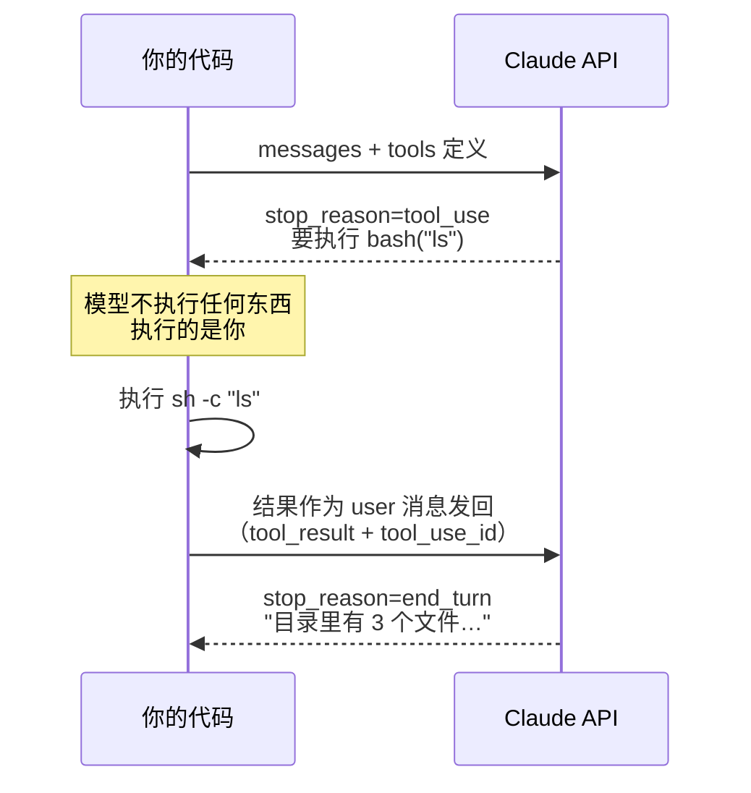

# Learn-agent 教程设计

**日期：** 2026-08-18
**状态：** 已定稿，待实施（先交付 L1）

---

## 1. 背景与目标

`lite-agent`（`~/webCode/ai-claude-tools/lite-agent`，5.1k 行 TypeScript）实现了一个完整的
CLI agent 框架，覆盖工具循环、上下文压缩、技能加载、子代理、后台任务、任务看板、
多 agent 协作、git worktree 隔离等机制。

本项目把这些机制拆解成一套**面向零基础读者的递进式教程**，对外分享。

**明确不是**"lite-agent 源码导读"。lite-agent 是网状耦合的（`tools/index.ts` 一次性
import 五个模块，`agentTeam.ts` 反过来又依赖 `tools`，构成循环依赖），按文件切片会得到
一堆互相 import 的碎片，读者必须先理解全局才能看懂局部。

**每课是为讲清一个概念而重写的最小实现，不是从 lite-agent 复制的切片。**
lite-agent 退到附录，作为"生产级参考实现"出现。

---

## 2. 读者与前置知识

**目标读者：** 从未接触过 agent 实现的开发者。

**假设具备：** JavaScript / TypeScript 基础，用过 Node 或前端构建工具，会用命令行。

**不假设具备：** 任何 agent、LLM API、prompt engineering 知识。token、上下文窗口、
tool use、stop_reason 等术语首次出现时必须解释，并给出英文原词方便读者自行检索。

**语言：** 中文讲解，中文代码注释。

**代码风格约束：** TypeScript 但刻意避开高级类型（泛型体操、条件类型、mapped types）。
零基础读者卡在类型系统上是最冤枉的失败。

---

## 3. 核心设计决策

| # | 决策 | 理由 |
|---|---|---|
| D1 | 从零递进教程，不是源码导读 | lite-agent 耦合度高，切片后教学价值归零 |
| D2 | 每课代码完全自包含 | 任何一课能单独拷走运行，读者不用在文件间跳转 |
| D3 | 只支持真实 API 调用，不做 mock | mock 会掩盖模型不确定性——那恰恰是 agent 的本质特征 |
| D4 | 每课 README 附真实运行输出实录 | 没有 API key 的读者靠实录也能完整理解 |
| D5 | 每课至少一张 mermaid 图 | 零基础读者靠图建立结构感；GitHub 原生渲染，分享零门槛 |
| D6 | 每课补"官方原生方案"一节 | 见下方 §4，这是本教程最大的差异化 |
| D7 | TypeScript + Bun，工具层用 Bun 原生 API | 环境准备从 5 步降到 3 步；代码更短 |
| D8 | agent team / worktree 降为附录导读 | 见 §5.3 |
| D9 | 双轨 API：主线只用兼容端通用能力，Anthropic 独有特性单独标注 | 见 §8.2，读者用中转 key 即可跑完主线 |

### D2 的代价与补偿

自包含意味着十几份相似的 agent loop 代码。补偿手段是每课 README 固定包含
「相比上一课新增了什么」一节，读者永远知道该盯哪几行看。这是刻意用代码冗余
换取阅读连续性。

---

## 4. 关键定位：手写实现 vs 官方原生方案

lite-agent 手写的多个核心机制，Claude API 目前已有原生对应物：

| lite-agent 手写 | 2026 年官方原生方案 |
|---|---|
| `microCompact`（旧 tool_result 换占位符） | Context editing beta：`context_management: {edits: [{type: "clear_tool_uses_20250919"}]}` |
| `autoCompact`（LLM 摘要全历史） | Compaction beta：`{type: "compact_20260112"}` + beta 头 `compact-2026-01-12` |
| `load_skill` + SKILL.md 渐进披露 | Tool search（`tool_search_tool_bm25_20251119`）+ 其余工具标 `defer_loading: true` |
| 手写 `while (stop_reason === "tool_use")` 循环 | SDK Tool Runner：`client.beta.messages.toolRunner` |
| 手写进度文件 / 任务看板 | Memory tool：`{"type": "memory_20250818", "name": "memory"}` |

**教学立场：** 手写仍然必须教——不手写一遍不会真正理解为什么需要它。但每课必须补一节
「官方现在怎么做」，否则读者学完照着手写版写生产代码就是错的。

市面上的 "build your own agent" 教程几乎全部停在手写阶段，不告诉读者 2026 年的正确做法。
**这一节是本教程相对于同类材料的核心增量。**

---

## 5. 课程大纲

14 课 + 2 附录，分 5 层。

### 5.1 完整清单

| # | 目录 | 解决的问题 | 新增机制 | 官方原生对照 |
|---|---|---|---|---|
| **L1 · 循环** — 建立 agent 的本体认知 |
| 01 | `01-first-call` | 模型只会说话，怎么让它"做事"；以及它到底记不记得上一轮 | 一次 `messages.create`；`messages` 数组；`stop_reason` | — |
| 02 | `02-first-tool` | 模型说要执行命令，谁来执行 | tool schema → `tool_use` → `tool_result` 回填 | — |
| 03 | `03-tool-loop` | 一个工具不够，任务要多步完成 | `while` 循环直到 `stop_reason !== "tool_use"`；并行工具调用 | Tool Runner |
| 04 | `04-sandbox-approval` | agent 会去读 `~/.ssh/id_rsa`，也会 `rm -rf` | `safePath` 路径校验 + 人在回路审批门 | — |
| **L2 · 成本与健壮** — 市面教程最缺的一层 |
| 05 | `05-prompt-caching` | agent 每轮重发完整历史，成本失控 | `cache_control`；前缀稳定性；验证缓存命中 | — |
| 06 | `06-streaming-errors` | 长输出撞 HTTP 超时；一次 429 整个 agent 崩掉 | `.stream()` + `finalMessage()`；分级异常处理；工具失败用 `is_error` 回传 | — |
| **L3 · 上下文工程** — 核心层 |
| 07 | `07-tool-design` | 30 个工具的 agent 比 5 个工具的更蠢 | 工具集设计原则 + 系统提示词 altitude（纯设计课，无新机制） | — |
| 08 | `08-compaction` | 20 轮工具调用后上下文爆掉 | 手写 microCompact / autoCompact + transcript 落盘 | Context editing / Compaction beta |
| 09 | `09-just-in-time` | 知识全塞进 system prompt 太贵 | 手写 SKILL.md frontmatter 渐进披露 | Tool search + `defer_loading` |
| 10 | `10-memory-progress` | 会话结束，agent 就失忆了 | 外部记忆：进度文件、结构化笔记、任务看板 | Memory tool `memory_20250818` |
| **L4 · 扩展** |
| 11 | `11-subagent` | 一次搜索把主上下文塞满垃圾 | 独立消息历史 + 收窄工具集防递归 + 只回摘要 | — |
| 12 | `12-background` | 起个 dev server 就把主循环卡死 | 非阻塞执行 + 通知队列注入回对话流 | — |
| 13 | `13-mcp` | 每接一个服务就要自己写一遍工具 | 接入 MCP server，从自造工具到用生态 | MCP connector |
| **L5 · 工程化** |
| 14 | `14-evals` | 改了个提示词，agent 是变好还是变坏了 | trace/trajectory 评估 + 回归集（用内置 `bun test`） | — |
| **附录** |
| A | `appendix-a-lite-agent` | 生产级实现长什么样 | 多 agent 协作、消息总线、git worktree 隔离——图 + 代码片段导读，不写可运行示例 | — |
| B | `appendix-b-dont-diy` | 什么时候不该自己写 | 手写循环 / Tool Runner / Managed Agents / Claude Agent SDK 四者对比与选型 | — |

### 5.2 相对初版大纲的调整及依据

**新增 05 prompt caching。** agent loop 每轮重发完整历史，不缓存成本相差近一个数量级。
它还带架构约束——渲染顺序是 `tools` → `system` → `messages`，前缀任何字节变化都会
让后面全部失效，所以稳定内容必须在前、volatile 内容（时间戳、随机 ID）必须在最后一个
缓存断点之后。**必须早讲，否则后面所有课的代码结构都要返工。** lite-agent 完全没有缓存。

**新增 06 streaming + 错误处理。** lite-agent 全是阻塞调用，错误处理只有
`catch (e: any)`。真实 agent 需要区分可重试（429、5xx、连接错误）和不可重试（400、404）。

**新增 07 工具设计课。** 官方指导："如果人类工程师都说不清某个场景该用哪个工具，
AI agent 更不可能做对。" lite-agent 挂了 30 多个工具，是这条原则的反例。
这一课没有新机制，纯讲设计判断，但预期是全套教程里价值最高的一课之一。

**新增 13 MCP。** MCP 由 Anthropic 于 2024 年 11 月开源，已被 OpenAI、Google DeepMind
采用，2026 年中累计约 9700 万次下载、官方注册表 6400+ 服务器，是 agent 连接外部系统的
事实标准。不讲 MCP，读者写出来的 agent 是孤岛。

**新增 14 evals。** 现在的共识是必须评估 trajectory（路径有没有绕、有没有死循环、
工具选得对不对），而不只是最终答案。对教程读者更直接的痛点是：改了提示词无法判断好坏。
Bun 内置 `bun test`，这一课零额外依赖。

**04 从"沙箱"扩为"沙箱 + 审批门。"** lite-agent 的安全措施是 5 个危险命令的字符串
黑名单（`rm -rf /`、`sudo` 等），`rm -rf  /`（两个空格）即可绕过。作为反面教材讲，
比作为正面教材有价值。正解是参数化 + 人在回路审批。

**10 从"任务看板"重构为"外部记忆与进度"。** 任务看板只是"结构化笔记"这个通用手法的
一个特例。官方讲上下文工程时给的四个手法是：compaction、结构化笔记/外部记忆、
sub-agent、just-in-time 检索——本教程的 08/10/11/09 正好一一对应。

### 5.3 agent team 与 worktree 降级的理由

这是 lite-agent 里最重的两块代码（`agentTeam.ts` 739 行 + `worktree.ts` 384 行），
但对零基础读者性价比最低：

- **通用性不足。** 两者都是 lite-agent 的工程特色，不是 agent 通用概念。
  git worktree 本质是 git 技巧，对零基础读者是额外门槛。
- **与官方推荐结构不一致。** 官方推荐的多 agent 结构是 lead + 专注 sub-agent 返回
  摘要的收敛结构（即本教程第 11 课），而非自治 teammate 之间互发消息。
  后者属于研究级话题，写成教学示例容易让读者误以为是标准做法。
- **教学版会失真。** 739 行里包含身份重注入、两级 shutdown、plan approval、
  五条退出通知路径——砍到 200 行后剩下的骨架已不能反映真实难点。

处置：在附录 A 中用 mermaid 图 + 关键代码片段讲清思路和坑，指向 lite-agent 真实实现，
不写可运行示例。

---

## 6. 每课的 README 结构

固定七节，顺序刻意——先让读者疼，再给药：

```markdown
# 04 · 沙箱与审批门
> 一句话：把 agent 关在工作目录里，危险操作先问过人。

## 1. 你会遇到的问题      具体场景 + 失败的真实输出。第一节就是痛点。
## 2. 心智模型            mermaid 图。先看懂结构再看代码。
## 3. 关键代码            分段讲，只贴新增部分，不贴整文件。
## 4. 跑一遍              命令 + 真实终端输出实录。
## 5. 代价与边界          这么做要付出什么、什么时候会不够用。
## 6. 官方现在怎么做      对应的原生 API（若有）。没有则写"暂无原生方案"。
## 7. 相比上一课新增了什么  增量视角，自包含代码的导航补偿。
```

可选追加「想一想」：一两个开放问题，不给答案。

### mermaid 使用约定

图类型跟着内容走，不是随便画方框：

| 讲什么 | 图类型 | 用在 |
|---|---|---|
| 消息在谁和谁之间怎么传 | `sequenceDiagram` | 01 02 11 12 13 |
| 循环、分支、什么时候退出 | `flowchart` | 03 04 08 10 |
| 状态怎么变迁 | `stateDiagram-v2` | 12、附录 A |
| 压缩前后 / 隔离前后对比 | 并排 `flowchart` 或表格 | 08 09 11 |
| 缓存前缀命中与失效 | `flowchart` + 高亮 | 05 |

02 课主图示例（零基础最容易卡在"tool_result 到底该谁发"）：



---

## 7. 仓库骨架

```
Learn-agent/
├── README.md                  入口：什么是 agent、环境准备、路线图总览、术语表
├── package.json               唯一依赖 @anthropic-ai/sdk
├── tsconfig.json              仅供编辑器类型提示，bun init 生成
├── .env.example               三个变量的模板（KEY / BASE_URL / MODEL_ID）
├── .gitignore
├── docs/
│   └── superpowers/specs/     设计文档（本文件）
└── examples/
    ├── 01-first-call/
    │   ├── README.md
    │   └── index.ts
    ├── 02-first-tool/
    ├── …
    ├── 14-evals/
    │   ├── README.md
    │   ├── index.ts
    │   └── agent.test.ts      bun test 回归集
    ├── appendix-a-lite-agent/
    │   └── README.md          仅文档，无代码
    └── appendix-b-dont-diy/
        └── README.md          仅文档，无代码
```

**根 README 承担入门门槛，不占用课程编号：**

1. 什么是 agent——一句话：一个 `while` 循环加一组函数
2. 环境准备——装 Bun、`bun install`、填 `.env`
3. 14 课路线总览图（mermaid）
4. 术语表——token、上下文窗口 context window、tool use、stop_reason、
   system prompt、agent loop、上下文压缩 compaction

---

## 8. 技术栈与运行方式

| 项 | 选择 |
|---|---|
| 运行时 | Bun 1.3.5（开发机已验证） |
| 语言 | TypeScript，避开高级类型 |
| 依赖 | `@anthropic-ai/sdk` —— 唯一一个 |
| 模型 | 从 `.env` 的 `MODEL_ID` 读，默认 `ugreen-ai-model` |
| 工具层 API | Bun 原生（`Bun.$`、`Bun.file`、`Bun.write`） |
| 测试 | 内置 `bun test`（仅第 14 课） |

### 读者的三步环境准备

```bash
curl -fsSL https://bun.sh/install | bash   # 1. 装 Bun
bun install                                 # 2. 装唯一依赖
cp .env.example .env && vim .env            # 3. 填 key
bun run examples/01-first-call/index.ts     # 跑起来
```

对比 lite-agent 的 pnpm + tsx + tsconfig + dotenv + @types/node 五件套。
**Bun 自动加载 `.env`，`dotenv` 直接删掉**——它在教程里是纯噪音。

### 已验证的 Bun 实现细节

`Bun.$` 的模板插值默认会转义为单个参数（这是防命令注入的安全设计）。实测结果：

```ts
await Bun.$`${command}`.text()          // ✗ 失败：整串被当成一个可执行文件名
await Bun.$`sh -c ${command}`.text()    // ✓ 正确：交给 sh 解析
```

非零退出码会抛 `ShellError`（带 `exitCode`）。agent 的 bash 工具**必须**用
`.nothrow().quiet()` 拿到结构化结果，把失败信息回传给模型，而不是让进程崩溃：

```ts
const r = await Bun.$`sh -c ${command}`.nothrow().quiet();
// → { exitCode: 1, stdout: "out", stderr: "err" }
```

这个转义行为正好用于第 04 课：**参数化才是防命令注入的正解，字符串黑名单不是。**

### 8.2 双轨 API 策略（已实测）

教程主线必须能在 Anthropic **兼容端**（公司中转、MiniMax 等）上跑通，读者不需要
Anthropic 官方 key。已在 `aiproxy.ugreencloud.com` 上实测的能力矩阵：

| 能力 | 兼容端 | 结论 |
|---|---|---|
| `messages` + `tools` + `tool_result` 完整往返 | ✅ 已用 `ugreen-ai-model` 实测跑通两轮 | **L1–L4 手写部分全部可跑** |
| 顶层 `system` 参数 | ✅ | 可跑 |
| `output_config: {effort}` | ✅ 接受请求 | 可用，但效果不可验证 |
| `thinking: {type: "adaptive"}` | ⚠️ HTTP 200 但响应不含 thinking 块 | **不作教学主线** |
| `cache_control` | ⚠️ HTTP 200 但 usage 中缓存字段被剥离 | 第 05 课效果无法在兼容端验证 |
| beta 特性（context editing / compaction / tool search / memory） | ❌ HTTP 400，被网关拦截 | 只能讲，不能跑 |

**据此的写作规则：**

1. **主线代码只用兼容端确认可用的能力**——`model` / `max_tokens` / `messages` /
   `system` / `tools` / `tool_result`。这套组合任何 Anthropic 兼容端都支持。
2. **凡涉及独有特性的内容一律写进「官方现在怎么做」一节**，并加醒目标注：
   `> ⚠️ 本节需要 Anthropic 官方 key，中转端点通常不支持。`
   这些小节只给代码和说明，不承诺输出实录。
3. **兼容端的 `tool_use.id` 形如 `chatcmpl-tool-xxxx`**——底层是
   Anthropic ↔ OpenAI 格式转译，这也解释了为什么 thinking 块与缓存 usage 字段会丢失。
   教程需要提醒读者：id 长什么样不重要，原样回填给 `tool_result.tool_use_id` 即可。
4. **`thinking` 和 `effort` 不进 L1 主线代码。** 在 03 课的「官方现在怎么做」里
   说明官方 API 上应当开启 `thinking: {type: "adaptive"}` 与
   `output_config: {effort: "high"}`，并解释 agent 为什么需要它们。
5. `max_tokens` 非流式取 16000；06 课讲流式后可放大。

## 9. 工程约定

1. **模型 ID 统一从 `process.env.MODEL_ID` 读**，绝不散落硬编码，不在示例间漂移。
   `.env.example` 默认给 `ugreen-ai-model`，并注明中转端点上还可换
   `claude-sonnet-4-6` / `claude-haiku-4-5`，官方端点用 `claude-opus-5`。
   所有示例读同一个变量。
2. **成本标注**：每课 README 顶部注明预计 API 调用次数，例如
   `预计消耗：3–5 次调用`。
3. **输出实录必须是真跑出来的**，包含真实 token 数字。不允许手工编造。
4. **每课代码单文件优先**（`index.ts`）。确实需要拆分时，同目录内不超过 3 个文件。
5. **不引入任何 lint / 格式化 / 打包配置。**（tsconfig.json 例外：它只为编辑器类型提示服务，Bun 运行时并不需要它。） 读者的注意力预算要留给 agent 概念。
6. **术语首次出现给英文原词**，如"上下文窗口（context window）"。
7. **任何真实 API key 只存在于 `.env`（已被 `.gitignore` 忽略）。**
   `.env.example`、README、示例代码、输出实录里一律是占位符或脱敏值。

---

## 10. 交付节奏

**第一批：L1 四课 + 仓库骨架 + 根 README。**

先完整交付 `01-first-call` 到 `04-sandbox-approval`，含 README 七节结构、
mermaid 图、真实输出实录、根 README 的入门部分和术语表。

由 hongaah 审阅实际形态后，再决定后续 10 课怎么写。这样避免一口气写完 14 课
才发现风格不对、需要全部返工。

---

## 11. 明确不做

- **不做 mock 模式。** 见 D3。
- **不做终端录屏 / 动图。** 代码一改就得重录，维护成本不成比例。
- **不为 agent team、worktree 写可运行示例。** 见 §5.3。
- **不做英文版。** 需要时另行讨论。
- **不搬运 lite-agent 的 CLI 交互层**（ESC 中断、多行粘贴检测、slash 命令）。
  那是终端 UX 工程，与 agent 概念无关。
- **不加 lint / prettier / CI。** 见 §9.5。

---

## 附：参考来源

- [Effective context engineering for AI agents — Anthropic](https://www.anthropic.com/engineering/effective-context-engineering-for-ai-agents)
- [Effective harnesses for long-running agents — Anthropic](https://www.anthropic.com/engineering/effective-harnesses-for-long-running-agents)
- [Building Effective AI Agents — Anthropic](https://www.anthropic.com/engineering/building-effective-agents)
- [LLM Agent Evaluation Metrics in 2026 — Confident AI](https://www.confident-ai.com/blog/llm-agent-evaluation-complete-guide)
- [What Is Model Context Protocol (MCP)? 2026 Guide](https://www.remio.ai/post/what-is-model-context-protocol-mcp-2026-guide)
- [Building a Coding Agent From Scratch: Harness Architecture — Decoding AI](https://www.decodingai.com/p/building-a-coding-agent-from-scratch-system-design)
