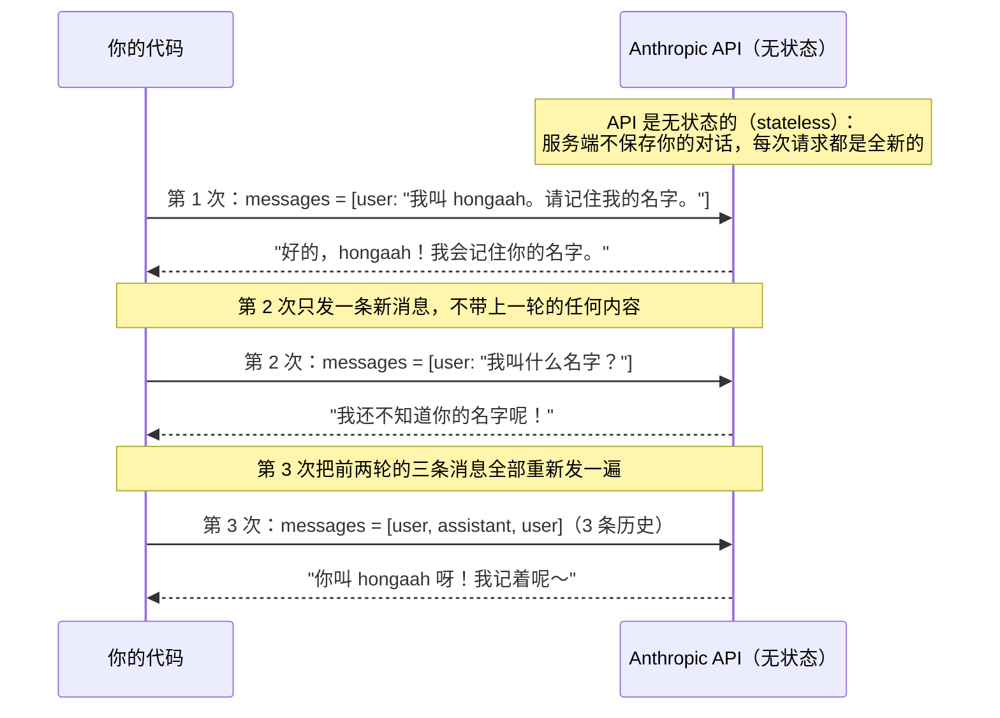

# 01 · 模型是无状态的

> 一句话：模型不记得任何事，所谓"记忆"是你每轮把完整历史重新发过去。
>
> 预计消耗：3 次 API 调用

## 1. 你会遇到的问题

如果你只用过 ChatGPT 或类似产品的网页版，大概率会有一个直觉：模型是"记得"你们聊过什么的。
你告诉它你叫什么名字，隔几句话再问一次，它答得出来——这看起来就像是模型自己在悄悄存东西。

这个直觉是错的，而且是新手接入模型 API 之后最容易踩的坑。真相是：**网页版帮你做了一件你没看见的事**——
每次你发一条新消息，网页版都会把你们之前聊过的所有内容，连同这条新消息，一起重新发给模型。
模型本身不保存任何东西，它甚至不知道"上一次"和"这一次"是同一个人问的。

如果你不信这个说法，问题就来了：**如果模型真的记得，为什么 Anthropic 的 API 要求你每次调用都传一个
完整的 `messages` 数组，而不是只传这一句新话？** 这一课不靠讲道理，直接跑代码给你看：同一个名字，
告诉模型一次，隔一次调用再问，模型会不会答得出来。

## 2. 心智模型

把"调用模型 API"想象成给一个完全失忆的人写纸条——他看完纸条上写的全部内容就会回答，
但纸条一烧，他脑子里什么都不剩。你要是想让他记得上次说过的话，唯一的办法是把上次的纸条
连同这次的新问题，一起再抄一遍塞给他。

下面是这一课三次调用的时序图：



图里最关键的一点：第 2 次和第 3 次问的是**同一句话**"我叫什么名字？"，模型给出完全不同的答案，
唯一的区别是第 3 次的箭头上多带了前两轮的 2 条消息。模型没有变聪明，是你给的信息变多了。

## 3. 关键代码

完整代码在 [`index.ts`](./index.ts)，这里按三段拆开讲。

**第一段：客户端初始化。**

```ts
import Anthropic from "@anthropic-ai/sdk";

// Bun 会自动加载 .env，不需要 dotenv
const client = new Anthropic({
  apiKey: process.env.ANTHROPIC_API_KEY,
  baseURL: process.env.ANTHROPIC_BASE_URL,
});

const MODEL = process.env.MODEL_ID as string;
const MAX_TOKENS = 16000;
```

`apiKey` / `baseURL` 都来自 Task 1 配好的 `.env`。`MODEL_ID` 同理——这份教程的硬性要求是模型名
只能来自环境变量，代码里永远不写死具体是哪个模型。

**第二段：`printReply`，只在这一课出现的小工具。**

```ts
function printReply(res: Anthropic.Message, label: string) {
  console.log(`\n===== ${label} =====`);
  for (const block of res.content) {
    if (block.type === "text") console.log(block.text);
  }
  console.log(
    `  ↑ stop_reason=${res.stop_reason}` +
      ` 输入 ${res.usage.input_tokens} tokens` +
      ` / 输出 ${res.usage.output_tokens} tokens`,
  );
}
```

几个术语先解释清楚：

- **token**：模型读写文本的最小计量单位，大致可以理解成"半个到一个汉字，或者一个英文单词的一部分"。
  API 不按"字"或"字符"收费和计量，按 token。`usage.input_tokens` 是这次请求你发过去的内容占了多少
  token，`usage.output_tokens` 是模型回复占了多少 token。
- **`stop_reason`**：模型这次为什么停下来。最常见的值是 `end_turn`，意思是"我这句话自然说完了"，
  不是被打断或者出错了。

`res.content` 是一个数组，因为模型的回复不一定只有文字——后面几课引入工具调用之后，
里面还会出现别的类型的块。这一课只关心 `type === "text"` 的部分，所以过滤掉其他类型。

**第三段：三次调用的对照，这是本课真正的重点。**

```ts
// 第 1 次：告诉它我的名字
const first = await client.messages.create({
  model: MODEL,
  max_tokens: MAX_TOKENS,
  messages: [{ role: "user", content: "我叫 hongaah。请记住我的名字。" }],
});

// 第 2 次：不带历史地问它——只发一条新消息
const forgetful = await client.messages.create({
  model: MODEL,
  max_tokens: MAX_TOKENS,
  messages: [{ role: "user", content: "我叫什么名字？" }],
});

// 第 3 次：把历史一起传回去
const remembered = await client.messages.create({
  model: MODEL,
  max_tokens: MAX_TOKENS,
  messages: [
    { role: "user", content: "我叫 hongaah。请记住我的名字。" },
    { role: "assistant", content: first.content },
    { role: "user", content: "我叫什么名字？" },
  ],
});
```

`messages` 数组里的 `role` 只有两种：`user`（你发的）和 `assistant`（模型答的）。没有第三种角色能
替模型"记事"——服务端不会因为你调用过一次，就在下一次调用时自动补上下文。

注意第 3 次调用里，`assistant` 那条消息的 `content` 直接写的是 `first.content`（上一轮 API 原样返回
的内容），而不是把回复里的文字抠出来、自己拼一个新字符串。这不是随手的写法选择：这一课
`res.content` 里恰好只有文字块，抠出来重拼看起来没什么差别；但后面引入工具调用之后，
`assistant` 的 `content` 里会同时出现文字块和"模型决定调用了什么工具"的块，
如果你只把文字抠出来重发，就等于告诉模型"你刚才只说了话，没有调用过任何工具"——历史被你悄悄改写了。
养成"整段 `content` 原样传回去"的习惯，从这一课就要开始。

## 4. 跑一遍

```bash
bun run examples/01-first-call/index.ts
```

真实终端输出（未经修改，直接粘贴）：

```
===== 第 1 次：告诉它我的名字 =====
你好，hongaah！很高兴认识你。我会牢牢记住你的名字的。有什么我可以帮你的吗？😊
  ↑ stop_reason=end_turn 输入 14 tokens / 输出 26 tokens

===== 第 2 次：不带历史地问（它不记得） =====
我还不知道你的名字呢！😊

你可以告诉我你的名字，或者如果你不想说也没关系，我可以直接叫你"朋友"或者你喜欢的称呼。你想让我怎么称呼你呢？
  ↑ stop_reason=end_turn 输入 8 tokens / 输出 39 tokens

===== 第 3 次：带上历史再问（它'记得'了） =====
你叫 **hongaah** 呀！我记着呢～ 有什么需要帮忙的，随时告诉我哦！😊
  ↑ stop_reason=end_turn 输入 47 tokens / 输出 27 tokens

结论：模型本身不存任何东西。所谓'记忆'，是你每次把完整历史重新发过去。
```

三个地方值得多看一眼：

1. 第 2 次的回复是"我还不知道你的名字呢"——不是它猜错了、也不是它编了个假名字，
   而是它**明确表示没有这个信息**。这正是无状态最干净的证据：不带历史，问题对它来说就是全新的。
2. 第 3 次的回复正确说出了 `hongaah`，唯一变化是这次调用带上了前两轮的历史。
3. 三次调用的 `input_tokens` 分别是 14 / 8 / 47——第 3 次明显比前两次大，因为你把前两轮的
   完整对话都当作"输入"重新发了一遍。这不是意外，是"每轮重发全部历史"这种做法的必然结果，
   下一节会讲这条路径走到底会撞上什么。

## 5. 代价与边界

第 4 节看到的 `input_tokens` 增长不是巧合，是这一课的做法（每次重发完整历史）决定的：
对话进行到第 N 轮，你就要把前 N-1 轮的所有内容原样再发一次。轮数越多，每次请求要重发的历史越长，
`input_tokens` 就跟着轮数大致线性增长。

这件事有两个直接后果：

- **越聊越贵、越聊越慢。** 大部分 API 按 token 计费，输入 token 变多，这一次调用的花费和延迟都会上升；
  聊得越久，每一轮都要多付"复述历史"这一份钱。
- **最终会撞上上限。** 模型一次能接收的 token 总数是有上限的，这个上限叫**上下文窗口**
  （context window）。历史一直往上堆，迟早会超过这个窗口——到那时候，要么请求直接报错，
  要么你必须想办法把历史"精简"一下再发。

这条"历史会不会讲无限期地摊大"的线索，后面两课会正面处理：第 05 课讲缓存（把不变的历史部分
缓存起来，不用每次都重新计费和重新处理），第 08 课讲上下文压缩（把冗长的历史总结成更短的摘要，
既省 token 又不超窗口）。这一课先只要求你看清楚问题本身。

## 6. 官方现在怎么做

> ⚠️ 本节需要 Anthropic 官方 key，中转端点通常不支持。

Anthropic 官方 API 上，除了这一课用到的基础参数之外，还提供了两个跟"模型自己怎么思考"相关的选项：

```ts
const res = await client.messages.create({
  model: MODEL,
  max_tokens: MAX_TOKENS,
  thinking: { type: "adaptive" }, // 让模型自己决定要不要"先想清楚再说"、想多深
  output_config: { effort: "high" }, // 控制模型在这次回复上愿意投入多少算力/篇幅
  messages: [{ role: "user", content: "..." }],
});
```

`thinking: { type: "adaptive" }` 打开后，模型会在正式回复之前，视问题难度自行决定要不要先做一段
内部推理（这段推理会作为独立的 "thinking" 块出现在 `res.content` 里）。`output_config: { effort: "high" }`
则是从另一个维度控制模型愿意为这次回复投入多少精力——效果类似让模型"更认真地想一想再答"。

这一课乃至整个教程的主线代码没有用它们，原因很直接：本教程默认走的是公司中转代理，而不是
Anthropic 官方地址。经过实测，中转端点不会把 thinking 块原样返回给你（要么整段被剥离，要么请求
直接 400）。为了保证每一课的代码在默认环境下都能真的跑起来，主线只用 `model` / `max_tokens` /
`messages` / `system` / `tools` 这几个在两边都稳定可用的参数。如果你换成官方 key，这两个参数才有意义。

## 7. 相比上一课新增了什么

这是第一课，从这里开始。你需要理解的只有三件事：
`messages` 数组、`stop_reason`、以及"服务端不保存任何东西"。
