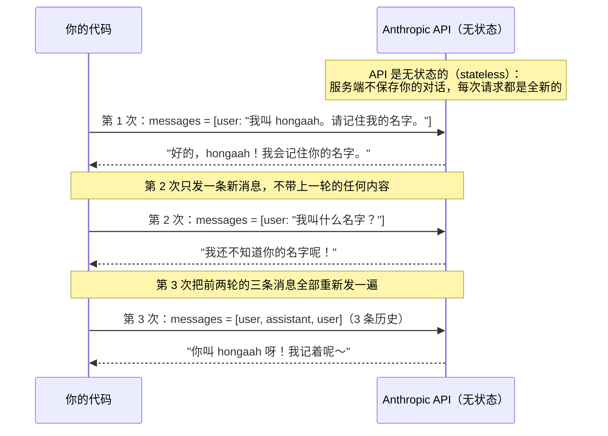

# 01 · 模型是无状态的

> 模型不记得任何事。所谓"记忆"，是你每轮把完整历史重新发过去。
>
> 预计消耗：3 次 API 调用

## 1. 你会遇到的问题

用过 ChatGPT 网页版的人都有个直觉：模型记得你们聊过什么。

这个直觉是错的。网页版帮你做了一件你没看见的事——每发一条新消息，它都把之前的全部对话连同新消息一起重新发给模型。模型本身不存任何东西。

不信？那为什么 API 要求你每次调用都传完整的 `messages` 数组，而不是只传新的那句话？

这一课直接跑代码给你看。

## 2. 心智模型

把调用模型想象成给一个失忆的人递纸条：他看完纸条就回答，纸条一烧，脑子里什么都不剩。想让他记得上次说的话，只能把上次的纸条连同新问题一起再抄一遍。



## 3. 关键代码

完整代码见 [`index.ts`](./index.ts)。

三次调用，唯一的区别是 `messages` 里装了什么：

```ts
// 第 1 次：告诉它名字
messages: [{ role: "user", content: "我叫 hongaah。请记住我的名字。" }]

// 第 2 次：只发新问题，不带历史 → 它不知道
messages: [{ role: "user", content: "我叫什么名字？" }]

// 第 3 次：把前两轮一起发过去 → 它"记得"了
messages: [
  { role: "user", content: "我叫 hongaah。请记住我的名字。" },
  { role: "assistant", content: first.content },   // 注意用 content 而不是抠出的文字
  { role: "user", content: "我叫什么名字？" },
]
```

第 3 次那条 `assistant` 消息直接用了上一轮返回的 `first.content`，而不是把文字抠出来重拼字符串。因为 `content` 是个数组，后面几课引入工具调用后，里面会出现 `text` 之外的块——原样传回去才不会丢东西。

这一课出现的三个术语：

| 术语 | 含义 |
|---|---|
| **token** | 模型读写文本的计量单位，约等于半个到一个汉字。API 按 token 计费，不按字符 |
| **`stop_reason`** | 模型为什么停下来。`end_turn` = 话说完了，不是被打断或出错 |
| **`usage`** | 这次调用的 token 账单：`input_tokens` 是你发过去的，`output_tokens` 是模型回的 |

## 4. 跑一遍

```bash
bun run examples/01-first-call/index.ts
```

> 报 HTTP 400 且返回一段 HTML？见根目录 README 的[跑不通怎么办](../../README.md#跑不通怎么办)。

```
===== 第 1 次：告诉它我的名字 =====
你好，hongaah！我已经记住你的名字了。很高兴认识你，有什么我可以帮你的吗？😊
  ↑ stop_reason=end_turn 输入 14 tokens / 输出 25 tokens

===== 第 2 次：不带历史地问（它不记得） =====
我不知道你的名字哦！😊 我们刚刚才开始对话，你还没有告诉我你的名字呢。
  ↑ stop_reason=end_turn 输入 8 tokens / 输出 53 tokens

===== 第 3 次：带上历史再问（它'记得'了） =====
你叫 **hongaah**！我记住了，不会忘的～ 😊
  ↑ stop_reason=end_turn 输入 46 tokens / 输出 27 tokens
```

三个地方值得看：

1. **第 2 次它明确说"我不知道"**，不是猜错、也不是编了个假名字。不带历史，这个问题对它就是全新的。
2. **第 3 次答对了**，唯一的变化是这次带上了前两轮。
3. **`input_tokens` 是 14 / 8 / 46。** 第 3 次明显更大，因为你把前两轮完整发了一遍。这不是意外，是"每轮重发全部历史"的必然结果。

## 5. 代价与边界

`input_tokens` 随轮数线性增长，带来两个后果：

- **越聊越贵、越聊越慢。** 每一轮都要为"复述历史"重新付费。
- **最终撞上限。** 模型单次能接收的 token 总量有上限，叫**上下文窗口**（context window）。历史一直堆，迟早超窗口。

这条线索后面会正面处理：第 05 课讲缓存（不变的历史部分不重复计费），第 08 课讲压缩（把冗长历史总结成摘要）。这一课只要求你看清问题本身。

## 6. 官方现在怎么做

> ⚠️ 本节需要 Anthropic 官方 key。第三方兼容端点大多不支持。

官方 API 还提供两个跟"模型怎么思考"有关的参数：

```ts
thinking: { type: "adaptive" },      // 模型自行决定要不要先想、想多深
output_config: { effort: "high" },   // 控制这次回复投入多少算力
```

打开 `thinking` 后，模型的内部推理会作为独立的 thinking 块出现在 `res.content` 里。

教程主线没用它们：不同端点对这两个参数的支持差别很大，有的直接剥离 thinking 块，有的返回 400。为了保证每一课在任何 Anthropic 兼容端点上都能跑，主线只用 `model` / `max_tokens` / `messages` / `system` / `tools` 这几个到处都稳定的参数。

## 7. 相比上一课新增了什么

这是第一课。你需要理解的只有三件事：`messages` 数组、`stop_reason`、服务端不保存任何东西。
