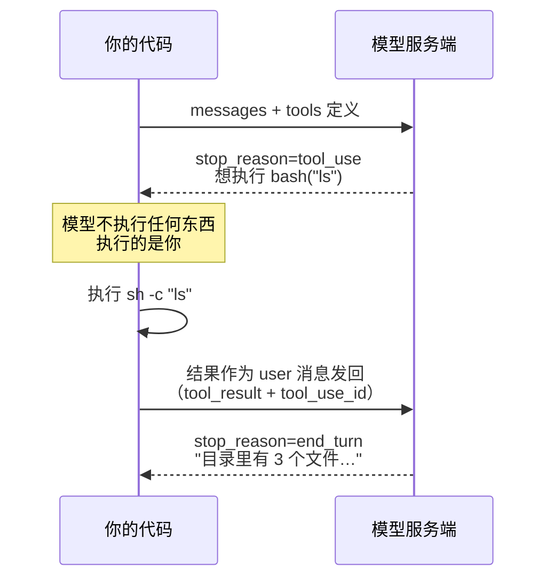

# 02 · 第一个工具

> 一句话：模型只会说"我想执行 ls"，真正执行的是你的代码。
>
> 预计消耗：2 次 API 调用

## 1. 你会遇到的问题

上一课讲清楚了一件事：模型不记得任何东西，所谓"记忆"是你自己每轮把完整历史重新发过去。
这一课要往前走一步——不再满足于模型只会说话，想让它**做事**：查一下当前目录有哪些文件、
读一读某个文件的内容、跑一条命令看看结果。

问题是，模型跑在别人的服务器上。它没有你的文件系统，没有你的终端，甚至不知道你的电脑长什么样。
它读不到你的硬盘，写不了你的文件，执行不了任何命令——物理上就没有这个通道。那市面上说的
"AI 帮我执行了 `ls`""AI 帮我改了代码"，到底是怎么做到的？

答案会让第一次接触的人有点意外：**并不是模型执行了什么，而是模型说出了它想执行什么，
然后由你的代码去真正执行，再把结果念给模型听。** 模型从头到尾只是在"说话"——它说的话这次
恰好换成了一种结构化的格式（工具调用），仅此而已。真正跑命令、读文件、发网络请求的，
永远是你写的那段程序。这一课就是要用最小的代码，把这个来回的每一步都摊开看清楚。

## 2. 心智模型



把这张图和上一课"给失忆的人写纸条"的比喻接起来看：这次纸条上除了对话内容，还多了一份
"清单"——你告诉模型"你可以用一个叫 bash 的工具，它能执行 shell 命令"。模型看完清单，
如果觉得有必要，会在回信里写"我想用 bash 执行 ls"，然后把笔放下、停止说话，把回合交还给你。
它没有、也不可能自己去点这个按钮——是你读到这句话之后，自己跑了这条命令，把跑出来的结果
当成新的一页纸，塞回给它，它才能接着往下说。

一个容易被忽略但很关键的细节：图中"结果作为 **user** 消息发回"这一步。工具是你这边执行的，
直觉上很容易觉得"这理应算我说的话，应该发在 user 里没错，但这不是因为它是我执行的"——
真正的原因是站在模型的视角看：工具结果不是它自己说出来的话，而是外部世界反馈给它的一条
**观察**（observation），跟用户发来的一条新消息在性质上是一样的：都是模型说完话之后，
从外面传回来的新信息。所以工具结果必须挂在 `role: "user"` 下面，而不是 `role: "assistant"`——
`assistant` 这个角色专属于模型自己说的话，工具结果不是模型说的，是模型"听到"的。

## 3. 关键代码

完整代码在 [`index.ts`](./index.ts)，按三段拆开讲。

**第一段：工具声明——模型只看得到这段描述。**

```ts
const bashTool: Anthropic.Tool = {
  name: "bash",
  description: "在当前目录执行一条 shell 命令，返回它的输出。",
  input_schema: {
    type: "object",
    properties: {
      command: { type: "string", description: "要执行的 shell 命令" },
    },
    required: ["command"],
  },
};
```

这一段发给模型之后，模型能看到的**只有**这几行文字：工具叫什么名字、这个工具是干什么用的、
调用它需要传什么参数。模型看不到 `runBash` 函数里的任何一行实现代码——对模型来说，
`bash` 工具就是一个只有名字和说明书的黑盒。这意味着 `description` 写得越清楚，模型判断
"什么时候该用这个工具""该传什么参数"就越准；这次的描述只有一句话，是因为 `bash` 本身
足够通用，换成更专用的工具（比如"查询某个用户的订单"）时，这里通常需要写得详细得多。

**第二段：工具实现——真正干活的代码，模型完全碰不到。**

```ts
async function runBash(command: string): Promise<string> {
  const r = await Bun.$`sh -c ${command}`.nothrow().quiet();
  const output = (r.stdout.toString() + r.stderr.toString()).trim();
  return output || "(没有输出)";
}
```

两个容易踩坑的地方：

- **必须包一层 `sh -c`。** 如果直接写 `Bun.$\`${command}\``，Bun 会把整个 `command` 字符串
  当成"一个可执行文件的文件名"去找，而不是当成一条要解释执行的命令，结果就是找不到文件、
  直接报错。这不是 bug，是 Bun 的插值默认会转义、防止命令注入的安全设计——你把变量插进去，
  Bun 认为你想要的是"把这个值原样当一个参数"，而不是"把这个值当命令语法解释"。`sh -c` 这层包装
  的作用，就是明确告诉系统"把 `command` 这一整个字符串交给 shell 去解释执行"。
- **`.nothrow().quiet()` 两个都不能少。** 默认情况下，`Bun.$` 只要命令的退出码非 0（比如
  `ls` 一个不存在的目录）就会抛异常，这门课不想让"模型执行的命令失败了"变成"我的程序崩了"——
  命令失败本身也是一种结果，应该原样念给模型听，让模型自己判断下一步怎么办，而不是让整个
  流程在这里中断。`.quiet()` 则是关掉 Bun 把命令输出自动打印到你终端的默认行为，
  改为只回收进 `r.stdout` / `r.stderr`，由你自己决定什么时候打印、打印成什么样。

**第三段：一次完整往返的三步。**

```ts
// 1. 存历史：模型这一轮的回复（含 tool_use 块）整个存进去
messages.push({ role: "assistant", content: first.content });

// 2. 执行：遍历 content，找到 tool_use 块，交给 runBash 真正执行
for (const block of first.content) {
  if (block.type !== "tool_use") continue;
  const output = await runBash((block.input as { command: string }).command);
  toolResults.push({
    type: "tool_result",
    tool_use_id: block.id, // 必须原样回填
    content: output,
  });
}

// 3. 发回：工具结果以 user 角色发回去
messages.push({ role: "user", content: toolResults });
```

零基础读者在这一段最容易想错的两件事，值得单独拎出来强调一遍：

1. **`tool_result` 是 `role: "user"` 发回去的，不是 `role: "assistant"`。** 第 2 节已经解释过
   原因：站在模型视角，工具结果是外部世界反馈给它的观察，不是它自己说的话。写反了不会直接报错
   （API 未必会拒绝这个请求），但模型会拿到一份语义错乱的历史——"assistant 说自己执行了工具
   又汇报了结果"，这跟真实发生的事情对不上，轻则让模型困惑，重则让它在更复杂的对话里推理出
   错误的结论。
2. **`tool_use_id` 必须原样回填。** 模型这一轮的回复里可能同时发起好几个工具调用（这一课只有
   一个，后面的课会遇到多个），每个 `tool_use` 块都带着自己独一无二的 `id`。你把执行结果发回去
   时，必须把对应的 `id` 原样填进 `tool_result.tool_use_id`——这是模型用来"对号入座"的唯一凭据：
   哪个结果对应哪次调用，全靠这个 id 匹配，不是靠顺序、也不是靠猜。

## 4. 跑一遍

```bash
bun run examples/02-first-tool/index.ts
```

> 如果这条命令报 HTTP 400 并返回一段 HTML 页面，多半是你的机器设了公司代理
> （`http_proxy` / `https_proxy`）。Bun 的 `fetch` 会走这个代理，而代理不放行你的
> 模型端点。在命令前面临时清掉即可：
> `http_proxy= https_proxy= all_proxy= bun run examples/02-first-tool/index.ts`
> 详见根目录 README 的「跑不通怎么办」。

真实终端输出（未经修改，直接粘贴）：

```
第 1 轮 stop_reason = tool_use

模型想执行: ls -la
tool_use.id = chatcmpl-tool-80eabd6afa1896f6
执行结果:
total 48
drwxr-xr-x@ 13 yangjie.ugreen  staff   416 Aug 18 13:42 .
drwxr-xr-x   3 yangjie.ugreen  staff    96 Aug 18 12:25 ..
-rw-------@  1 yangjie.ugreen  staff   130 Aug 18 14:00 .env
-rw-r--r--@  1 yangjie.ugreen  staff   615 Aug 18 13:39 .env.example
drwxr-xr-x@ 13 yangjie.ugreen  staff   416 Aug 18 14:02 .git
-rw-r--r--@  1 yangjie.ugreen  staff    25 Aug 18 13:39 .gitignore
drwxr-xr-x@  3 yangjie.ugreen  staff    96 Aug 18 13:35 .superpowers
-rw-r--r--@  1 yangjie.ugreen  staff  2731 Aug 18 13:39 bun.lock
drwxr-xr-x@  3 yangjie.ugreen  staff    96 Aug 18 12:57 docs
drwxr-xr-x@  4 yangjie.ugreen  staff   128 Aug 18 14:04 examples
drwxr-xr-x@ 14 yangjie.ugreen  staff   448 Aug 18 13:39 node_modules
-rw-r--r--@  1 yangjie.ugreen  staff   263 Aug 18 13:39 package.json
-rw-r--r--@  1 yangjie.ugreen  staff   713 Aug 18 13:35 tsconfig.json

第 2 轮 stop_reason = end_turn

模型的最终回答：
当前目录下有以下文件和文件夹：

**文件：**
- `.env` — 环境变量文件
- `.env.example` — 环境变量示例文件
- `.gitignore` — Git 忽略规则文件
- `bun.lock` — Bun 包管理器的锁文件
- `package.json` — Node.js 项目配置文件
- `tsconfig.json` — TypeScript 配置文件

**文件夹（目录）：**
- `.git` — Git 版本控制目录
- `.superpowers` — 隐藏配置目录
- `docs` — 文档目录
- `examples` — 示例代码目录
- `node_modules` — 依赖包目录
```

几个地方值得多看一眼：

1. 模型自己选择了 `ls -la` 而不是最朴素的 `ls`——没人要求它这么做，工具描述里也没提过
   `-la` 这个参数，模型是根据"当前目录下有哪些文件"这个问题，自己判断出多带隐藏文件和详细信息
   会是更好的回答。这正是工具调用有意思的地方：你只告诉模型"有这么个工具能跑 shell 命令"，
   具体怎么用、传什么参数，是模型自己决定的。
2. `tool_use.id` 长得是 `chatcmpl-tool-80eabd6afa1896f6` 这个样子——如果你用的也是中转端点，
   会看到同样的 `chatcmpl-tool-` 前缀。这是底层把 Anthropic 格式和 OpenAI 格式来回转译时
   留下的痕迹，不影响使用：你不需要关心它具体长什么样，原样回填进 `tool_result.tool_use_id`
   就行。
3. 第 1 轮 `stop_reason` 是 `tool_use`，不是 `end_turn`——这是新出现的取值，意思是"我这轮话
   还没说完，我需要先等你把工具结果给我，才能继续"。这跟上一课看到的 `end_turn`（"我自然
   说完了"）是两种截然不同的停止原因。

## 5. 代价与边界

这一课的代码只做了**一次**往返：模型要工具结果 → 你给 → 模型说人话，写死两轮，然后就结束了。
如果模型看完 `ls` 的结果，紧接着又想 `cat` 一下某个具体文件呢？现在这段代码没法继续——
它没有"再检查一次 `stop_reason` 是不是又变成了 `tool_use`，如果是就再跑一轮"这样的逻辑，
第二轮拿到 `end_turn` 之后就直接收工了。真实场景里，模型经常需要连续用好几次工具才能把一件事
办完（先 `ls` 看看有什么文件，再 `cat` 某个文件，再基于内容做点什么），这需要一个循环，
而不是写死的两轮——这正是下一课要解决的问题。

还有一个更根本的问题这一课刻意没碰：`runBash` 对模型传来的命令**来者不拒**，`rm -rf` 也会
照跑不误。这一课的重点是先把"往返"这件事讲清楚，工具执行的安全边界放到第 04 课专门处理。

## 6. 官方现在怎么做

> ⚠️ 本节需要 Anthropic 官方 key，中转端点通常不支持。

这一课手写的"存历史 → 执行工具 → 回填结果 → 再调用一次"，本质上是一个可以预期的固定套路——
只要工具本身写好了，这套胶水代码不管换到哪个场景基本长得都一样。Anthropic 官方 SDK 提供了一个
叫 **Tool Runner**（`client.beta.messages.toolRunner`）的封装，把这整套"调用模型 → 发现要用工具
→ 执行 → 回填结果 → 再调用模型"的循环包装掉了，你只需要注册工具函数，剩下的往返逻辑由 SDK
替你跑：

```ts
const runner = client.beta.messages.toolRunner({
  model: MODEL,
  max_tokens: MAX_TOKENS,
  messages: [{ role: "user", content: "当前目录下有哪些文件？" }],
  tools: [
    {
      ...bashTool,
      run: async (input: { command: string }) => runBash(input.command),
    },
  ],
});

for await (const message of runner) {
  console.log(message);
}
```

那为什么这门教程还要坚持带你手写一遍？因为不亲手写过"往返"的每一步，你不会知道
`toolRunner` 内部到底替你做了什么决定——它什么时候认为该停下来、工具结果失败了怎么处理、
要不要限制循环的轮数——这些决定一旦交给一个封装好的黑盒，出问题的时候你会毫无头绪。
手写一遍之后再回头用 `toolRunner`，你看到的不再是一个魔法函数，而是一段"我知道它在干什么"
的省心代码。

## 7. 相比上一课新增了什么

- 请求里多了 `tools` 参数
- 响应的 `stop_reason` 出现了新取值 `tool_use`
- `content` 里出现了 `tool_use` 块（不再只有 `text`）
- 历史里多了一种消息：装着 `tool_result` 的 user 消息
