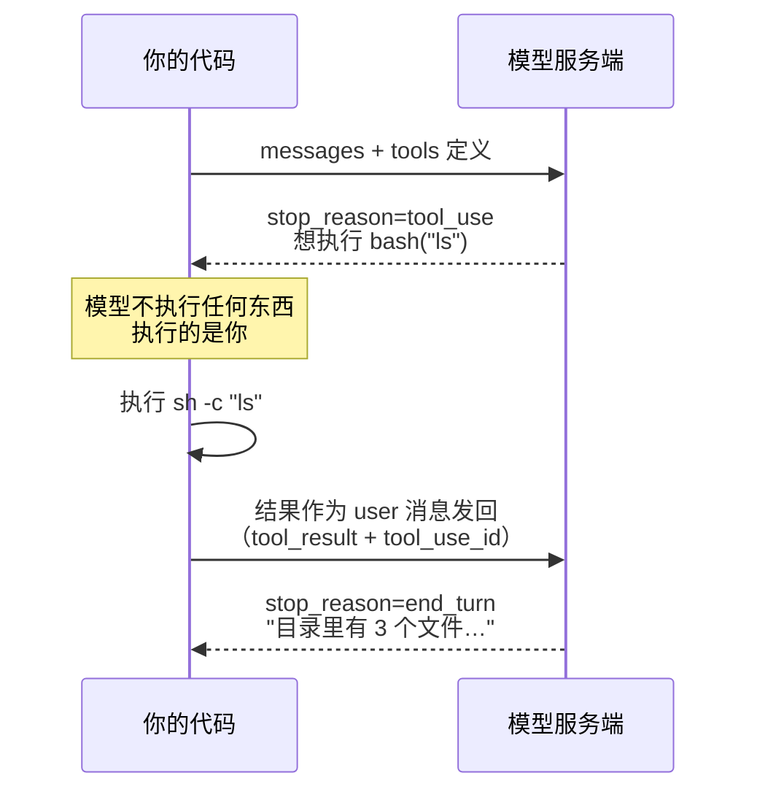

# 02 · 第一个工具

> 一句话：模型只会说"我想执行 ls"，真正执行的是你的代码。
>
> 预计消耗：2 次 API 调用

## 1. 你会遇到的问题

模型跑在别人的服务器上，没有你的文件系统、没有终端，读不到你的硬盘、执行不了任何命令。

那"AI 帮我跑了 `ls`"是怎么发生的？**不是模型执行了什么，是模型说出了它想执行什么，你的代码去真正执行，再把结果念给它听。** 它自始至终只是在"说话"——这次说的话换成了结构化格式（工具调用）。

## 2. 心智模型



工具结果放进 `role: "user"`，不是 `role: "assistant"`。站在模型视角，这是外部世界传回的一条**观察**（observation），跟用户发的新消息性质一样——不是模型自己说的话。

## 3. 关键代码

完整代码见 [`index.ts`](./index.ts)。

```ts
const bashTool: Anthropic.Tool = {
  name: "bash",
  description: "在当前目录执行一条 shell 命令，返回它的输出。",
  input_schema: {
    type: "object",
    properties: { command: { type: "string", description: "要执行的 shell 命令" } },
    required: ["command"],
  },
};
```

模型只看得到这段描述，看不到 `runBash` 的实现。`description` 写得越清楚，模型越知道什么时候该用、传什么参数。

`runBash` 两个坑：

| 坑 | 原因 |
|---|---|
| 必须包一层 `sh -c` | 直接插值 `Bun.$\`${command}\`` 会被当成文件名去找，而不是命令语法 |
| `.nothrow().quiet()` 缺一不可 | 前者防止非 0 退出码抛异常炸掉流程，后者防止 Bun 把输出打到你的终端 |

一次往返三步：

```ts
messages.push({ role: "assistant", content: first.content }); // 1. 存历史

for (const block of first.content) {           // 2. 执行
  if (block.type !== "tool_use") continue;
  const output = await runBash((block.input as { command: string }).command);
  toolResults.push({ type: "tool_result", tool_use_id: block.id, content: output }); // id 必须原样回填
}

messages.push({ role: "user", content: toolResults }); // 3. 发回，role 是 user 不是 assistant
```

`tool_use_id` 是模型"对号入座"的唯一凭据——一轮可能有多个 `tool_use` 块，靠 id 匹配，不靠顺序。

## 4. 跑一遍

```bash
bun run examples/02-first-tool/index.ts
```

> 报 HTTP 400 且返回一段 HTML？见根目录 README 的[跑不通怎么办](../../README.md#跑不通怎么办)。

真实终端输出（未经修改，直接粘贴）：

```
第 1 轮 stop_reason = tool_use

模型想执行: ls -la
tool_use.id = chatcmpl-tool-80eabd6afa1896f6
执行结果:
total 48
drwxr-xr-x@ 13 user  staff   416 Aug 18 13:42 .
-rw-------@  1 user  staff   130 Aug 18 14:00 .env
drwxr-xr-x@ 13 user  staff   416 Aug 18 14:02 .git
drwxr-xr-x@  4 user  staff   128 Aug 18 14:04 examples
-rw-r--r--@  1 user  staff   263 Aug 18 13:39 package.json
...

第 2 轮 stop_reason = end_turn

模型的最终回答：
当前目录下有以下文件和文件夹：

**文件：**
- `.env` — 环境变量文件
- `package.json` — Node.js 项目配置文件
- `tsconfig.json` — TypeScript 配置文件

**文件夹（目录）：**
- `.git` — Git 版本控制目录
- `examples` — 示例代码目录
- `node_modules` — 依赖包目录
```

- 模型自己选了 `ls -la`——没人要求，工具描述里也没提这个参数，是它自己判断"列文件"该带上隐藏文件和详细信息。
- `tool_use.id` 长得像 `chatcmpl-tool-80eabd6afa1896f6`：有些兼容端点会返回这种前缀的 id，原样回填即可，不用关心它具体长什么样。
- 第 1 轮 `stop_reason` 是 `tool_use`，不是 `end_turn`——意思是"话还没说完，等工具结果"。

## 5. 代价与边界

这一课写死两轮：模型要工具 → 你给结果 → 模型说人话，收工，不会检查"是不是又要工具了"。

真实任务经常要连续用好几次工具（`ls` 完再 `cat` 一个文件，再基于内容做事），这需要循环而不是写死两轮——下一课解决。

`runBash` 对模型传来的命令来者不拒，`rm -rf` 也照跑不误——工具执行的安全边界放到第 04 课处理。

## 6. 官方现在怎么做

> ⚠️ 本节需要 Anthropic 官方 key。第三方兼容端点大多不支持。

手写的"存历史 → 执行工具 → 回填结果 → 再调用一次"是个固定套路。官方 SDK 提供 **Tool Runner**（`client.beta.messages.toolRunner`），把整套循环包装掉，你只需要注册工具函数：

```ts
const runner = client.beta.messages.toolRunner({
  model: MODEL,
  max_tokens: MAX_TOKENS,
  messages: [{ role: "user", content: "当前目录下有哪些文件？" }],
  tools: [{ ...bashTool, run: async (input: { command: string }) => runBash(input.command) }],
});

for await (const message of runner) console.log(message);
```

不亲手写一遍"往返"，你不会知道 `toolRunner` 内部替你做了什么决定——它什么时候停、工具报错怎么处理。手写过一遍之后再用它，才是"知道它在干什么"的省心代码，不是魔法函数。

## 7. 相比上一课新增了什么

- 请求里多了 `tools` 参数
- `stop_reason` 出现新取值 `tool_use`
- `content` 里出现 `tool_use` 块，不再只有 `text`
- 历史里多了一种消息：装着 `tool_result` 的 user 消息
