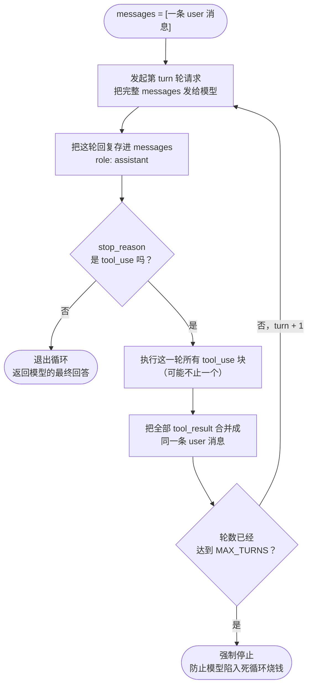

# 03 · 循环起来

> 一句话：把"调用→执行→回填"包进 while 循环，agent 就能自己走完多步任务。
>
> 预计消耗：4～8 次 API 调用（取决于模型分几步做完）

## 1. 你会遇到的问题

上一课写死了两轮：模型要工具 → 你执行 → 模型说人话，收工。这在演示里没问题，因为那个任务
（"当前目录下有哪些文件？"）本来就只需要一步。但现实里的任务大多不是一步能搞定的：先 `ls`
看看目录里有什么，再挑一个文件 `cat` 出来读读内容，看完内容之后可能还要改点东西写回去——
步骤之间环环相扣，后一步要用前一步的结果才知道该干什么。

麻烦在于：**步数你事先不知道。** 这次任务也许 2 步就够，换一个任务可能要 6 步。你没法把轮数
写死在代码里——只有模型自己在每一轮结束时知道"我还要不要继续用工具"。这一课要做的事情很直接：
把上一课写死的两轮，换成一个会自己数着轮数走下去、直到模型说"我说完了"才停下来的循环。

## 2. 心智模型



跟上一课的两轮对照着看：上一课的代码相当于把这张图里的 `B → C → D → F → G` 这一圈手写死了
恰好一次，然后直接跳到 `B` 再跑最后一遍收尾。这一课只是把"再跑一遍"这句话从代码里的
"再写一段几乎一样的调用"，变成了让同一段代码自己转圈——每转一圈都要过一次判断：
`stop_reason` 还是不是 `tool_use`。只要还是，就说明模型认为自己的话没说完，得先等工具结果；
一旦不是，循环立刻退出。

图里 `H` 这个判断——`MAX_TURNS` 上限——跟"模型自己想不想停"完全无关，是你这边单方面加的
一道保险丝。没有它，一旦模型陷入某种"读文件→没读懂→再读一遍"的死循环，会一直转下去，
每转一圈都在真金白银地烧 API 调用，没有任何东西能让它自己刹车。

## 3. 关键代码

完整代码在 [`index.ts`](./index.ts)，按四段拆开讲。

**第一段：循环骨架——为什么判断条件是 `!== "tool_use"`，而不是 `=== "end_turn"`。**

```ts
for (let turn = 1; turn <= MAX_TURNS; turn++) {
  const res = await client.messages.create({ model: MODEL, max_tokens: MAX_TOKENS, system: SYSTEM, messages, tools: TOOLS });
  messages.push({ role: "assistant", content: res.content });

  if (res.stop_reason !== "tool_use") {
    console.log(`\n循环结束，共 ${turn} 轮。stop_reason=${res.stop_reason}`);
    return;
  }
  // ……执行工具、回填结果
}
```

这里故意反着写：判断的不是"等于 `end_turn` 就退出"，而是"只要不是 `tool_use` 就退出"。
两者看起来像是同一件事，实际不是。`stop_reason` 除了 `end_turn` 和 `tool_use`，还可能是
`max_tokens`（回复被长度截断）或者别的取值——这些情况下模型显然也没有"再要一次工具"的意思，
循环理应停下来，把 `stop_reason` 原样报出去让你知道发生了什么，而不是傻乎乎地卡在判断条件上
继续转圈。用"排除法"写这个条件，才能保证循环只在"模型明确还要用工具"这一种情况下继续，
其余一切情况一律退出。

**第二段：分发表 `toolHandlers`——按名字找实现，加一个工具只要加一行。**

```ts
const toolHandlers: Record<string, (input: any) => Promise<string>> = {
  bash: async ({ command }) => { /* ... */ },
  read_file: async ({ path }) => { /* ... */ },
  write_file: async ({ path, content }) => { /* ... */ },
};
```

上一课只有一个工具，用 `if` 判断名字够用；这一课变成三个，再写三个 `if` 就开始难读了。
换成一张"名字 → 处理函数"的表之后，调用方式变成 `toolHandlers[block.name]`——以后无论加到
第 4 个工具还是第 10 个工具，都只是往这张表里多添一行，循环本身一个字都不用改。

这里有个 TypeScript 的细节值得留意：项目的 `tsconfig.json` 开了 `noUncheckedIndexedAccess`，
所以 `toolHandlers[block.name]` 取出来的类型不是"处理函数"，而是"处理函数或者 `undefined`"——
编译器很清楚，你传进来的 `block.name` 是模型说出来的字符串，它没法保证这个名字一定在表里
（模型偶尔会"凭空"要一个不存在的工具名）。所以代码里一定要先判空：

```ts
const handler = toolHandlers[block.name];
if (!handler) {
  output = `错误：没有名为 ${block.name} 的工具`;
} else {
  // 判空之后 handler 才能放心调用
}
```

这不是可以省略的防御性编程，是编译器强制要求的——不判空这段代码根本编译不过。

**第三段：工具报错要回传给模型，不能让进程崩掉。**

```ts
try {
  output = await handler(block.input);
} catch (e: any) {
  // 工具报错不能让整个 agent 崩掉，要把错误告诉模型让它自己想办法
  output = `错误：${e.message}`;
}
```

设想 `read_file` 读了一个不存在的路径——`Bun.file(path).text()` 会抛异常。如果不接住这个异常，
整个 `runAgent` 函数就会中断退出，用户拿到的是一个丢在终端里的 stack trace，而不是任何有用的
回答。这一课的做法是反过来：把异常在这里就地接住，转换成一段普通的错误文本，当成这次工具调用
的 `tool_result` 正常发回给模型。模型看到"错误：ENOENT: no such file or directory"这样的内容，
跟看到任何别的工具输出没有区别——它会理解成"这条路走不通"，然后自己换个办法，比如先 `ls`
确认一下文件到底叫什么名字，再重新尝试。这是两种完全不同的设计："工具出错就抛异常炸掉整个
agent"和"工具出错也是一种正常结果，把它念给模型听，让模型自己决定怎么办"。后者才是 agent
循环该有的样子——错误不是终点，是模型下一步决策的输入。

**第四段：并行工具调用——一轮里所有 `tool_result` 必须放进同一条 user 消息。**

```ts
const results: Anthropic.ToolResultBlockParam[] = [];
for (const block of res.content) {
  if (block.type !== "tool_use") continue;
  // ……执行，把结果 push 进 results
}
messages.push({ role: "user", content: results });
```

模型的一次回复（`res.content`）不保证只装一个 `tool_use` 块——如果任务允许，模型完全可以在
同一轮里说"我要同时读 A 文件、读 B 文件、再跑一条 ls"，`res.content` 里就会一次性出现三个
`tool_use` 块。这时候正确的做法是：把这三个工具**全部执行完**，把三份结果**合并进同一个数组**，
最后**只 `push` 一条** `role: "user"` 的消息，`content` 是装着三个 `tool_result` 的数组。

容易踩的坑是反过来写：每执行完一个工具就单独 `push` 一条 user 消息，结果一轮並行调用被拆成了
三条历史记录。这样做通常不会直接报错，但会悄悄喂给模型一种错误的因果关系——模型看到的历史
变成了"我一次性问了三件事，但对方一件一件分开回我"，这跟"一次并行请求应该拿到一次性的并行
回应"这个直觉不符。更实际的后果是：模型据此调整自己的行为，以后变得不敢在一轮里同时要多个
工具，改成每次只要一个、等一轮结果回来再要下一个——原本可以并行节省的那部分时间，就这样被
悄悄让给了保守的单步试探，agent 整体变慢了却看不出明显的报错。这一课的示例任务里模型实际上
每轮只要了一个工具（第 4 节会看到），但这条规则不依赖某一次运行是否恰好触发了并行——只要
`res.content` 里可能出现不止一个 `tool_use` 块，代码就必须按"多个结果、一条消息"的方式写，
不能等真的看到并行调用了才临时改。

## 4. 跑一遍

```bash
bun run examples/03-tool-loop/index.ts
```

> 如果这条命令报 HTTP 400 并返回一段 HTML 页面，多半是你的机器设了公司代理
> （`http_proxy` / `https_proxy`）。Bun 的 `fetch` 会走这个代理，而代理不放行你的
> 模型端点。在命令前面临时清掉即可：
> `http_proxy= https_proxy= all_proxy= bun run examples/03-tool-loop/index.ts`
> 详见根目录 README 的「跑不通怎么办」。

真实终端输出（未经修改，直接粘贴）：

```
[第 1 轮] 输入 469 tokens / 输出 55 tokens
  > bash({"command":"find . -name \"*.md\" -type f | sort"})
    ./.superpowers/sdd/progress.md
./.superpowers/sdd/task-1-brief.md
./.superpowers/sdd/task-1-report.md
./.superpowers/sdd/task-2-brief.md
./.superpowers/sdd/task-2-report.md
./.superpowers/sdd/task-3-b

[第 2 轮] 输入 984 tokens / 输出 59 tokens
  > bash({"command":"find . -name \"*.md\" -type f | sort > md-list.txt"})
    (没有输出)

[第 3 轮] 输入 1056 tokens / 输出 49 tokens
  > bash({"command":"wc -l < md-list.txt"})
    33

[第 4 轮] 输入 1117 tokens / 输出 41 tokens
  已完成。当前目录下共有 **33 个 .md 文件**，文件名列表已写入 `md-list.txt` 文件中（包含 `node_modules` 等子目录下的文件）。

循环结束，共 4 轮。stop_reason=end_turn
```

跑完之后确认了一遍 `md-list.txt`：确实生成了，33 行，跟第 3 轮 `wc -l` 报的数字对得上（示例
产物已经在收尾时删掉，见第 7 节前的说明）。几个地方值得多看一眼：

1. **这次跑了 4 轮，模型全程只用了 `bash` 一个工具。** `read_file` 和 `write_file` 定义都发给了
   模型，但它一次都没调用——第 2 轮它选择用 `find ... | sort > md-list.txt` 这条命令直接把结果
   重定向写进文件，而不是先拿到列表文本、再调用 `write_file` 工具去写。这是个值得记住的现象：
   工具列表是"你允许模型用什么"，不是"模型必须都用一遍"。给了三个工具，模型完全可能只挑一个
   够用的反复用，只要能达到目的，它没有理由绕远路去用另外两个。
2. **每一轮都恰好只要了一个工具，没有出现并行调用。** 这次的任务本身是强顺序的——必须先知道
   有多少个 `.md` 文件、文件写进去之后才能数行数，后一步天然依赖前一步的结果，模型没有机会
   同时发起互不依赖的多个调用。第 3 节讲的并行规则在这次输出里看不出直接证据，但换一个
   "同时读 3 个配置文件"这样天然可以并行的任务，你会在某一轮的 `res.content` 里看到不止一个
   `tool_use` 块——到时候代码不用改，因为规则从一开始就是按"可能有多个"写的。
3. **`input_tokens` 从第 1 轮的 469 涨到第 4 轮的 1117，将近 2.4 倍。** 这跟第 01 课看到的现象
   是同一件事的延伸：每一轮发出去的 `messages` 都包含了之前所有轮次的完整历史（包括工具输出），
   轮数越多，这份历史越长，`input_tokens` 就跟着往上涨。留意 `output_tokens` 没有这个趋势
   （55 → 59 → 49 → 41，基本持平甚至略降）——增长的只是"你发给模型看的"这一部分，不是
   "模型说了多少话"那一部分。这条曲线会在第 05 课（缓存）和第 08 课（压缩）里被正面处理，
   这一课先只要求你亲眼看到它确实在涨。

## 5. 代价与边界

`MAX_TURNS` 不是可有可无的装饰，是这一课唯一能防止模型"陷进去"的东西。设想一个模型反复
`read_file` 同一个文件、每次都觉得内容不对劲又读一遍的场景——没有这道上限，循环会一直转下去，
每一圈都在真实地消耗一次 API 调用，没有任何机制会让它自己意识到该停了。

真正值得警惕的是第 4 节看到的那条 token 曲线。这一课的任务只跑了 4 轮，`input_tokens` 就已经
涨了 2.4 倍；如果任务复杂到需要 10 轮、20 轮呢？到第 10 轮的时候，你是在为前 9 轮所有的工具
输出（包括 `find` 打印出来的几十行文件名）反复付费——历史只会越滚越大，从来不会自己变小。
这不是这一课代码写得不够好，是"每轮重发完整历史"这个做法本身的必然结果。第 05 课（缓存）
会解决"重复内容不用重新计费"的问题，第 08 课（压缩）会解决"历史本身不能无限变长"的问题，
这一课先只负责把问题摆出来。

还有一件事这一课刻意没处理：这三个工具什么都敢干。`write_file` 能覆盖任意路径下的任意文件，
`bash` 能跑 `rm -rf` 这种命令——工具的实现里没有任何一行代码在检查"这个操作安全吗"。这一课
的重点是先把循环跑通，工具执行的安全边界（比如敏感路径拦截、危险命令确认）放到下一课处理。

## 6. 官方现在怎么做

> ⚠️ 本节需要 Anthropic 官方 key，中转端点通常不支持。

两件事跟这一课直接相关。

**其一，Tool Runner 能把整个 while 循环包掉。** 上一课已经提过 `client.beta.messages.toolRunner`
能封装"调用→执行→回填→再调用"的单轮往返，它同样能封装这一课手写的多轮循环——包括
`stop_reason` 判断、并行工具的批量执行、结果合并成一条消息这些细节，都由 SDK 内部处理，
你只需要注册工具、给一个初始消息，然后遍历它产出的每一条消息：

```ts
const runner = client.beta.messages.toolRunner({
  model: MODEL,
  max_tokens: MAX_TOKENS,
  system: SYSTEM,
  messages: [{ role: "user", content: userInput }],
  tools: [
    { ...bashToolDef, run: async (input) => runBash(input.command) },
    { ...readFileToolDef, run: async (input) => Bun.file(input.path).text() },
    { ...writeFileToolDef, run: async (input) => { /* ... */ } },
  ],
  max_iterations: MAX_TURNS, // 对应这一课手写的 MAX_TURNS
});

for await (const message of runner) {
  console.log(message);
}
```

**其二，多步任务应该考虑打开 `thinking: { type: "adaptive" }` 和 `output_config: { effort: "high" }`。**
这一课的任务需要模型自己规划"先干什么、再干什么"，而不是一步到位——这正是 `thinking` 参数
设计要解决的场景：打开之后，模型会在决定调用哪个工具之前，视情况先做一段内部推理（比如
"用户要的是数量和清单两件事，我应该先枚举文件，再写文件，最后数一下核对"），这段推理会作为
独立的 thinking 块出现在 `res.content` 里，你可以选择要不要展示给用户看。`output_config:
{ effort: "high" }` 则会让模型在每一步上更舍得"多想一步"，减少因为图省事而漏掉某个步骤、
导致循环轮数意外变多的情况。

```ts
const res = await client.messages.create({
  model: MODEL,
  max_tokens: MAX_TOKENS,
  thinking: { type: "adaptive" },
  output_config: { effort: "high" },
  system: SYSTEM,
  messages,
  tools: TOOLS,
});
```

这一课的主线代码没有用它们，原因跟第 01 课说的一样：本教程默认走公司中转代理，经过实测
中转端点不会把 thinking 块原样返回（要么被剥离，要么请求直接 400），第 3 节点评里出现的
`tool_use.id` 前缀 `chatcmpl-tool-` 也是同一层转译留下的痕迹。为了保证每一课的代码在默认
环境下都能真的跑起来，主线只用 `model` / `max_tokens` / `messages` / `system` / `tools`
这几个在两边都稳定可用的参数。如果你换成官方 key，这两个参数才用得上。

## 7. 相比上一课新增了什么

- 两轮写死 → `for` 循环，靠 `stop_reason` 决定什么时候停
- 1 个工具 → 3 个工具，用分发表 `toolHandlers` 按名字派发
- 新增 `system` 系统提示词
- 新增 `MAX_TURNS` 上限，防止死循环
- 工具抛错不再让进程崩溃，而是把错误文本回传给模型
- 明确了并行工具调用的规则：一轮的所有结果并进同一条 user 消息
