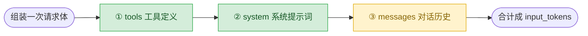

# 05 · 上下文的成本结构

> 一句话：每一轮 input_tokens 由「工具定义 + 系统提示词 + 对话历史」三段拼成，前两段每轮原样重发。
>
> 预计消耗：6～8 次 API 调用（3 次成本拆解 + 多轮任务视模型路径而定，通常 2～4 轮）

## 1. 你会遇到的问题

03 课你已经亲眼看到 `input_tokens` 一轮轮往上涨（469 → 984 → 1056 → 1117，将近 2.4 倍），但那一课没说清楚：涨的到底是什么？涨多少是必然的，涨多少是纯浪费？

这一课把账拆开算清楚，回答两个问题：

- 一次请求的 `input_tokens` 由哪几块组成，各占多少？
- 多轮跑下来，这些 token 里有多少是在为「上一轮已经发过的内容」重复付费？

## 2. 心智模型

一次请求的 input 是三段内容按固定顺序拼起来的：



绿色的 ①② 在一次 agent 会话里从第 1 轮到最后一轮**字节不变**——你没改过工具定义，也没改过系统提示词。黄色的 ③ 才是每轮真正变化的部分：每过一轮，`messages` 就多两条（模型的回复 + 工具结果），只涨不缩。

顺序不是随便画的：请求体按 `tools → system → messages` 的顺序拼接，第 6 节的缓存前缀正是靠这个顺序生效——不变的部分排在前面，缓存才有东西可命中。

## 3. 关键代码

完整代码见 [`index.ts`](./index.ts)。

**第一部分：差值法拆成本。** 这个端点没有 `count_tokens` 接口（实测 404），只能靠"多发一次、看差多少"这种笨办法——三次请求内容几乎一样，每次只多带一个部分：

```ts
const bare = await client.messages.create({ model: MODEL, max_tokens: 8, messages: [question] });
const withSystem = await client.messages.create({ model: MODEL, max_tokens: 8, system: SYSTEM, messages: [question] });
const withAll = await client.messages.create({ model: MODEL, max_tokens: 8, system: SYSTEM, tools: TOOLS, messages: [question] });

const sys = withSystem.usage.input_tokens - bare.usage.input_tokens;
const tools = withAll.usage.input_tokens - withSystem.usage.input_tokens;
```

`max_tokens: 8` 是因为这里只关心输入端花了多少，不需要模型多说话。

**第二部分：算重复率。** 第 N 轮的 `messages` 等于「第 N-1 轮的 `messages` + 新增两条」，所以第 N-1 轮发过的 `input_tokens`，会被第 N 轮原样再发一遍：

```ts
const sent = perRound.reduce((a, b) => a + b, 0);
const repeated = perRound.slice(0, -1).reduce((a, b) => a + b, 0); // 除最后一轮外，都被下一轮重发过
```

## 4. 跑一遍

```bash
http_proxy= https_proxy= all_proxy= bun run examples/05-context-cost/index.ts
```

> 报 HTTP 400 且返回一段 HTML？见根目录 README 的[跑不通怎么办](../../README.md#跑不通怎么办)。

真实终端输出（未经修改，直接粘贴）：

```
一次请求的 input_tokens 由三部分组成：

  你的问题              5 tokens
  system 提示词    +  135 tokens
  工具定义         +  418 tokens
  --------------------------------
  合计                558 tokens

  固定开销 553 tokens，是问题本身的 111 倍。
  而且每一轮都要原样重发一次。

跑了 3 轮，每轮 input_tokens：
  第  1 轮     584
  第  2 轮     692
  第  3 轮     840

  累计发送   2116 tokens
  其中重复   1276 tokens（60%）
  真正新增   840 tokens
```

两个数字值得记住：

1. **固定开销是问题本身的 111 倍。** `hi` 这句话只花 5 token，但 system + tools 一次性就要搭进去 553 token。问题越短，这个倍数越夸张——真实项目里 system 提示词和工具定义只会更长，不会更短。
2. **重复率 60%。** 这只是一个两步就能做完的任务（数 `.ts` 文件、读 `package.json`），跑 3 轮就已经过半。任务越复杂、轮数越多，`repeated / sent` 只会继续往上涨，因为每一轮都完整包含前面所有轮次的内容。

固定开销的绝对值（553 token）每次运行都一样——system 和 tools 的文本没变，分词结果就不变；多轮任务跑几轮、重复率具体是多少，会随模型这次选择的执行路径小幅浮动，属于正常现象。

## 5. 代价与边界

重复发送不可避免——API 无状态（第 01 课的结论），服务端不记得上一轮说过什么，你只能每轮都重新证明一遍。这条路走到底，能做的只有两件事：

- **让重复的部分变便宜。** 内容不变就不必重新计费——第 6 节讲怎么做。
- **让历史别无限变长。** 重复率会随轮数持续走高，历史需要有个头——第 08 课讲压缩。

这一课不解决问题，只是把账算清楚，让后面两课的动机站得住脚。

## 6. 官方现在怎么做

> ⚠️ 本节需要 Anthropic 官方 key。第三方兼容端点大多不支持。

`cache_control` 让服务端缓存请求前缀，命中部分只按缓存价计费，不再全价重算：

```ts
system: [{ type: "text", text: SYSTEM, cache_control: { type: "ephemeral" } }],
tools: TOOLS.map((t, i) =>
  i === TOOLS.length - 1 ? { ...t, cache_control: { type: "ephemeral" } } : t
),
```

`cache_control` 标在一个内容块上，意思是"缓存到这里为止的所有前缀"。三条前缀稳定性规则，都是第 2 节那张图的直接推论：

- **顺序固定是 `tools → system → messages`。** 断点只能打在这个顺序里，打反了缓存无从谈起。
- **前缀任何一个字节变了，这个字节之后的缓存全部失效。** 哪怕只改了 system 提示词里一个标点。
- **时间戳、随机 ID 这类每次都变的内容，必须放在最后一个缓存断点之后。** 混进前缀，等于让前缀"看起来"每次都在变。

命中与否看 `usage.cache_read_input_tokens`（命中）和 `cache_creation_input_tokens`（首次写入缓存）。

**这一课的主线没法演示这个效果**：实测这个端点接受 `cache_control` 参数、不报错，但返回的 `usage` 里缓存相关字段被整个剥掉了——两次几乎相同的请求，`input_tokens` 完全一样，看不出命中还是没命中。不是没生效，是端点把统计信息剥离了。第三方兼容端点普遍如此，这也是这一课主线用差值法而不是缓存字段的原因。

## 7. 相比上一课新增了什么

这一课没有新的执行机制——循环、工具分发、错误处理照抄 03 课。新增的只是"算账"这一层：

- 用差值法把一次请求的 `input_tokens` 拆成三段，分别量化
- 记录每轮 `input_tokens`，算出跑完一个任务总共重复发了多少
- 得到两个具体数字（固定开销倍数、重复率），作为 05/08 两课解法的依据
