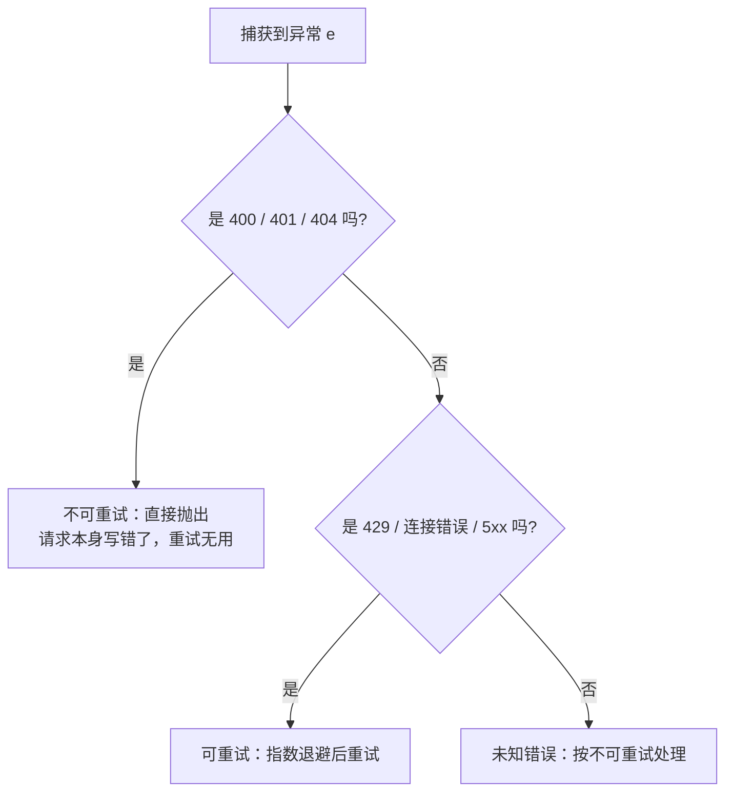

# 06 · 流式输出与错误处理

> 一句话：别让用户干等，别让一个错误崩掉整个循环。
>
> 预计消耗：4 次 API 调用（1 次流式成功，3 次故意触发 400 用来验证分级）

## 1. 你会遇到的问题

两个真实场景，都出在生产 agent 里：

- **用户干等。** 前 5 课全用 `client.messages.create()`——模型要把整段回复生成完才返回。回复长一点（比如让它写一份代码审查意见），终端能沉默十几秒，用户以为程序卡死了。
- **一次限流崩掉整个循环。** agent 循环里某一步调用触发 429（限流），如果代码只有裸的 `await client.messages.create(...)`，这个异常没人接，直接冒泡到进程顶层——循环停在那一步，哪怕等两秒重试就能成功。

这一课解决这两件事：流式输出让用户从第一个字就看到进度；错误分级让代码知道"这个错等一下能重试"还是"重试一百次也没用"。

## 2. 心智模型

非流式是等厨房把整桌菜一次端上来；流式是做好一道端一道，不用对着空盘子干等。

错误处理的核心是分级：一部分错误换个时间点重试也没用（请求本身缺字段），另一部分纯粹是运气不好（服务临时挤爆了），重发一次大概率就好。分不清这两类，"重试"要么对着必死的请求瞎重试，要么把真正该重试的错误直接放弃。



## 3. 关键代码

完整代码见 [`index.ts`](./index.ts)。

**流式：`stream.on("text")` 拿片段，`finalMessage()` 拿完整结果。**

```ts
const stream = client.messages.stream({ model: MODEL, max_tokens: MAX_TOKENS, messages: [...] });
stream.on("text", (text) => process.stdout.write(text)); // 每收到一片就打印，不等生成完
const final = await stream.finalMessage(); // 等流结束，返回和非流式一样的完整 Message
```

`text` 事件只给增量字符串；`stop_reason`、`usage` 这些字段要等 `finalMessage()` 才有——流式和非流式最终拿到的是同一种对象，区别只在于中途要不要看片段。

**`classify()` 判断顺序不能反。** SDK 里所有具体错误类都是 `APIError` 的子类：

```ts
export class BadRequestError extends APIError {}
export class AuthenticationError extends APIError {}
export class NotFoundError extends APIError {}
export class RateLimitError extends APIError {}
export class InternalServerError extends APIError {}
export class APIConnectionError extends APIError {}
```

如果 `classify()` 先判 `e instanceof Anthropic.APIError`，这一条会把下面所有分支全部截胡——`RateLimitError` 也是 `APIError`。一个真正写错的 400 请求会先命中 `APIError` 分支，被判成"可重试"，然后代码对着一个注定失败的请求做三次指数退避，白等 7 秒才放弃。判断顺序必须从最具体的子类走到最宽泛的基类，这是这一课最容易踩的坑。

**`withRetry` 先判可重试，再决定等不等。**

```ts
if (!v.retryable) {
  throw e; // 不可重试的错误立刻抛出，不浪费时间等待
}
await Bun.sleep(waitMs);
```

调换顺序（先等待再判断）等于对所有错误都先扣一次退避时间，哪怕这个错误无论等多久都不会变好。

## 4. 跑一遍

```bash
http_proxy= https_proxy= all_proxy= bun run examples/06-streaming-errors/index.ts
```

> 报 HTTP 400 且返回一段 HTML？见根目录 README 的[跑不通怎么办](../../README.md#跑不通怎么办)。

```
=== 流式输出 ===

Agent循环是让AI自主完成任务的"感知-思考-行动"重复过程：它先观察环境或获取新信息，再基于目标进行推理和决策，最后执行一个动作。执行动作后，AI会再次感知结果，形成闭环，不断迭代直到达成目标。这个循环的核心在于，每一步行动都基于前一步的反馈，从而让AI能动态调整策略，而非一次性输出答案。

  收到 86 个片段
  首字节耗时 128ms，全部完成 1107ms
  stop_reason=end_turn，输出 86 tokens

  用户从第 128ms 就开始看到内容，而不是干等 1107ms。

=== 错误分级 ===

  缺少 max_tokens
    → BadRequestError (400)  可重试=false  请求本身写错了，重试无用
  messages 是空数组
    → BadRequestError (400)  可重试=false  请求本身写错了，重试无用

=== 重试策略 ===

  对一个不可重试的错误调用 withRetry：
  第 1 次失败：BadRequestError (400)，不可重试，直接放弃
  → 一次就放弃了，没有做无谓的等待
```

四个地方值得看：

1. **首字节 128ms，全部完成 1107ms**——差了 8.6 倍。用户从 128ms 就开始看到文字往外冒，而不是对着空白等满 1107ms。这个差距就是流式的全部价值：不是让模型算得更快，是让*看到结果*这件事提前发生。
2. **86 个文本片段对应 86 个输出 token**，说明这个端点基本按 token 逐个推流，不是攒一大段再发。
3. **两个错误用例都被判成 `BadRequestError (400) 可重试=false`**——`classify()` 在真实错误上按预期工作。
4. **重试演示只失败一次就放弃**，没有做无谓的 1s/2s/4s 等待——这正是"先判可重试再等待"要保证的行为。

## 5. 代价与边界

**这一课的错误分级代码只在 400 这一类上被真实验证过。** 401（错误 key）、404（未知模型名）这两个分支在本课用的兼容端点上触发不了：

| 场景 | 实测 |
|---|---|
| 错误的 API key | 不报错，正常返回 `stop_reason=end_turn` |
| 不存在的模型名 | 不报错，`model` 字段原样把请求里的名字送回来，不代表真的换了模型 |

`classify()` 里 `AuthenticationError` 和 `NotFoundError` 两条分支写法跟其它分支完全对称（同样的 `instanceof` 判断、同样的返回结构），只是这个端点从不产生能触发它们的错误。换成 Anthropic 官方端点，这两条路径立刻能跑通——**这一课不假装演示了全部分支，缺的两个是端点的限制，不是代码的问题。**

另外，`withRetry` 只管单次调用内部的退避，生产还需要两样这里没做的东西：**总超时**（整个任务的墙钟时间上限，防止退避链无限拖下去）和**熔断**（连续失败 N 次后不再自动重试，转成人工介入，而不是无限空转浪费配额）。

## 6. 官方现在怎么做

`maxRetries` 和 `timeout` 是 SDK 客户端行为，不是服务端参数，原理上任何 Anthropic 兼容端点都能用——但跟第 5 节一样，本课的兼容端点触发不出 429/5xx，没法用真实调用验证，以下内容读自 SDK 源码（`node_modules/@anthropic-ai/sdk/client.mjs` 的 `shouldRetry`），不是跑出来的。

官方 SDK 自带一套重试逻辑，不用手写 `withRetry` 也有基本保障：

```ts
const client = new Anthropic({
  apiKey: process.env.ANTHROPIC_API_KEY,
  maxRetries: 2,     // 默认值，覆盖 408 / 409 / 429 / 5xx 和网络连接错误
  timeout: 60_000,   // 单位是毫秒！Python SDK 的 timeout 是秒
});
```

单位陷阱：TypeScript SDK 的 `timeout` 是**毫秒**，Python SDK 是**秒**，两边抄错一个数量级不会报错，只会在真正超时时间上差 1000 倍。

超时本身也会被当成可重试的错误自动重试（SDK 源码注释原话是"request timeouts are retried by default"），所以最坏情况下一次调用的总耗时是 `timeout × (maxRetries + 1)`——`timeout` 设 60 秒、`maxRetries` 用默认值 2，最坏能挂近 3 分钟才最终失败。

## 7. 相比上一课新增了什么

请求参数没变——还是 `model` / `max_tokens` / `messages`。变的是**怎么发和怎么收**：`.create()` 换成 `.stream()` + `stream.on("text")` + `finalMessage()`；`catch` 块从"打印一下就算了"变成显式分级，再决定重试还是直接放弃。前面几课全程假设请求会成功，这是第一课正面处理"它没成功怎么办"。
