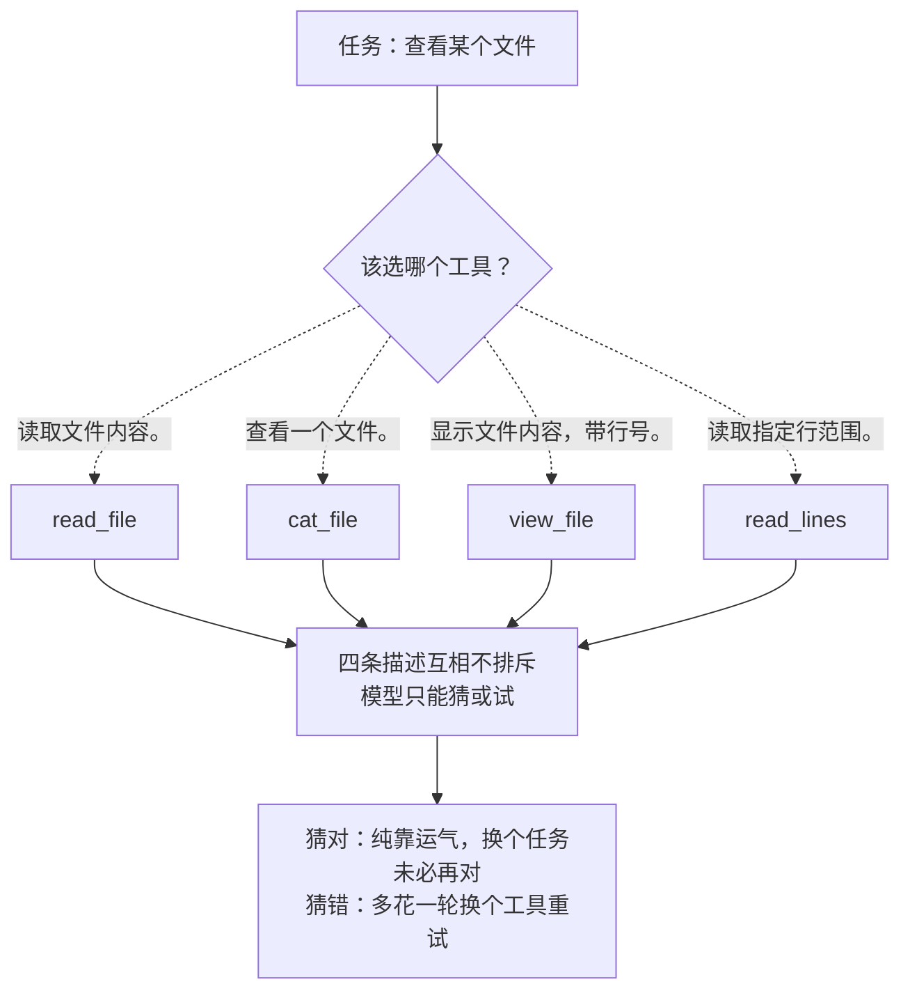

# 07 · 工具设计

> 一句话：工具集怎么设计，比工具本身怎么实现更影响 agent 表现——这一课没有新 API，全是判断。
>
> 预计消耗：约 5 次 API 调用（同一个任务，两套工具集各跑一遍）

## 1. 你会遇到的问题

真实项目里的工具不是一次性设计出来的，是一个个加上去的。第一天只有 `read_file`；第二周有人嫌它不够灵活，加了 `read_lines`；第三周接了个新模块，顺手抄了个 `cat_file`；第四周为了给终端用户看行号，又加了 `view_file`。

到第 8 个工具的时候，`read_file`、`cat_file`、`read_lines`、`view_file` 同时挂在工具列表里——四个都能"读文件"，谁也说不清这次该用哪个。你自己作为写这些工具的工程师，可能都答不上来。

Anthropic 官方的判断标准很直接：**如果人类工程师都说不清某个场景该用哪个工具，agent 更不可能做对。** 这一课不引入任何新 API，只用同一个任务、同一批工具实现，跑两套不同的工具*定义*，看设计怎么影响结果。

## 2. 心智模型



模型看不到你写工具时的心路历程，只看得到 `description` 这一行字。四条描述字面上都成立，模型没有任何依据分出优先级——这不是模型笨，是可用信息本身就不够。

## 3. 关键代码

完整代码见 [`index.ts`](./index.ts)。两套工具集共享同一个 `execute()` 实现，这一课比的是"怎么描述工具"，不是"工具怎么实现"。

臃肿版（8 个）的描述彼此不划边界，字面上都对：

```ts
{ name: "read_file", description: "读取文件内容。" }
{ name: "cat_file",  description: "查看一个文件。" }
{ name: "view_file", description: "显示文件内容，带行号。" }
```

精简版把"读文件"和"找文件里的某几行"拆成两件事，并且**在描述里主动说清楚边界**：

```ts
{ name: "read_file",
  description: "读取一个文件的全部内容。只在需要完整内容时用；只想找某几行就用 bash 跑 grep。" }
```

这句话干了两件事：说清楚 `read_file` 自己该在什么场景用，同时替模型指了一条路——"你以为要用我，但其实该用 `bash` + `grep`"。臃肿版那三条描述没有一条提过其他工具的存在，各说各话。

## 4. 跑一遍

```bash
http_proxy= https_proxy= all_proxy= bun run examples/07-tool-design/index.ts
```

> 报 HTTP 400 且返回一段 HTML？见根目录 README 的[跑不通怎么办](../../README.md#跑不通怎么办)。

真实终端输出（未经修改，直接粘贴）：

```
==============================================
臃肿工具集（8 个工具）
==============================================
  第 1 轮 → find_files({"pattern":"package.json"})
  第 2 轮 → read_file({"path":"package.json"})

  轮数：3
  工具调用序列：find_files → read_file
  首轮 input_tokens：647（其中工具定义占大头）

==============================================
精简工具集（3 个工具）
==============================================
  第 1 轮 → bash({"command":"cat package.json 2>/dev/null | head -100"})

  轮数：2
  工具调用序列：bash
  首轮 input_tokens：464（其中工具定义占大头）
```

如实说结果：**这次跑，臃肿版没有选错工具**——8 个里它挑了语义最贴切的 `read_file`，没跟 `cat_file` / `view_file` / `read_lines` 三个功能重叠的选项搞混。这跟 brief 预告的一致：模型完全可能在臃肿工具集下也顺利完成任务，不能指望每次都翻车。

但两个差距是确定的：

- **多走一轮。** 臃肿版先 `find_files` 确认文件存在，再 `read_file` 读内容；精简版一步 `bash cat` 拿到结果。8 个工具选项摆在面前，模型多做了一步"探路"，精简版没这个动作。
- **首轮 input_tokens：647 对 464，多 39%。** 这个差距和"选没选对工具"无关，纯粹是 8 个工具的 JSON 定义比 3 个的体积大，且这个体积每一轮都要重发一次，不是一次性成本。

## 5. 代价与边界

工具设计三条：

1. **职责不重叠。** 判断标准就是第 1 节那句话：人类工程师说不清该用哪个，agent 更不可能做对。同一件事只留一个工具能做，做不到就把边界写进描述里。
2. **`description` 是模型唯一能看到的说明。** 它看不到你的实现、你的注释、你脑子里"这个工具是给什么场景准备的"。参数名要自解释，边界要显式写进描述——第 3 节那句"只想找某几行就用 bash 跑 grep"就是范例。
3. **工具定义每轮都重发。**（第 05 课算过这笔账：固定开销随轮数累加。）8 个工具比 3 个贵，且贵在每一轮，轮数越多差距越大，不是加一次就完的一次性成本。

系统提示词也有同样的"划边界"问题，术语叫**高度（altitude）**：写得太低（一堆 if-else 式硬规则，比如"文件超过 100 行用 read_lines，文件名以 test 开头用 cat_file"）只能覆盖你想到的场景，规则数量最终会和工具数量一样爆炸；写得太高（"合理使用工具"）等于没说，模型没有可执行的判断依据。第 3 节那句"只在需要完整内容时用；只想找某几行就用 bash 跑 grep"是折中的好例子——给判断依据，不穷举场景。

## 6. 官方现在怎么做

> ⚠️ 本节需要 Anthropic 官方 key。第三方兼容端点大多不支持。

工具减到不能再减，还是有几十上百个（比如接了多个 MCP server）时，全部塞进每轮请求就不再是"设计问题"而是"规模问题"。官方方案是 **tool search**：把大部分工具标 `defer_loading: true`，它们不出现在常规请求体积里，模型需要时通过专门的搜索工具按需检索、加载：

```ts
tools: [
  { type: "tool_search_tool_bm25_20251119", name: "tool_search" },
  { ...readFileTool, defer_loading: true },
  { ...writeFileTool, defer_loading: true },
  // ……几十个不常用的工具都可以这样标记
]
```

**先做减法，再上工具搜索。** 工具搜索解决的是"工具太多，每轮带不起"，不解决"职责分不清"——8 个互相重叠的工具就算都标上 `defer_loading`，模型该选不出来还是选不出来，只是选不出来这件事被挪到了搜索那一步。

## 7. 相比上一课新增了什么

这一课没有新 API、没有新参数——`messages.create` 的调用方式和 03 课一模一样。`index.ts` 里唯一的新东西是**同一个任务、同一套工具实现，只换 `tools` 定义跑两遍**，用来对照"怎么描述工具"这一个变量的影响。教程主线到这里为止，重心第一次从"能不能跑通"移到"跑得好不好"。
