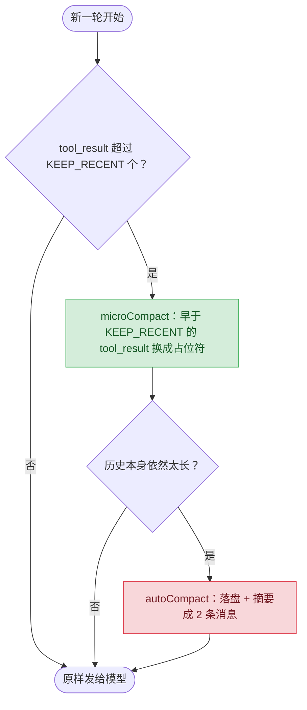

# 08 · 上下文压缩

> 工具输出一旦写进历史就不会再变，但没人让它别再重发一遍。这一课把旧输出换成占位符，扛不住再上摘要。
>
> 预计消耗：8～12 次 API 调用（两轮对照任务视模型路径而定，通常各 4～6 轮；外加 1 次 autoCompact 摘要调用）

## 1. 你会遇到的问题

03 课你看着 `input_tokens` 一路涨（469 → 984 → 1056 → 1117）。05 课把账拆开算清楚：跑 3 轮，累计发送 2116 token，其中 1276 token（60%）是在为上一轮已经发过的内容重复付费。

这 60% 里大头是工具输出。工具结果一旦写进 `messages`，内容就再也不会变，却因为"每轮重发全部历史"这条铁律（01 课：API 无状态），被后面每一轮原样再发一次。任务越长、工具调用越多，这部分死重就越大。

这一课动手解决：把不再需要逐字重读的旧工具输出，换成一句话占位符。

## 2. 心智模型

压缩分两级，一级不够才用二级：



`microCompact` 每轮都做，本地字符串替换，不花一次额外的模型调用。`autoCompact` 只在 `microCompact` 顶不住时才出手——它本身要发一次请求换一份摘要，代价高一个数量级。

## 3. 关键代码

完整代码见 [`index.ts`](./index.ts)。

**1. 为什么保留最近 `KEEP_RECENT` 个不动。** 模型刚拿到的工具结果，接下来的判断很可能还依赖它；这时候压掉，模型就"失忆"了，大概率重新调一次工具找回来，反而更贵。

```ts
const targets = new Set(ids.slice(0, -KEEP_RECENT)); // 除了最近 KEEP_RECENT 个，其余才是压缩对象
```

**2. 为什么占位符要带工具名和预览。** 只写「[已压缩]」，模型不知道自己做过什么、结果长什么样，大概率会重新调用同一个工具——白白多花一轮。

```ts
const preview = b.content.slice(0, PREVIEW_LENGTH).replace(/\n/g, " ");
return { ...b, content: `[已压缩：${name} 的输出，开头是 "${preview}…"]` };
```

**3. 为什么 `autoCompact` 必须先落盘。** 摘要是有损压缩，细节会丢；原始记录留一份文件，真出问题能翻回去查，不至于信息彻底消失。

```ts
const path = `.transcripts/transcript_${Date.now()}.jsonl`;
await Bun.write(path, messages.map((m) => JSON.stringify(m)).join("\n"));
```

## 4. 跑一遍

```bash
http_proxy= https_proxy= all_proxy= bun run examples/08-compaction/index.ts
```

> 报 HTTP 400 且返回一段 HTML？见根目录 README 的[跑不通怎么办](../../README.md#跑不通怎么办)。

真实终端输出（未经修改，直接粘贴）：

```
==============================================
不压缩
==============================================
  第  1 轮  input=   379
  第  2 轮  input=   505
  第  3 轮  input= 15093
  第  4 轮  input= 15249
  第  5 轮  input= 15564
  —— 5 轮，峰值 15564，累计 46790

==============================================
开启 microCompact
==============================================
  第  1 轮  input=   379
  第  2 轮  input=   531
  第  3 轮  input=  5351
  第  4 轮  input=  2289
  —— 4 轮，峰值 5351，累计 8550

==============================================
对比
==============================================
  峰值 input_tokens   15564  →  5351
  累计 input_tokens   46790  →  8550
  累计省下 82%

==============================================
autoCompact 演示
==============================================
  原始历史已存到 .transcripts/transcript_1787041946758.jsonl
  压缩前 4 条消息（199 字符）
  压缩后 2 条消息（239 字符）

  摘要内容：
  [历史已压缩，原始记录见 .transcripts/transcript_1787041946758.jsonl]

  已完成工具模块重构，将 src 下的工具模块拆分为 bash.ts、file.ts、todo.ts 三个文件；当前正在为拆分后的模块补充测试；关键决定是放弃单一文件，按功能拆分为三个独立模块。
```

模型对 7 个 README 分别调用了 `read_file`（不是一条 `bash` 命令批量 `cat`），每次几 KB 的结果都单独写进 `messages`——第 3 轮那次跳变（不压缩 505→15093，压缩 531→5351）就是这 7 次结果一起进入历史的瞬间。开着 `microCompact` 时，其中已经滑出 `KEEP_RECENT` 窗口的结果被换成了占位符，同一轮涨幅小了近 3 倍；4 轮之后任务就问完了，比不压缩少跑一轮。

峰值降了 66%（15564→5351），累计降了 82%（46790→8550）。**这个差距成立的前提是工具输出真的大**：如果这次任务模型选择一条 `bash` 命令把 7 个文件一次性 `cat` 出来，工具结果会挤在一个 `tool_result` 里，`COMPACT_THRESHOLD` 照样会压它，但压缩时机更晚、可比较的中间轮次更少，效果不会有这么明显——这不是 bug，是 `COMPACT_THRESHOLD` 按大小决策的正常结果。

`autoCompact` 演示里有个反直觉的地方：压缩后的字符数（239）比压缩前（199）还多。这份示例只有 4 句简短对话，摘要要把"完成了什么 / 进行到哪 / 关键决定"写全，天然比这四句大白话啰嗦。`autoCompact` 真正省的是消息**条数**（4→2）和后续每轮**重复发送的次数**，不是这个玩具例子的绝对字符数——历史越长，摘要相对原文的压缩比才会显现出来。

## 5. 代价与边界

压缩是有损的，代价体现在三处：

- **模型可能想重看被压掉的内容，却只剩一句预览。** 占位符不是完整备份，真要核对细节，模型看不到，只能猜或者重新调用工具。
- **`autoCompact` 本身要花钱花时间。** 它是一次额外的 API 调用（`max_tokens: 2000`），跑一次摘要就多一份延迟和账单，不是免费操作。
- **摘要质量不稳定。** 模型总结历史时可能漏掉某个关键决定或数字，而这种丢失不会报错，只会在后面某一步突然对不上。

三个代价的共同后果：能少压就少压。所以顺序永远是先 `microCompact`（便宜、本地、大部分信息原样保留），扛不住了才上 `autoCompact`（贵、有损、留后路）。

## 6. 官方现在怎么做

> ⚠️ 本节需要 Anthropic 官方 key。第三方兼容端点大多不支持。

官方原生提供两级压缩，跟这一课的 `microCompact` / `autoCompact` 是同一个思路，只是搬到了服务端。

**Context editing**——服务端自动清掉旧的工具结果，相当于内置版 `microCompact`：

```ts
context_management: { edits: [{ type: "clear_tool_uses_20250919" }] },
```

加请求头 `betas: ["context-management-2025-06-27"]`。

**Compaction**——服务端自动摘要，相当于内置版 `autoCompact`：

```ts
context_management: { edits: [{ type: "compact_20260112" }] },
```

加请求头 `betas: ["compact-2026-01-12"]`。

**关键提醒**：用 compaction 时，下一轮必须把 `response.content` 整个原样追加回 `messages`。摘要是以独立内容块的形式回来的，只取文字（比如手写抠出 `text` 块）会把 compaction 块丢掉，历史状态直接断裂，后面的请求等于没压缩过。

实测：这两个 beta 在很多第三方兼容端点上会被网关直接拦掉，返回 400。用本课配置的端点测试时没有 400——两次请求都拿到了正常的 200 响应；但返回体里没有 `context_management.applied_edits` 字段，无法确认服务端到底执行了压缩还是把这两个参数悄悄丢弃了。跟 05 课 `cache_control` 的结论一样：接受参数、不报错，不代表真的生效。

## 7. 相比上一课新增了什么

循环本身照抄 03 课：还是「调用模型 → 有 `tool_use` 就执行 → 结果塞回 `messages` → 下一轮」。唯一的改动是这一行——每轮调用模型之前，先把 `messages` 过一遍 `microCompact`：

```ts
if (useCompact) messages = microCompact(messages);
```

新增的是两个函数：`microCompact`（本地、同步、不花 API 调用，接进了主循环）和 `autoCompact`（花一次 API 调用，这一课只做了独立演示，没有接进主循环）。
