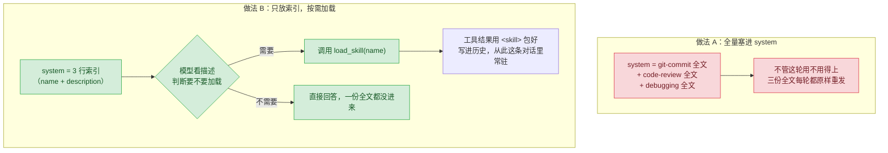

# 09 · 按需加载

> 一句话：专业知识不写死进 system prompt，只放一行「什么时候用」的索引，模型开口要了再把全文塞进去。
>
> 预计消耗：3 次 API 调用（A 一轮直接答完；B 先 `load_skill` 取全文，再答，两轮）

## 1. 你会遇到的问题

agent 要写好一条提交信息、做一次靠谱的代码审查、系统化地定位一个 bug，都需要专业知识——不是模型不懂这些道理，是不知道**你的项目**具体要求多严、审查按什么顺序看、调试要先做哪一步。直觉做法是把这些知识整段写进 system prompt，反正模型每次都能看到。

05 课已经算过这笔账：system prompt 是每一轮都原样重发的固定开销，不是一次性成本（05 课实测：553 token 的固定开销，比问题本身贵 111 倍）。这一课的三份知识加起来只有 5699 字符，摊到 system prompt 里，首轮 `input_tokens` 就从几十跳到三千多——而多数任务用不上这三份里的两份。知识越攒越多，这个"每轮都带着用不上的东西"的浪费只会越来越夸张。

正确做法是只在 system prompt 里放一行"这是什么、什么时候用"，全文留在磁盘上，模型判断需要时自己调工具去取。

## 2. 心智模型



A 那条路径没有分支——三份知识不管用不用得上，字节数原样进每一轮的 system。B 那条路径多了一步判断：模型先看索引里的 `description` 决定要不要加载，加载了才为那一份的全文付费，没用上的两份从头到尾没进过这条对话。

## 3. 关键代码

完整代码见 [`index.ts`](./index.ts)，三份知识见 [`skills/`](./skills/)。

**解析 frontmatter。** 每个 `SKILL.md` 开头是 `---` 包起来的元信息，正则一次性切开头部和正文，头部按 `:` 拆成键值对，这里只取 `name` 和 `description` 两个字段：

```ts
const match = text.match(/^---\n([\s\S]*?)\n---\n([\s\S]*)$/);
for (const line of match[1]!.split("\n")) {
  const i = line.indexOf(":");
  if (i > 0) meta[line.slice(0, i).trim()] = line.slice(i + 1).trim();
}
```

**`description` 要写"什么时候用"，不是"这是什么"。** 模型只看得到这一行，判断"这轮任务要不要加载它"全靠这行字。三份知识的 description 都以场景开头：

```
git-commit:  写 git 提交信息时用。讲清楚主题句多长合适、什么时候要写正文……
code-review: 做代码审查时用。讲清楚正确性和风格谁优先……
debugging:   遇到 bug、测试失败或者行为跟预期不符时用，动手改代码之前先……
```

反过来，如果写成"这是一份关于 git 提交规范的说明文档"，模型拿到的是"这份东西讲了什么"，判断不出"这轮任务是不是该用它"——第 5 节还会回到这一点。

**`load_skill` 的返回用 `<skill>` 标签包起来**，和 A 做法里塞进 system 的格式完全一致：

```ts
// A：拼进 system 时
`<skill name="${s.name}">\n${s.body}\n</skill>`

// B：工具返回时，格式原样复用
function loadSkillContent(name: string): string {
  const skill = SKILLS.find((s) => s.name === name);
  return `<skill name="${skill.name}">\n${skill.body}\n</skill>`;
}
```

两种做法最终喂给模型的知识长一个样，只是进入对话的时机和路径不同——这样对比才公平，不会因为格式不同影响模型怎么用这份知识。

## 4. 跑一遍

```bash
http_proxy= https_proxy= all_proxy= bun run examples/09-progressive-disclosure/index.ts
```

> 报 HTTP 400 且返回一段 HTML？见根目录 README 的[跑不通怎么办](../../README.md#跑不通怎么办)。

真实终端输出（未经修改，直接粘贴）：

```
加载到 3 份知识：git-commit, code-review, debugging
正文合计 5699 字符


==============================================
A · 全部塞进 system
==============================================
  第 1 轮  input=3327
  —— 1 轮，首轮 3327，累计 3327

==============================================
B · 只放索引，按需加载
==============================================
  第 1 轮  input=458
    → load_skill({"name":"git-commit"})
  第 2 轮  input=1410
  —— 2 轮，首轮 458，累计 1868

==============================================
对比
==============================================
  首轮 input_tokens   3327  →  458
  累计 input_tokens   3327  →  1868
```

三个数字：

1. **首轮 3327 对 458，少了 86%。** A 的 system 一次性塞进三份全文（5699 字符），B 的 system 只有三行索引，差距和第 05 课的结论一致——system 是每轮固定成本，塞得越多越贵。
2. **B 确实多花一轮。** A 没有工具，直接回答；B 先调 `load_skill("git-commit")`，第 2 轮才回答——任务只用到 `git-commit` 一份，`code-review` 和 `debugging` 从头到尾没被加载。
3. **累计 3327 对 1868，B 仍然更省（44%）。** 这一点第 5 节要讲清楚为什么——不是必然的，是这次三份知识凑巧不大。

## 5. 代价与边界

**这次的结果不是必然的，如实记录条件。** brief 提醒过一种可能：B 多一轮，且加载进来的那份知识也进了历史，如果任务只用一份知识、总共只跑两三轮，B 的累计token可能反而比 A 高。实测下来这次 B 仍然更省，原因是三份知识全文合计只有 5699 字符（约 3300 token），而 B 多付出的"一轮往返"成本（索引本身 + 一轮消息往返的固定开销，约 458 token）远小于"省下两份没用上的知识"（约 3800 字符）。

把账拆开看：

- **B 省的钱** = 用不上的知识份数 × 单份大小。这次是 2 份没用上，省了大头。
- **B 多花的钱** = 多出的一轮往返开销（index 常驻的 system + 一轮消息的固定结构）。这次很小，因为索引本身只有三行字。

只要「省的」大于「花的」，B 就划算。三份知识、只用一份，这次刚好还是划算的；但如果知识总量本来就小（比如只有 1 份，B 连"省下没用上的"这件事都不成立），或者单次任务要用到大部分知识（比如同时要 `git-commit` 和 `code-review`，两轮 `load_skill`），B 多花的往返成本占比就会明显上升，优势会被摊薄，甚至抵消。

**按需加载省的是"用不上的那些"，收益 = 知识总量 × 用不上的比例。** 只有三份知识、任务恰好用到一份时，优势已经不算小，但这更多是因为这次全文本来就不大；真正的价值在知识有几十份的时候——A 的 system prompt 会随知识数线性变长，B 的 system prompt 永远只有一份索引那么大，不管背后挂了 3 份知识还是 300 份。

**另外，description 写得不好，这一整套等于白搭。** 模型只靠这一行字判断"要不要加载"——写得含糊，模型要么该加载的时候不加载（任务做不好），要么每次都保守地把好几份都加载一遍（退化成比 A 还贵，因为多付了好几轮往返）。

## 6. 官方现在怎么做

> ⚠️ 本节需要 Anthropic 官方 key。第三方兼容端点大多不支持。

同一个思路，官方有两个方向的产品化实现——一个把它用在"工具定义"上，一个直接把 `SKILL.md` 这套机制原生支持。

**Tool search。** 07 课已经从"工具选不准"的角度提过这个参数，这里是同一个机制的另一面："工具定义太多，每轮带不起"。把大部分工具标 `defer_loading: true`，它们不占常规请求体积，配合专门的搜索工具，模型先搜再加载——对象从"知识正文"换成了"工具 JSON 定义"，思路和这一课的 `load_skill` 完全一样：

```ts
tools: [
  { type: "tool_search_tool_bm25_20251119", name: "tool_search" },
  { ...gitCommitTool, defer_loading: true },
  { ...codeReviewTool, defer_loading: true },
  // ……几十个不常用的工具都可以这样标记
]
```

至少要留一个工具不标 `defer_loading`（比如上面的 `tool_search` 本身），全部 defer 会直接报 400。

**Agent Skills。** 官方把这一课手写的"目录 + frontmatter + 按需加载"机制原生产品化了，通过 `container.skills` 声明一批技能，运行时由平台负责索引、判断、加载全文，不用自己写 `loadSkills` / `load_skill` 这套解析和分发逻辑。

## 7. 相比上一课新增了什么

循环、工具分发照抄 03 课，没有新执行机制。新增的是两块：

- 新增 `skills/` 目录和三份 `SKILL.md`——第一次把"专业知识"当成一种要管理生命周期的资源，而不是写死在代码里的字符串。
- 新增 `load_skill` 工具，system prompt 从"装全文"变成"装索引"——05 课量化了"system 每轮重发"的代价，这一课是第一次针对这个代价给出具体解法：不是让内容变小，是让大部分内容大多数时候根本不在场。
