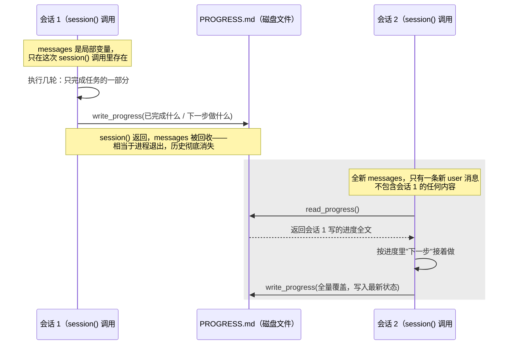

# 10 · 外部记忆与进度

> 一句话：01 课靠"每轮重发历史"让模型看起来记得事——但历史只活在 `messages` 数组里，进程一退就没了；这一课把状态写到进程之外，让下一次会话接得上。
>
> 预计消耗：两次独立会话共约 8～15 次 API 调用（各会话轮数随模型路径浮动；本课实录跑出 4 + 7 = 11 次）

## 1. 你会遇到的问题

01 课证明了模型本身不存任何东西："记忆"是你自己把完整历史每轮重发一遍。这招管用的前提是：
历史还在——也就是那个 `messages` 数组还活在内存里。

真实的长任务撑不住这个前提。翻译一个几百个文件的仓库、跑一个要审批因而会被人晾几小时的任务、
限流之下故意分批执行——都会经历进程重启。`messages` 数组随进程一起消失，下一次运行是全新的
一次调用，**没有任何"重发历史"的历史可发**。

这一课解决的不是"怎么记住对话"，是"进程退出之后，下一次的自己怎么知道上一次做到哪了"。

## 2. 心智模型



两次会话之间唯一的信息通道是磁盘上的一个文件，不是共享的变量、不是同一个进程。会话 2 能不能
接上，完全取决于它**主动去读**这个文件——这正是第 4 节要验证的地方。

## 3. 关键代码

完整代码见 [`index.ts`](./index.ts)。

**1. `messages` 是 `session()` 内的局部变量，这是刻意的。**

```ts
async function session(label: string, userInput: string) {
  const messages: Anthropic.MessageParam[] = [{ role: "user", content: userInput }];
  // ...循环若干轮...
}
```

`session()` 调用两次，两次的 `messages` 互不相干。函数一返回，第一次那份就没了——不用真的
开两个进程来演示"进程退出"，一个函数作用域的生命周期就足够模拟这件事。

**2. system prompt 里那句"下一次会话的你只能看到这个文件"是让机制生效的关键。**

```
你随时可能被中断，下一次会话的你只能看到这个文件，看不到现在的对话。
所以写给未来的自己看，别省略上下文。
```

没有这句话，模型没有理由主动维护一份"给未来自己看"的交接文档——它默认自己的对话是连续的，
写出来的东西更像是给当前用户的总结（"我刚刚做了……"），而不是给一个完全不知情的自己看的
进度记录。这句约束不是装饰，是整个机制唯一的强制力来源。

**3. `write_progress` 是全量覆盖，不是追加。**

```ts
write_progress: async ({ content }) => {
  await Bun.write(PROGRESS_FILE, content);   // 覆盖，不是 append
  return `进度已更新（${content.length} 字符）`;
},
```

如果改成追加，每次会话都会在文件末尾接一段，跑上十次会话，`PROGRESS.md` 自己就变成一部
长篇累牍的流水账——`read_progress` 把它整个读进来又是一截 input tokens，等于把"上下文膨胀"
从 `messages` 数组搬到了进度文件里，问题没解决，只是换了个地方发作。全量覆盖强迫模型每次
都提炼出"当前最新状态"，只留活的信息。

## 4. 跑一遍

```bash
http_proxy= https_proxy= all_proxy= bun run examples/10-memory-progress/index.ts
```

> 报 HTTP 400 且返回一段 HTML？见根目录 README 的[跑不通怎么办](../../README.md#跑不通怎么办)。

真实输出（已截短）：

```
==============================================
第 1 次会话
==============================================
    → bash({"command":"ls examples/"})
    → bash({"command":"wc -l examples/01-first-call/README.md examples/02-first-tool/..."})
    → write_progress({"content":"# 任务进度：统计 examples 目录下每课 README.md 的行数..."})
  [第 4 轮] 已完成前两课的统计：
- examples/01-first-call/README.md = 127 行
- examples/02-first-tool/README.md = 146 行
进度已写入进度文件，本次会话到此结束。
  —— 会话结束，共 4 轮

----------------------------------------------
进度文件现在的内容：
----------------------------------------------
## 已完成
- 本次会话统计了前两课：01-first-call = 127 行，02-first-tool = 146 行
## 下一步
- 后续会话统计剩余课程（03 到 10）：03-tool-loop、04-sandbox-approval、...

==============================================
第 2 次会话（全新上下文，只有进度文件）
==============================================
    → read_progress({})
  [第 2 轮] 进度文件显示，之前已经统计了前两课。现在继续统计剩余课程。
    → bash({"command":"wc -l examples/03-tool-loop/README.md ..."})
  ...（中间几轮：发现部分目录还没有 README.md，检查目录结构，逐一补齐剩余课程的统计）
    → write_progress({"content":"# 任务进度...## 任务状态：✅ 已完成..."})
  [第 7 轮] 任务已经完成。以下是这次会话的结果汇总：...
  —— 会话结束，共 7 轮
```

**关键验证点通过：第 2 次会话的第一个动作就是 `read_progress()`**，不是瞎猜也不是从头重做。
它读到"已完成 01/02、下一步做 03～10"之后，才开始继续统计——`messages` 里没有这句话的任何
痕迹，这个动作完全来自进度文件 + system prompt 的约束。

第 1 次会话 4 轮，第 2 次会话 7 轮；第 2 次轮数更多是因为它中途发现 `08-compaction` 和本课
自己的目录当时还没有 `README.md`（这两课在本次实录跑的时候确实还没写完），多花了几轮去核实
目录结构、排除掉不存在的文件，最后仍然正确汇总了已存在的 7 份 README 的行数。

## 5. 代价与边界

- **进度文件本身也占上下文。** `read_progress` 读回来的内容要塞进这一轮的 `messages`，文件
  越写越详细，读回来的 token 就越多——它不是免费的外部存储，只是把成本挪到了"要不要读"这个
  可选动作上。
- **模型可能忘记更新。** system prompt 只是约束，不是强制。如果模型在某一轮做了事却没调用
  `write_progress`，进度文件和实际状态就会不同步，下一次会话会从一个过时的起点接着做。
- **全量覆盖意味着写错一次就丢一次历史。** 这一课没有版本控制——`write_progress` 覆盖的
  瞬间，上一版内容就没了。真实项目里更稳的做法是每次更新进度顺带 `git commit`，进度文件的
  历史版本靠 git log 找回，而不是指望这一课的机制自己留痕。

## 6. 官方现在怎么做

> ⚠️ 本节需要 Anthropic 官方 key。第三方兼容端点大多不支持。

这一课自己设计了进度文件的格式、自己写了 `read_progress` / `write_progress` 两个工具——
官方把"记什么、怎么存"这件事标准化成了一个内置工具：

```ts
tools: [{ type: "memory_20250818", name: "memory" }]
```

模型通过统一的命令集合（`view` / `create` / `str_replace` / `insert` / `delete` / `rename`）
读写一个专属的记忆目录，不用你去发明文件格式、不用你手写"覆盖还是追加"这类决定——协议本身
定死了这些操作的语义。TypeScript/Python SDK 还提供了 `betaMemoryTool`，只要你实现一个"存储
后端"（本地文件系统、数据库都行），就能把这些命令接到真实存储上：

```ts
import { betaMemoryTool, BetaLocalFilesystemMemoryTool } from "@anthropic-ai/sdk/tools/memory/node";

const memory = await BetaLocalFilesystemMemoryTool.init("./memory");
const tool = betaMemoryTool(memory);   // 命令级读写全部委托给这个 handler
```

这一课手写的 `PROGRESS.md` 读写，本质上是官方 memory tool 的一个极简单文件版本——命令集合
从"两个自定义工具"收窄成"一套标准协议"，好处是不用每个项目重新发明格式，代价是存储结构要
按官方定的命令集合来组织，不能再随手写一段 markdown 了事。

## 7. 相比上一课新增了什么

- 新增 `PROGRESS.md` 作为进程外的持久状态，以及两个操作它的工具：`read_progress` / `write_progress`
- system prompt 里第一次出现"你随时可能被中断，下一次会话的你看不到现在的对话"这类约束——
  之前几课的 system prompt 只讲角色和规矩，没讲过"你的记忆会消失"
- 结构上的变化：一次运行里跑了**两次独立的 `session()` 调用**，第二次的 `messages` 完全不
  包含第一次的任何内容，只能靠磁盘上的文件接上——之前每一课都只有一个 while 循环，这一课
  第一次出现"循环套循环、状态在循环之间靠外部文件传递"的结构
- agent 循环骨架、`bash` 工具的实现，跟前几课相同，没有改动
