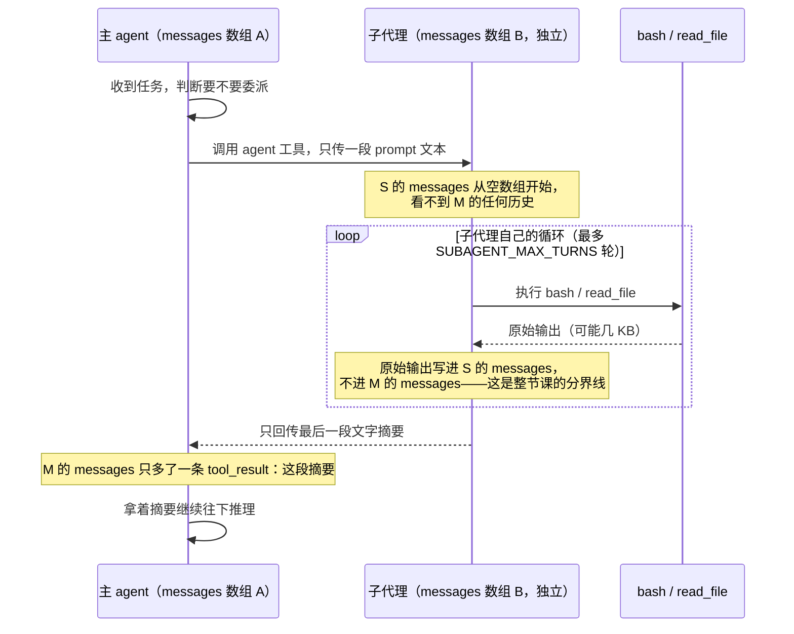

# 11 · 子代理

> 一句话：子代理没有魔法——就是给它另开一个 `messages` 数组。工具的原始输出留在那个数组里，主 agent 只收到最后一段摘要。
>
> 预计消耗：正式 A/B 对照共 8 次调用（A 3 次 + B 5 次；本课这次跑 B 没有触发委派）。

## 1. 你会遇到的问题

前几课的调查任务，结果都直接写回主 agent 自己的 `messages`：`bash` 吐出的目录列表、`read_file`
读回的整份文件内容，不管这一轮真正要的答案有多短，原始输出照单全收。01 课定的铁律是每轮都要把
完整历史重发一遍——工具输出越大，这条铁律就越贵。

08 课处理过这个问题的一半：工具输出一旦写进 `messages` 就不会再变小，那一课把旧输出换成占位符，
是**事后**瘦身。这一课换个角度堵在更前面——一次"翻遍所有文件找答案"的调查，压根不让原始内容
进主 agent 的 `messages`。派一个子代理去干这活，它自己开一份 `messages`，脏活全留在那边，主
agent 的历史里只会多一行摘要。

## 2. 心智模型



`M` 和 `S` 是两个互不相干的数组，函数一返回，`S` 就被回收——跟 10 课"进程退出后 `messages`
消失"是同一种生命周期，只是这次不用等进程退出，一次函数调用就够了。

## 3. 关键代码

完整代码见 [`index.ts`](./index.ts)。

**1. 隔离的全部实现，就是这一行局部变量声明。**

```ts
async function runSubagent(prompt: string): Promise<string> {
  const messages: Anthropic.MessageParam[] = [{ role: "user", content: prompt }];
  // ……自己的循环，自己的 messages……
}
```

没有沙箱、没有独立进程、没有什么专门的"子代理运行时"。`runSubagent` 里的 `messages` 跟
`runMain` 里的 `messages` 不是同一个引用，函数返回后这份历史就没了——读者以为的高级机制，
拆开看只是"不共享那个变量"。

**2. 子代理的工具集里为什么不能有 `agent`。**

```ts
// 主 agent（调用处）：tools = [...BASE_TOOLS, AGENT_TOOL]
// 子代理（runSubagent 内部）：
const res = await client.messages.create({
  model: MODEL, max_tokens: MAX_TOKENS,
  system: "你是一个调查子代理……",
  messages, tools: BASE_TOOLS,        // 注意：没有 AGENT_TOOL
});
```

子代理拿到的工具集比主 agent 少一个 `agent`。如果子代理也能看见这个工具，它可以再派一个子代理，
那个子代理还能再派——没人保证它会停，进程和账单都可能被这条递归链拖垮。收窄工具集是唯一的防线，
不是靠模型"自觉不递归"。

**3. 只回传最后一段文字，中间过程整段丢弃。**

```ts
const summary =
  lastResponse?.content
    .filter((b): b is Anthropic.TextBlock => b.type === "text")
    .map((b) => b.text)
    .join("") || "(子代理没有产出摘要)";
return summary;
```

子代理跑了几轮、读了几个文件、每次工具输出多长——这些都留在它自己的 `messages` 里，函数一返回
跟着一起被回收。`runSubagent` 的返回值就是这一段字符串，主 agent 能看到的只有它。

## 4. 跑一遍

```bash
bun run examples/11-subagent/index.ts
```

> 报 HTTP 400 且返回一段 HTML？见根目录 README 的[跑不通怎么办](../../README.md#跑不通怎么办)。

```
==============================================
A · 主 agent 自己动手
==============================================
  第  1 轮  主上下文 input=371
    → bash({"command":"find examples -type f -name README.md"})
  第  2 轮  主上下文 input=583
    → read_file({"path":"examples/01-first-call/README.md"})
    → read_file({"path":"examples/02-first-tool/README.md"})
    ...（一口气读了 13 个 README）
  第  3 轮  主上下文 input=30908
  —— 5 轮，主上下文峰值 31275

==============================================
B · 派给子代理
==============================================
  第  1 轮  主上下文 input=520
    → bash({"command":"ls -la examples/"})
  第  2 轮  主上下文 input=1201
    → 派出子代理
      [子代理] read_file({"path":"examples/01-first-call/README.md"})
      [子代理] read_file({"path":"examples/02-first-tool/README.md"})
      ...（同样读了 13 个）
      [子代理] 内部消耗 31451 tokens，回传摘要 826 字符
  第  3 轮  主上下文 input=1949
  —— 3 轮，主上下文峰值 1949

==============================================
对比
==============================================
  主上下文峰值   31275  →  1949
  主 agent 轮数  5  →  3
```

三个数字放在一起看才有意思：

1. **主上下文峰值从 31275 降到 1949，少了 94%。** 13 个 README 的原始内容，
   A 组全灌进了主上下文，B 组一个字都没进来——主 agent 只拿到 826 字符的摘要。
2. **子代理内部消耗 31451 tokens，几乎等于 A 组的 31275。** 同样的文件总要有人读，
   这笔钱没省。
3. **主 agent 轮数从 5 降到 3。** A 组要自己安排读哪些、怎么读；B 组一句话派出去就等结论。

## 5. 代价与边界

**省的是主上下文，不是总花费。** 上面第 2 条已经说明了——子代理烧的 31451 tokens
一样要付钱。这一课换来的是主 agent 的上下文干净，不是账单变便宜。
真正省钱要靠第 08 课的压缩，或者给子代理换个更便宜的模型。

**子代理看不见主对话。** 它只有你写在 `prompt` 里的那些字。任务描述含糊，
它就做偏——而且你还没法中途纠正它。

**摘要是有损的。** 主 agent 想追问某个细节，只能重派一个子代理再读一遍。

**光给工具不给指引，模型多半不会用。** 这一课初版没有 `DELEGATE_SYSTEM`，
只是把 `agent` 工具挂上去，结果模型全程自己一把梭，一次都没派。
加上"遇到要翻多个文件的调查任务就委派"这句话之后才正常工作。
这跟第 07 课的结论是同一件事：**description 和 system prompt 是模型判断的唯一依据。**

**任务不够重时看不出差别。** 如果只问"哪一课行数最多"，模型一条 `wc -l` 就够了，
文件内容根本不会进上下文，A、B 两组峰值几乎一样。委派的价值和"被隔离掉的内容有多大"
成正比。

## 6. 官方现在怎么做

> ⚠️ 本节需要 Anthropic 官方 key。第三方兼容端点大多不支持。

Managed Agents 把"派子代理"做成了一等公民，叫 **multiagent**。协调者配置里加一个跟 `tools`
同级的字段，最小可用只要一行：

```ts
multiagent: {
  type: "coordinator",
  agents: [{ type: "self" }],   // 派自己的副本去做子任务
},
```

`{ type: "self" }` 派出的副本用同一个 model、system、工具集，但**没有继续委派的能力**——
跟这一课手写的"子代理拿不到 `agent` 工具"是同一条防线。区别是官方做成了硬校验：
roster 成员自己再带 `multiagent.agents`，创建时就报错，不用等运行时才发现递归。

翻文件这类"读得多、想得少"的活可以派给便宜模型，在 roster 里加一个独立 agent 引用即可：

```ts
const worker = await client.beta.agents.create({
  name: "文件阅读工",
  model: "claude-haiku-4-5",       // 读得多、想得少，用便宜档
  system: "只回答给你的那个问题，读完汇报结论和依据。",
  tools: [{ type: "agent_toolset_20260401" }],
});

multiagent: { type: "coordinator", agents: [worker.id, { type: "self" }] },
```

worker 用自己的模型独立跑，账单按它的价格算——这正好对上第 5 节那笔账：
子代理的 token 省不掉，但可以让它更便宜。

本质和 `runSubagent()` 是同一件事：独立上下文、收窄工具、只回传结论。
差别在于那个"独立的 `messages` 数组"从你的局部变量，变成了服务端持久化的 thread，
并且原生支持并发多个副本。

## 7. 相比上一课新增了什么

- 新增 `AGENT_TOOL`（只给主 agent）和 `runSubagent()`（独立 `messages`、独立循环、`tools:
  BASE_TOOLS` 不含 `AGENT_TOOL`）。
- 主循环结构没变，还是 03 课那套「调用模型 → 有 `tool_use` 就执行 → 结果塞回 `messages` →
  下一轮」，只多了一处分支：`block.name === "agent"` 时走 `runSubagent()`，否则走原来的
  `toolHandlers` 分发表。
- 第一次同一个进程里出现"两份互不相干的 `messages`"——不是 10 课那种前后两次会话，是同一轮
  里主 agent 和子代理各自独立地在跑自己的小循环。
- `bash`、`read_file` 两个基础工具的实现，跟前几课相同，没有改动。
