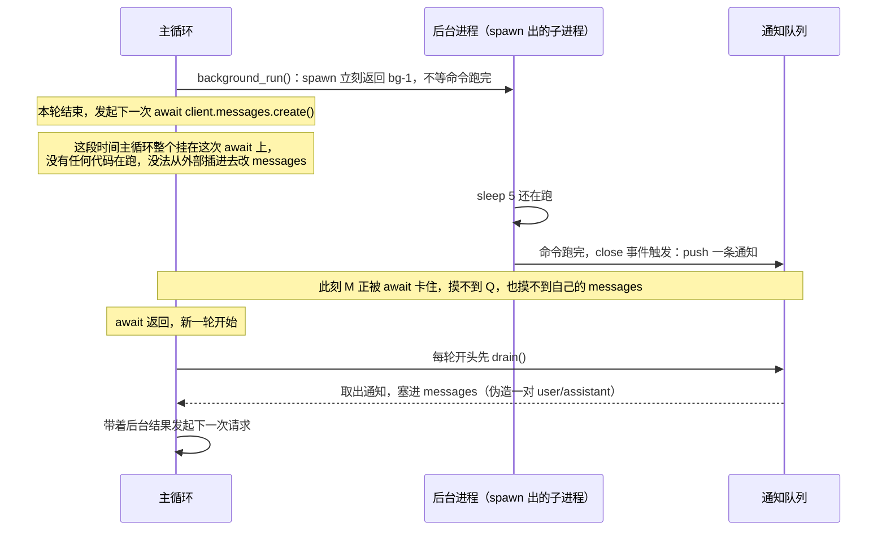

# 12 · 后台任务

> 一句话：起个 dev server、跑一次要几十秒的构建，同步执行会让整个 agent 循环卡在原地——这一课把执行改成非阻塞，再把异步完成的结果通过一对伪造的 user/assistant 消息注入回对话。
>
> 预计消耗：约 4 次 API 调用（本课实录跑出 4 轮；含一次真实的 5 秒后台等待，轮数随模型是否直接干等而浮动）

## 1. 你会遇到的问题

`npm install`、跑一遍测试、起一个 dev server——这些命令动辄几十秒。前面几课的 `bash` 工具都是同步的：发起命令、`await` 它跑完、把结果塞进 `tool_result`。命令跑多久，整个 agent 循环就卡多久。

这不只是慢。同步执行意味着**命令跑完之前，agent 没有第二件事可做**——不能顺手去干别的，不能给用户看进度，模型自己也没机会说"我先干点别的，等会儿回来看"。真实场景这种命令常常还不止一条：起完 dev server 还要跑 lint，跑完 lint 还要等测试，全部串行等，等待时间线性叠加。

这一课把慢命令挪到后台执行，agent 立刻拿回控制权。

## 2. 心智模型



后台任务完成的那一刻和主循环能安全处理它的那一刻，几乎从来不是同一时刻——中间隔着一次网络请求的往返。队列的作用就是把这两个时刻接起来。

## 3. 关键代码

完整代码见 [`index.ts`](./index.ts)。

**1. `spawn` 立刻返回，结果要等 `close` 事件才知道。**

```ts
run(command: string): string {
  const id = `bg-${++this.seq}`;
  const child = spawn("sh", ["-c", command], { cwd: process.cwd() });
  child.on("close", (code) => {
    task.status = code === 0 ? "completed" : "failed";
    task.output = buf.trim().slice(0, 2000) || "(没有输出)";
    this.queue.push({ id, command, status: task.status, output: task.output });
  });
  return `后台任务 ${id} 已启动：${command}`;   // 函数在这里就返回了，不等 close
}
```

`run()` 返回的是"已启动"的确认，不是命令的结果。真正的结果在 `close` 回调里产生，跟 `run()` 的返回是两个不同的时刻——这就是非阻塞的全部秘密。

**2. 为什么要队列，而不是直接把结果塞进对话。**

`close` 回调触发时，主循环大概率正卡在 `await client.messages.create()` 上——一次网络请求的中间，没有任何安全的插入点能让外部代码去改 `messages` 数组。所以 `close` 回调不碰 `messages`，只把结果存进自己的 `queue`：

```ts
// 命令跑完了，但主循环这会儿可能正在等 API 响应。
// 所以不能直接打断它，只能先放进队列。
this.queue.push({ id, command, status: task.status, output: task.output });
```

队列把"什么时候完成"和"什么时候告诉模型"这两件事解耦——完成时间由 `close` 事件决定，通知时间由主循环的节奏决定，两者不用互相等。

**3. 注入为什么要伪造一对 user/assistant 消息。**

主循环每轮开头 `drain()` 一次队列，有结果就塞进 `messages`：

```ts
messages.push({ role: "user", content: `<background-results>\n${text}\n</background-results>` });
messages.push({ role: "assistant", content: "收到后台结果。" });
```

`messages` 是一问一答的结构，模型每轮的输出都紧跟在一条 user 消息后面。这次注入前，数组末尾大概率已经是一条 user（上一轮的 `tool_result`）——如果只插一条 user 消息就完了，下一次请求发出去时数组里会连续出现两条 user，跟模型熟悉的交替节奏对不上。补一条 assistant 确认把这轮对话闭合成一次完整的问答，下一次真正的请求看到的还是干净的交替结构。这个细节读者自己写的时候一定会踩。

## 4. 跑一遍

```bash
http_proxy= https_proxy= all_proxy= bun run examples/12-background/index.ts
```

```
  → background_run({"command":"sleep 5 && echo 后台任务跑完了"})
    后台任务 bg-1 已启动：sleep 5 && echo 后台任务跑完了
  → bash({"command":"find examples -name \"index.ts\" | wc -l"})
    12

[第 2 轮] 后台任务已启动，bash 统计也已完成。让我检查一下后台任务的状态。
  → check_background({"task_id":"bg-1"})
    [running] sleep 5 && echo 后台任务跑完了
(还在跑)

[第 3 轮] 后台任务还在运行中（sleep 5 还没结束）。我等一下再检查。
  → bash({"command":"sleep 3"})
    (没有输出)
  ⇢ 注入了 1 条后台结果

[第 4 轮] 两件事都有结果了：

1. **后台任务**：`sleep 5 && echo 后台任务跑完了` 已执行完成，输出为 **"后台任务跑完了"**。

2. **bash 统计**：`examples` 目录下共有 **12 个** `index.ts` 文件。

  —— 结束，共 4 轮
```

实际发生的顺序，跟"理想剧本"不完全一样：

- **第 1 轮**：模型在同一轮里发了两个并行工具调用——先 `background_run` 启动后台任务，紧接着用 `bash` 做统计。这是最理想的行为，后台任务前脚起来，等待时间立刻被同一轮的另一件事填上了。
- **第 2 轮**：模型没有另找别的事做，而是主动调用了 `check_background` 去查状态——这时候任务还在跑（`[running] … (还在跑)`）。这正是干等的一种形式，只是换成了轮询而不是傻等。
- **第 3 轮**：模型选择用 `bash` 跑 `sleep 3` 手动等——本质上还是等，只是用同步 bash 代替了反复轮询。
- **第 4 轮开头**：`sleep 3` 执行期间，后台任务的 5 秒计时结束，`close` 事件触发，结果被推进队列；轮到第 4 轮开头 `drain()` 时刚好捞到，日志打出 `⇢ 注入了 1 条后台结果`，模型据此给出最终答案。

注入机制本身按预期触发了——结果没有丢，模型第 4 轮拿到的两件事的结论都是对的。但第 2、3 轮的行为说明：**队列只保证结果不丢，不保证模型会拿这段时间去做别的事**，这一点第 5 节会再讲清楚。

## 5. 代价与边界

- **后台输出照样占上下文。** 注入进 `messages` 的那一刻起，它就是货真价实的 input token。省下来的是墙钟时间，不是 token 账单——某种意义上还多花了 token，因为多了一轮"确认收到"的往返。
- **进程退出，后台任务跟着死。** `spawn` 出的子进程挂在这个 Node/Bun 进程下面，`main()` 一旦异常退出，跑到一半的后台任务没有任何持久化，直接没了。真要跨进程重启还能存活，得接真正的守护进程（`nohup`、`systemd`），或者退而求其次，写进度文件让下一次会话接上（10 课的模式）。
- **没有超时，没有资源上限。** `BackgroundManager` 不限制并发数量，也不给单个任务设超时——一个卡死的命令会一直挂在 `running`，`pending` 永远大于 0。真实项目里这两项都得补。

诚实说明：**注入机制只保证结果不丢，不保证模型会聪明地安排顺序**——后者取决于提示词，不是这套机制能控制的。第 4 节的实录就是证据：模型第 1 轮确实顺手把统计任务并到了同一轮，但第 2、3 轮转而去查状态、去同步等待，跟"启动后台任务后去做别的事"这个理想脚本并不完全一致。写了队列不等于模型自动学会并行思考，system prompt 里那句"不要干等"是提示，不是约束。

## 6. 官方现在怎么做

> ⚠️ 本节需要 Anthropic 官方 key。第三方兼容端点大多不支持。

这一课没有对应的官方原生方案——Messages API 是一个无状态的请求/响应协议，不管你的进程怎么调度、子进程什么时候退出、结果怎么塞回对话。`background_run` / `check_background` / 队列 / 注入，全部是这一课自己在应用层攒出来的机制，没有参数可以替代。

跟这件事沾边、但性质不同的官方能力是 **Managed Agents 的会话容器**：Anthropic 托管一个持久化的 Agent 配置，每次运行开一个 Session，命令直接跑在服务端提供的沙箱容器里，会话本身可以长期存在、跨多次交互保留状态。这解决的是相邻但不同的问题——它不是"帮你把后台任务的完成通知塞回对话"，而是把"进程去哪跑、活多久"这件事整个搬到了平台那边，你的代码不用再自己管子进程的生命周期。是把这一课手写的调度机制换成了托管基础设施，不是同一套东西的官方版本。

## 7. 相比上一课新增了什么

基础循环没变——还是那个 `for (turn) { create → 分发 tool_use → 回填 tool_result }`。新增的是两块：

- 新增 `BackgroundManager` 类（`run` / `check` / `drain` / `pending`）和两个工具 `background_run` / `check_background`；`bash` 工具还在，留给"必须等结果才能继续"的快命令。
- 主循环本身多了一步：每轮开头先 `BG.drain()`，有通知就塞进 `messages`。`stop_reason !== "tool_use"` 分支也多了一条路径——模型说完了，但后台还有任务在跑，就等 2 秒再看一眼，而不是直接退出循环。
