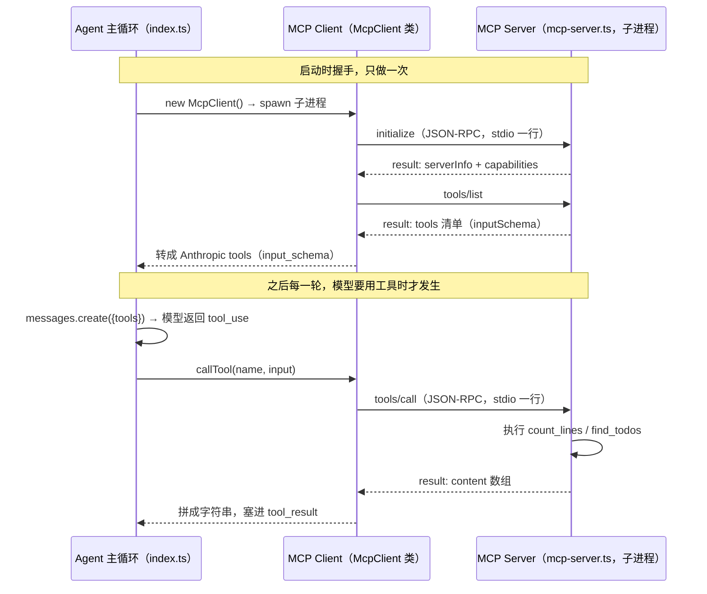

# 13 · 接入 MCP

> MCP 把"工具怎么实现"和"agent 怎么调用工具"彻底拆开——你的 client 只认协议，不关心工具是谁写的。
>
> 预计消耗：约 2 次 API 调用（本课实录跑出 2 轮）

## 1. 你会遇到的问题

前十二课的工具都是自己写的：`bash`、`count_lines`、`background_run`——想要什么能力，自己写一个函数塞进 `tools` 数组。这在自己的沙箱里没问题，换个场景就不成立了：GitHub 有几百个 API，数据库有自己的连接池和权限模型，Slack 有自己的消息格式，每接一个外部系统都要重新读一遍文档、重新写一遍工具函数。

换个 agent 框架，前面写好的工具还要再抄一遍——工具函数是跟着框架走的，带不走。

MCP（Model Context Protocol）是 Anthropic 2024 年 11 月开源的协议，现在已被 OpenAI、Google DeepMind 采用，解决的正是这个重复：GitHub、数据库、Slack 的团队各自把自己的能力包成一个 MCP server，你的 agent 只需要一个通用的 MCP client 去接。协议一致，换十个 server 不用改一行 client 代码。

这一课自己写一个最小 MCP server 和最小 MCP client，看清这层协议到底是什么。

## 2. 心智模型



模型自己从不直接跟 MCP server 打交道——它只看到 Anthropic 格式的 `tools`，吐出 `tool_use`。真正的协议对话发生在 MCP Client 和 MCP Server 之间，agent 主循环只是把两边的结果搬来搬去。

## 3. 关键代码

完整代码见 [`mcp-server.ts`](./mcp-server.ts) 和 [`index.ts`](./index.ts)。

**1. 协议只有三个方法。** server 端就是一个 `switch`：

```ts
switch (req.method) {
  case "initialize":
    send({ jsonrpc: "2.0", id: req.id, result: { protocolVersion: "2024-11-05", ... } });
  case "tools/list":
    send({ jsonrpc: "2.0", id: req.id, result: { tools: TOOLS } });
  case "tools/call": {
    const text = await callTool(req.params.name, req.params.arguments ?? {});
    send({ jsonrpc: "2.0", id: req.id, result: { content: [{ type: "text", text }] } });
  }
}
```

握手、要清单、调工具，仅此而已。传输是 JSON-RPC 2.0 over stdio，一行一条消息——没有 HTTP，没有 WebSocket，`send()` 就是 `process.stdout.write(...)`。

**2. schema 几乎一一对应。**

```ts
function toAnthropicTool(mcpTool: any): Anthropic.Tool {
  return {
    name: mcpTool.name,
    description: mcpTool.description,
    input_schema: mcpTool.inputSchema,   // 驼峰 → 下划线，其余原样
  };
}
```

MCP 用 `inputSchema`，Anthropic 用 `input_schema`，字段内容完全一样，转换只是改个字段名。正因为这么像，同一个 MCP server 才能被 Claude Desktop、Cursor、你自己的 agent 一起接上用。

**3. 客户端必须按行缓冲。**

```ts
this.proc.stdout.on("data", (chunk: Buffer) => {
  this.buffer += chunk.toString();
  const lines = this.buffer.split("\n");
  this.buffer = lines.pop() ?? "";   // 最后一段可能是半条消息，留着等下一个 chunk
  for (const line of lines) {
    if (!line.trim()) continue;
    const msg = JSON.parse(line);
    // ...按 id 找到对应的 pending promise 并 resolve
  }
});
```

`stdout` 的 chunk 边界和 JSON 消息边界不是一回事——一个 chunk 可能装半条消息，也可能装三条。不按行缓冲直接 `JSON.parse(chunk.toString())`，大概率随机报 `Unexpected token` 或 `Unexpected end of JSON input`。这是自己写 MCP 客户端必踩的坑。

## 4. 跑一遍

```bash
http_proxy= https_proxy= all_proxy= bun run examples/13-mcp/index.ts
```

```
已连接 MCP server：learn-agent-demo-server v1.0.0
它提供了 2 个工具：count_lines, find_todos


[第 1 轮] 我来同时执行这两个任务：统计文件行数和搜索 TODO 注释。
  → [MCP] count_lines({"path":"examples/01-first-call/index.ts"})
    examples/01-first-call/index.ts: 58 行
  → [MCP] find_todos({"dir":"examples"})
    没有找到 TODO 或 FIXME。

[第 2 轮] 以下是统计结果：

1. **文件行数**：`examples/01-first-call/index.ts` 共有 **58 行**。

2. **TODO 注释**：在 `examples` 目录下**没有找到**任何 TODO 或 FIXME 注释，代码很干净，没有遗留的待办事项。

  —— 结束，共 2 轮
```

两个地方值得看：

1. **握手先于任务。** 前两行在 agent 循环开始之前就打出来了——`initialize` 和 `tools/list` 是启动时做的一次性动作，不占用对话轮次。
2. **`find_todos` 如实返回"没有找到"。** 教程代码本来就不该留 TODO，这不是 bug，是搜索结果本身。
3. **每次工具调用都带 `[MCP]` 标记**，提醒这不是本地函数，是转发给子进程的结果。

## 5. 代价与边界

- **多一个进程，要管它的生命周期。** `McpClient` 内部 `spawn` 出一个子进程，用完要 `close()`（`stdin.end()` + `kill()`）——忘了关，子进程会一直挂着。
- **stdio 传输只适合本地。** server 和 client 必须在同一台机器、同一个进程树里，父子进程之间才能共享 stdin/stdout。要连远程 MCP server，协议要换成 HTTP + SSE，这一课没实现。
- **没实现的东西还有很多。** 这里只做了 `tools`——真实的 MCP 还有 `resources`（暴露文件/数据）、`prompts`（预置提示词模板）、双向通知、错误恢复、并发请求的排队与超时。这一课的 `McpClient` 是教学最小实现，不是生产实现。

## 6. 官方现在怎么做

> ⚠️ 本节需要 Anthropic 官方 key。第三方兼容端点大多不支持。

生产代码不要像这一课一样手写协议，官方有两条路：

**1. `@modelcontextprotocol/sdk`。** 官方 TypeScript/Python SDK，帮你处理握手细节、错误码、`resources`/`prompts`、多种传输（stdio、HTTP+SSE）。这一课手写是为了让协议原理看得见，真写 MCP server/client 用这个包。

**2. Claude API 的 MCP connector——服务端直连远程 MCP server，客户端都不用写。**

```ts
mcp_servers: [{ type: "url", url: "https://example.com/mcp", name: "my-server" }],
tools: [{ type: "mcp_toolset", mcp_server_name: "my-server" }],
betas: ["mcp-client-2025-11-20"],
```

**必须提醒**：`mcp_servers` 单独给会被当作校验错误拒绝——两半必须同时给：`mcp_servers` 声明 server，`tools` 里再加一条 `{type: "mcp_toolset", mcp_server_name: <同名>}` 显式启用它，外加 beta 头 `mcp-client-2025-11-20`。这一课的 `McpClient`/子进程/按行缓冲，在这条路径下全部由 Anthropic 服务端接管。

## 7. 相比上一课新增了什么

结构上最大的区别：`index.ts` 里**没有一个本地工具实现**。前十二课不管工具怎么变，`callTool` 或等价的 handler 里始终是本地写好的函数体；这一课的工具清单来自 `mcp.listTools()`，调用也全部通过 `mcp.callTool()` 转发给子进程——agent 循环本身不知道、也不需要知道 `count_lines` 是怎么实现的。

新增的是 `McpClient` 这一层（`request` / `initialize` / `listTools` / `callTool` / `close`），以及 `toAnthropicTool` 这一个字段名转换函数。基础的 `for (turn) { create → 分发 tool_use → 回填 tool_result }` 循环没有变，只是分发的目标从"本地函数"换成了"转发给 MCP server"。
