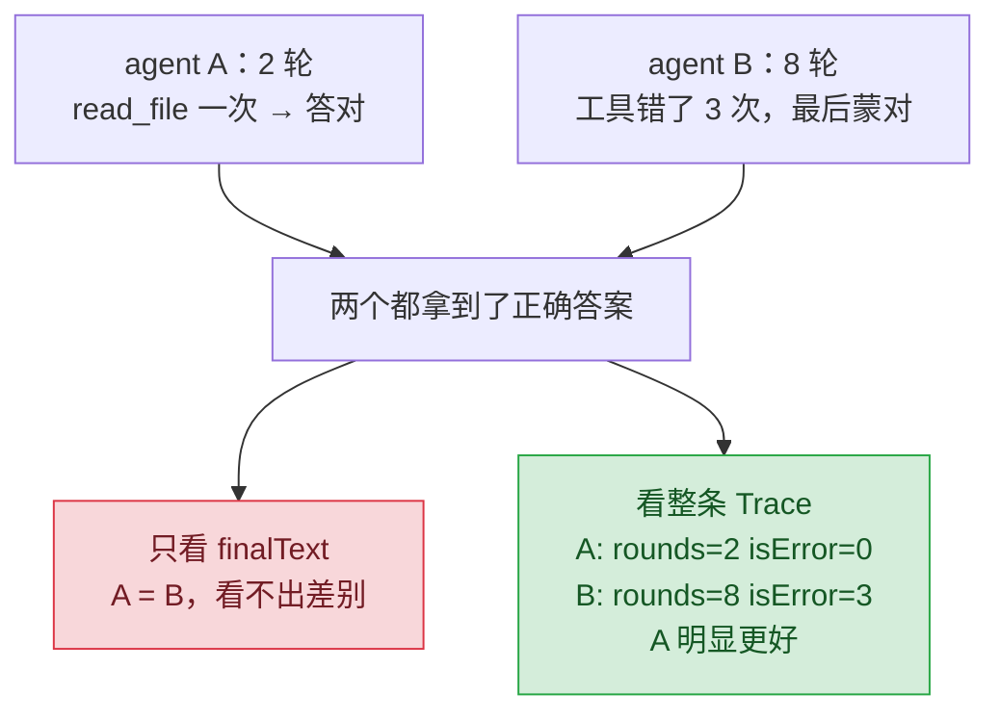

# 14 · 怎么知道 agent 变好了

> 一句话：光看答案对不对不够，要评的是 trajectory（执行路径）——走了几轮、调对没调对工具、有没有绕圈子。
>
> 预计消耗：`index.ts` 跑一次是一次完整对话，通常 2～3 次 API 调用；`bun test` 跑 4 个用例，
> 每个用例都是独立的完整对话，全部跑完约十几次调用，一两分钟。

## 1. 你会遇到的问题

前面十三课每一课都在改 agent：加工具、调 system prompt、换上下文策略。改完了，怎么知道是变好了还是变坏了？

直觉做法是跑一遍，看着还行。这站不住脚，两个原因都要命：

- **模型有随机性。** 同一个任务跑十次，输出不完全一样。你看到的"还行"可能只是这一次运气好，换一次种子就翻车。
- **只盯最终答案会漏掉大部分退化。** 答案对不对是"结果"；agent 是两轮利落做完，还是绕了八轮、
  调错三次工具才蒙对，是"过程"。改坏一句 system prompt，最先崩的往往是过程——工具选错了，
  但模型还是能兜回来给出正确答案。你只看答案，完全看不出退化已经发生，直到某天它兜不回来了。

需要一套能重复跑、跑完直接给判决的东西，而不是"再肉眼看一遍"。这就是 eval。

## 2. 心智模型



只判"答对没答对"的评估，会把这两个 agent打成平局——但没人愿意要那个绕八轮、错三次的版本
留在生产环境里。trajectory 里的轮数、工具调用序列、出错次数，才是能提前预警"正在变差"的信号。

## 3. 关键代码

完整代码见 [`index.ts`](./index.ts) 和 [`agent.test.ts`](./agent.test.ts)。

**`Trace` 每个字段对应一类退化：**

| 字段 | 记录什么 | 涨了/变了说明什么 |
|---|---|---|
| `rounds` | 花了几轮 | 绕圈子——本来两轮能做完的事，现在要问好几遍 |
| `toolCalls` | 每次调用的名字、输入、输出、`isError` | 序列变了 = 工具选错；`isError` 变多 = 反复试错 |
| `hitTurnLimit` | 是否撞上 `maxTurns` 强制退出 | true = 陷入死循环，任务根本没做完 |
| `inputTokens` | 累计输入 token | 涨了 = 更贵更慢，哪怕答案完全没变 |
| `finalText` | 最终文本 | 唯一直接对应"结果对不对"的字段——过去十三课只看这一个 |

前四个字段过去十三课的 `index.ts` 从来不返回，只在 `console.log` 里一闪而过。想写断言，
就必须先把它们从"打印出来看一眼"升级成"结构化地存下来"——这正是这一课 `runAgent`
和 03 课的唯一区别。

**断言只能针对事实，不能针对措辞。** 模型每次的措辞都不一样，抠字眼的断言迟早会因为一次
无关的用词变化而挂：

```ts
expect(trace.finalText).toContain("learn-agent");        // 对：断言"包含这个事实"
expect(trace.finalText).toBe("项目名是 learn-agent");     // 错：断言死了具体措辞，模型换个说法就挂
```

**超时设 120 秒，因为 `bun test` 默认 5 秒。** 一次 `runAgent` 调用往往要走完两三轮工具循环，
每轮都是一次真实的网络请求，5 秒内基本跑不完。不设超时，测试会因为"超时"而不是"断言不成立"
挂掉——这两种失败原因必须分得开，否则你会误以为是 agent 变差了，其实只是等得不够久。

## 4. 跑一遍

```bash
bun run examples/14-evals/index.ts
```

> 报 HTTP 400 且返回一段 HTML？见根目录 README 的[跑不通怎么办](../../README.md#跑不通怎么办)。

```
最终回答： `package.json` 中 `name` 字段的值是 **`learn-agent`**。

轨迹：
  轮数        2
  工具调用    bash
  出错次数    0
  累计 input  851 tokens
  撞轮数上限  false
```

```bash
bun test examples/14-evals/agent.test.ts
```

下面是一次真实运行——四个用例里有一个挂了，原样贴出来，不做美化：

```
bun test v1.3.5 (1e86cebd)

examples/14-evals/agent.test.ts:
44 |   async () => {
45 |     const trace = await runAgent(
46 |       "先读 no-such-file-xyz.txt，读不到的话改读 package.json，告诉我 name 字段。",
47 |     );
48 |     // 至少踩一次错，但最终仍然拿到正确结果
49 |     expect(trace.toolCalls.some((c) => c.isError)).toBe(true);
                                                        ^
error: expect(received).toBe(expected)

Expected: true
Received: false

      at <anonymous> (/path/to/Learn-agent/examples/14-evals/agent.test.ts:49:52)
(fail) 工具报错之后要能自己恢复 [2222.60ms]

 3 pass
 1 fail
 7 expect() calls
Ran 4 tests across 1 file. [6.08s]
```

第 4 个用例（"工具报错之后要能自己恢复"）挂了。下一节详细拆这个失败——它不是"模型变笨了"，
而是这一课自己给的教材。

## 5. 代价与边界

**跑一次都要花钱花时间。** 4 个用例、每个都是一次真实的多轮对话，一两分钟起步。回归集不能
无限堆——真实项目里通常只对"改了这块逻辑"相关的用例做全量回归，其余定期抽样跑。

**测试本身是 flaky 的。** 同一份代码、同一套断言，把整个 suite 连续跑了 7 次，结果：

| 用例 | 7 次里通过次数 |
|---|---|
| 能答对 package.json 里的项目名 | 7/7 |
| 简单任务不该绕圈子 | 7/7 |
| 读文件的任务应该真的去读文件 | 7/7 |
| 工具报错之后要能自己恢复 | 3/7 |

前三个稳定 100%。第 4 个几乎一半时间在挂——但这不是"agent 表现不好"：7 次里，最终答案
每次都正确包含 `learn-agent`，`hitTurnLimit` 每次都是 `false`。任务本身，agent 一次都没做砸过。

问题出在断言盯的信号上。用探针脚本把四次真实轨迹摊开看：

```
run 1: bash("cat no-such-file-xyz.txt 2>&1")     → isError=false（bash 不检查退出码）
run 2: bash(...) 然后 read_file("package.json")   → isError=false
run 3: read_file("no-such-file-xyz.txt") 抛异常    → isError=true（被 catch 到）
run 4: bash("cat ... || echo FILE_NOT_FOUND")      → isError=false
```

模型有两条路能发现文件不存在：调 `read_file`（抛异常 → 被 `catch` 到 → `isError=true`），
或者调 `bash` 跑 `cat`（进程非零退出，但 `bash` 处理函数只是把 stdout+stderr 拼起来返回，
从不检查退出码，`isError` 永远是 `false`）。选哪条路基本是模型的自由发挥，只有一条路会被
现在的 `isError` 记录下来。断言 `toolCalls.some(c => c.isError)` 断的是事实没错，但这个"事实"
本身只覆盖了一半的失败路径——工具设计上的盲区，不是模型的问题。

这不属于"断言太严"（不是阈值定错），也不属于"agent 表现不好"（任务完成率 7/7）。
它是第三种情况：**断言绑定的信号本身就没被完整测量到**，比措辞问题更隐蔽——因为
`isError` 是个布尔值，看起来完全"符合事实断言"的规范，实际上这个事实只在特定条件下才被记录。
按任务要求，这个失败被原样保留，没有放宽阈值、也没有回头改 `index.ts` 让 `bash` 也检查退出码——
那样能让测试变绿，但会把"eval 只跟你的埋点一样可靠"这个教训一起抹掉。真要修，两条路都成立：
让 `bash` 处理函数也标记非零退出码，或者把断言换成检查 `finalText` 里有没有提到"文件不存在"这类
可验证的恢复痕迹——这两个都留给读者，不在这一课改。

应对 flaky 测试的办法从来不是追求 100% 绿：断言留余量（比如轮数用 `≤4` 而不是 `=2`）、
关键用例多跑几次看通过率、把结果当分布而不是单次判决。这里只有 4 个用例；真实项目的回归集
应该随发现的问题一起长大——每修一个 bug，就把复现它的场景变成一个新用例。

## 6. 官方现在怎么做

没有官方原生的 evals 方案——`messages.create` 不提供"给这条轨迹打分"这样的接口，这件事
从来都是调用方自己拼的。两个跑出这套四用例回归集之外的思路：

- **LLM-as-judge**：把整条 `Trace`（不只是 `finalText`）序列化，喂给一个更强的模型，
  让它按几条标准打分（有没有绕路、工具选得对不对、有没有不必要的重试），比人工过一遍 trace
  快，也比死板的断言更能识别"过程合理但形式不同"的轨迹。
- **生产流量采样回归**：从真实用户请求里抽样保存 trace，定期用新版本重放，对比关键指标
  （轮数、出错率、token 消耗）有没有系统性劣化，而不是只靠手写的几个用例。

这两件事都需要额外的基础设施（打分模型、trace 存储、重放系统），超出本教程范围，这里只提思路。

## 7. 相比上一课新增了什么

这一课没有新工具、没有新 API 参数——`runAgent` 就是 03 课那个循环，只是从"打印在终端上"
换成了"存进一个 `Trace` 结构体返回"：03 课每轮 `console.log` 完就完了，调用方拿不到任何东西；
这一课把轮数、每次工具调用的完整记录、累计 token、是否撞轮数上限，全部收进返回值。

顺带做了两处裁剪：去掉了 03 课的 `write_file` 工具和 system prompt（这一课的任务只需要读，
不需要写，也不需要人设），`maxTurns` 从写死的常量改成参数，方便不同用例传不同上限。

有了这个结构体，`agent.test.ts` 才第一次能对"过程"而不只是"结果"下断言——这是这一课真正
新增的东西：不是更聪明的 agent，是一套能告诉你 agent 有没有变笨的测试。
