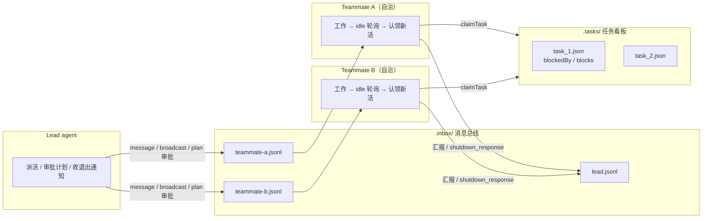
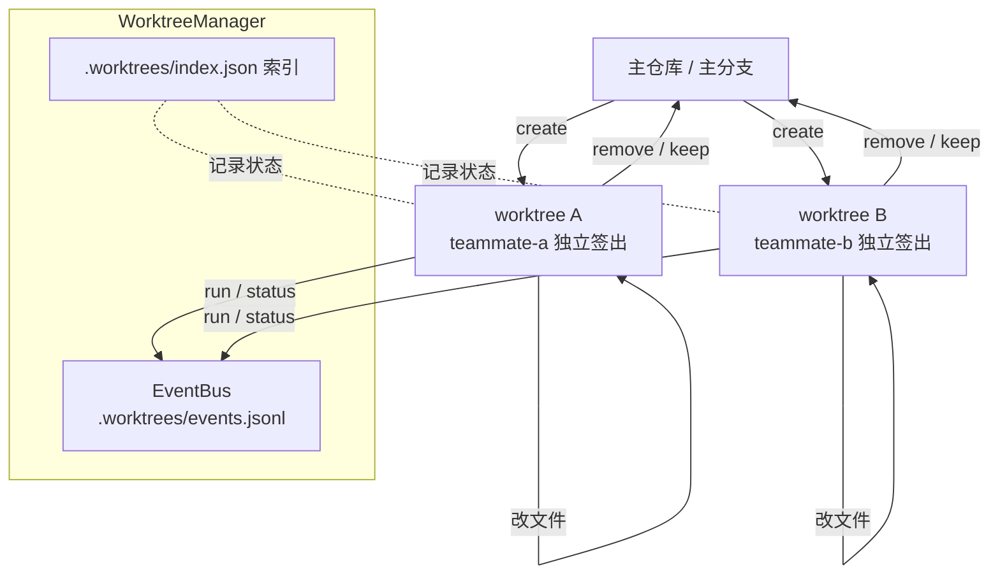

# 附录 A · 生产级实现长什么样

> 十四课的代码都是为讲清一个概念重写的最小版本。这一篇讲真实项目怎么组织它们——
> 参考对象是 lite-agent，一个 5.1k 行的 TypeScript agent 框架，纯文档，无代码。

## 十四课的机制在真实项目里的位置

| 课 | lite-agent 对应文件 | 行数 | 生产版多做了什么 |
|---|---|---|---|
| 01 模型是无状态的 | `agent/client.ts` | 12 | 把"每课手写一次 `new Anthropic()`"收成单例，供其余模块共享同一个 client——这一课的机制本该就只有 12 行 |
| 03 循环起来 | `agent/index.ts` | 159 | `while` 循环从课程里内联的几十行，独立成一个可被其他模块调用的主循环模块 |
| 02 第一个工具 / 07 工具设计 | `tools/index.ts` | 174 | 从一个工具长到 30+ 个，07 课"工具边界要清楚"从一次性判断变成要长期维护的一张注册表 |
| 04 沙箱与审批门 | `tools/file.ts` + `tools/bash.ts` | 104 + 51 | 路径校验、命令执行各自独立成模块——但 ROADMAP 自己承认没做到位，见下文差距清单 |
| 05 上下文的成本结构 | `prompt/system.ts` | 52 | system prompt 拼装单独成模块，不是一段写死的字符串常量 |
| 06 流式输出与错误处理 | `main.ts` | 137 | 用户可见的流式渲染和顶层错误处理独立在 CLI 层，和"跑一次性任务"的逻辑分开 |
| 08 上下文压缩 | `agent/compact.ts` | 127 | 拆成 microCompact（细粒度触发）和 autoCompact（整体触发）两条路径，教程只有一种占位符替换策略 |
| 09 按需加载 | `agent/skill.ts` | 91 | 就是这一课机制的直接实现：加载 SKILL.md。规模不大，说明复杂度不在这里 |
| 10 外部记忆与进度 | `tools/todo.ts` | 104 | todo 是 agent 自己的步骤清单；旁边另有 320 行的 `task.ts` 任务看板，是给团队认领活用的另一套粒度，下文详述 |
| 11 子代理 | `agent/subagent.ts` | 61 | 和这一课几乎是同一件事：独立 messages、收窄工具、只回传结论。真正的差异不在这个文件里，在旁边 739 行的 `agentTeam.ts` |
| 12 后台任务 | `agent/background.ts` | 154 | 加了 daemon 模式（长期服务不超时）、SIGTERM 后 3 秒再 SIGKILL 的优雅停止 |
| 13 MCP | — | — | **没有。** 它的工具全是自己写的，接不了外部 MCP server |
| 14 evals | — | — | **没有。** `package.json` 里 `test` 脚本是 `echo "Error: no test specified" && exit 1` |

最后两行值得多看一眼：**一个 5.1k 行、认真做了多 agent 和 worktree 隔离的项目，
既没接 MCP，也没有一行测试。** 这不是个例——工具生态和评估是最容易被推迟的两件事，
而它们恰恰是第 13、14 课的主题。教程把它们放进正课，正是因为真实项目里太容易漏掉。

`agentTeam.ts`（739 行）和 `worktree.ts`（384 行）不在这张表里——十四课里没有一课需要
"两个 agent 互相知道对方存在"，这两块是教程整体绕开的内容，单独讲。

## 多 agent 协作

`agentTeam.ts` 是全仓库单个最大的文件，739 行，几乎是第二名 `worktree.ts`（384 行）的两倍。
运行时靠三块目录撑起来：`.inbox/`（每个 agent 一个 `{name}.jsonl` 收件箱）、
`.team/config.json`（团队配置）、`.tasks/`（任务看板，见下）。

**和第 11 课 subagent 的本质区别，不是"更强的 subagent"：**

| | subagent（11 课） | teammate（agentTeam.ts） |
|---|---|---|
| 生命周期 | 一次性，函数返回就回收 | 长期存活，跑完一个任务接着 idle 轮询 |
| 调度方式 | 阻塞——派出去等结果，主 agent 停在原地 | 自治——完工后自己从任务看板认领没人领的活 |
| 身份 | 没有，`messages` 数组一个局部变量 | 有名字、有收件箱，是团队里持续存在的一个成员 |

**739 行不是设计过度**——每一块都对应一个真实会出事的场景：

- **身份重注入。** 上下文压缩会把早期"你是谁、你的任务是什么"这些内容一起清掉；不重新注入，
  teammate 压缩后可能对着任务看板发呆，甚至把自己当成 lead。
- **五条退出路径。** idle 超时、强制关停、优雅关停、API 失败、崩溃，都要通知 lead——
  lead 是靠"收到通知"才知道一个 teammate 已经不在了，漏一条，lead 会对着一个已经死掉的
  teammate 一直等，整个团队卡死。
- **两级关停。** 优雅请求给 teammate 收尾的机会（比如正写到一半的文件），它可以拒绝；
  强制终止是失控时的最后手段，不给拒绝的余地。
- **审批协议。** teammate 提交计划要等 lead 审批才能执行，防止它拿到一个模糊任务后
  自己发挥，走出一个跟预期不符的方向，浪费掉一整轮 token 预算。

参数都是硬编码：`MAX_RETRIES=2`、`RETRY_DELAY_MS=2000`、`POLL_INTERVAL=5000`、
`IDLE_TIMEOUT=60000`、50 轮硬上限。就算写了 739 行，这套机制自己承认还没填完——
teammate 提交计划后如果 lead 不审批，会一直挂着，协议本身没有超时兜底。
复杂度来自"自治多 agent"这件事本身的成本，不是来自过度设计。

消息总线用 JSONL 文件实现，六种消息类型里确认过的四种是 `message`（点对点）、
`broadcast`（广播）、`shutdown_request`、`shutdown_response`。读即清空、没有锁，
崩溃会丢消息——这条留到下面的差距清单细讲。

## git worktree 隔离

两个 teammate 同时改同一份 checkout，必然冲突：改同一个文件是内容冲突，
改不同文件也可能因为共享工作目录互相踩脚。`worktree.ts` 的解法是每个 teammate
拿一个独立的 git worktree——共享同一个 `.git`，工作目录各自独立。

`WorktreeManager` 提供六个操作：create / list / status / run / remove / keep。
它解决了"同一份代码两个 agent 同时改"这一个问题，同时引入三个新问题：

- **生命周期谁管。** worktree 创建之后，什么时候该清理不是自动的，需要显式 remove 或 keep。
- **任务失败了分支怎么清理。** 半途失败的 teammate 可能留下一个脏 worktree 和一条没人要的分支，
  没人主动收拾就一直占着。
- **合并冲突谁来解。** 隔离只保证 teammate 之间互不干扰，代码终究要合回主线——
  谁负责 resolve、按什么顺序合，worktree 机制本身不回答。

## 教学版和生产版的差距清单

按 lite-agent 自己 ROADMAP 里的优先级分类，教程里这些全都没有。清单里越往下的项，
连 lite-agent 自己都还没做——这恰恰是最好的证据：这不是"教程省事、生产项目做全了"，
是问题本身有多层，做到 739 行也只解决了前几层。

**安全（P0）**
- teammate 的 `read_file` 没走 `safePath`，路径校验有缺口
- `bash` 需要白名单或沙箱隔离，教程的路径检查不够

**可靠性（P0 / P1）**
- 应该用状态机控制 teammate 各阶段可用的工具集，而不是靠 prompt 约束——
  prompt 说"这个阶段别用某个工具"，模型不一定听
- 消息总线是 JSONL 文件，无锁、读即清空，崩溃会丢消息，需要 ACK 机制或换 Redis Stream
- `.catch(() => {})` 吞掉了 teammate 的错误，应该上报给 lead 而不是静默失败
- teammate 提交计划后，lead 不审批就会一直挂着，审批没有超时兜底

**资源（P2，ROADMAP 里还没做）**
- 每个 teammate 的 token 预算、墙钟超时、同时工作的并发上限

**可观测性（P3，ROADMAP 里还没做）**
- 结构化日志、OpenTelemetry tracing、teammate 结束时上报执行摘要

**持久化（P4，ROADMAP 里还没做）**
- 审批和关停请求都在内存里，进程一退就没，重启后无法恢复到中断前的状态

## 什么时候你需要这些

多数人不需要自治多 agent。先用第 11 课的 subagent——阻塞、一次性、够用的场景比想象中多。

只有 subagent 的限制真正开始硌人时才考虑往上走：任务需要跨越多次进程重启保持身份和状态、
需要多个 agent 真的并发改同一个代码库的不同部分、需要一张任务看板协调谁在做什么。
这些信号缺一不可——单独出现一条，通常还有更便宜的办法。

即使决定要做，739 行也不是终点，是起点：上面那份差距清单里 P0 的安全问题
（`read_file` 没走 `safePath`、`bash` 没有沙箱）还没填完。自己从零写一套自治多 agent，
大概率会先把这些已知的坑重新踩一遍，而不是绕开它们。
