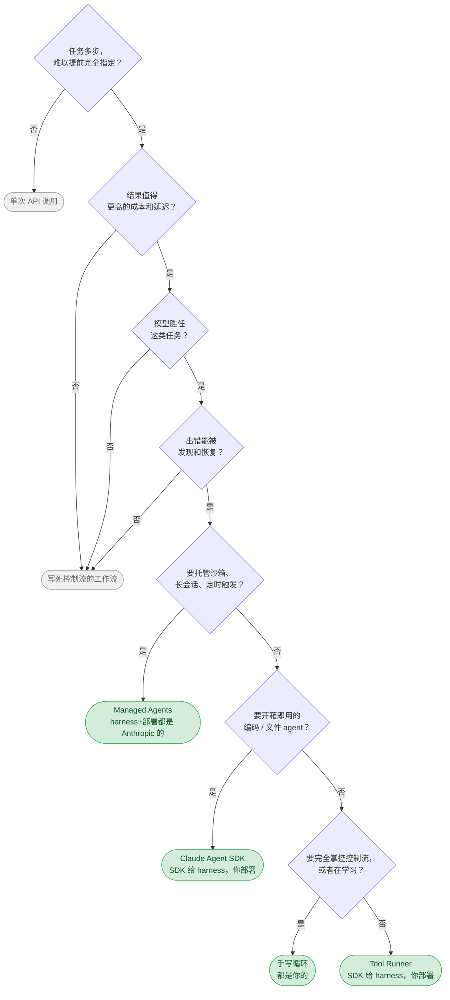

# 附录 B · 什么时候别自己写

> 十四课教你手写 agent 循环。这一篇讲什么时候不该手写——四种方案怎么选，纯文档，无代码。

结论先放前面：四种方案的区别可以完全归到两个独立的问题——**谁提供 harness**（agent 循环 +
上下文管理）、**谁提供部署**（跑在哪台机器上）。不要用"哪个更高级"这种维度去比，按这两个
问题去查表就是选型的全部内容。

## 对比

| 方案 | 你写什么 | harness / 部署 | 什么时候用 |
|---|---|---|---|
| **手写循环**（本教程） | `while (stop_reason === "tool_use")` 整个循环 | 都是你的 | 要完全掌控控制流；或者学习 |
| **Tool Runner** | 只写工具函数 | SDK 给 harness，你自己部署 | 想要自定义工具但不想手写循环——多数情况的默认选择 |
| **Managed Agents** | agent 配置 | Anthropic 给 harness **和** 托管沙箱 | 要托管的有状态 agent、长会话、定时触发 |
| **Claude Agent SDK** | 一个 prompt + 配置 | SDK 给完整 Claude Code harness 和内置工具，你自己部署 | 想要开箱即用的编码/文件 agent |

四行读下来会发现一条对角线：从"你写整个循环"到"你只写一句话"，每往下一行，
你交出去的控制权多一点，换来的是少一点手写代码。这条对角线上没有哪一行天然更"高级"——
手写循环不是低配版 Tool Runner，Tool Runner 也不是低配版 Claude Agent SDK，
四行是四种不同的权衡，不是同一件事的四个成熟度等级。

## 三个容易搞混的地方

**1. Tool Runner 不是 Claude Agent SDK。** 名字像，是两个不同的包：

- **Tool Runner** 在 `@anthropic-ai/sdk` 里，入口 `client.beta.messages.toolRunner`。
  它只帮你跑"调用 → 执行 → 回填"这一圈，工具全部由你提供，**没有内置工具**。
  第 03 课那个 `while (stop_reason === "tool_use")` 循环，就是它替你做的事——区别是它内置在
  SDK 里，改天升级 SDK 顺带就修了循环里的边界情况，不用你自己维护。
- **Claude Agent SDK** 是 `@anthropic-ai/claude-agent-sdk`，是 Claude Code 打包成的库，
  **自带**文件读写、bash、grep、web 搜索等一整套工具。你不写工具，只写 prompt 和配置。

两者都是"SDK 给 harness"，差在给不给工具——Tool Runner 是空壳循环，Claude Agent SDK 是
带工具的完整 agent。

**2. 四个里只有 Managed Agents 管部署。** 手写循环、Tool Runner、Claude Agent SDK 都要你
自己找机器跑；出问题都是你 ssh 上去看日志。Managed Agents 把执行搬进 Anthropic 管理的沙箱，
这正是第 04 课那个没有干净解法的问题的另一种答案——在宿主机上给 agent 开 shell，
路径校验和审批门都只是缓解，不是根治；Managed Agents 直接把"给 agent 一台机器"这件事
从你的问题变成 Anthropic 的问题。

**3. 先问要不要 agent，而不是先问用哪个方案。** 下一节的判断标准在四个方案之前生效——
任何一条答不上来，就不该往这张表上看，退回单次 API 调用或者控制流写死的工作流。

## 要不要 agent

四条判断标准，全部成立才继续往下选方案：

- 任务是否**多步且难以提前完全指定**——如果步骤和顺序你现在就能写死，不需要 agent 替你决定
- 结果是否**值得更高的成本和延迟**——agent 比单次调用慢、比工作流贵
- **模型是否胜任**这类任务——agent 不会让模型变聪明，只会让它多试几次
- 出错**能否被发现和恢复**——发现不了的错误，多轮循环只会把它重复放大

四条标准依次对应图里的 Q1–Q4，任何一处拐进灰色框，就说明当前任务还没到需要 agent 的地步。
真正进了绿色框的四选一，靠的是后两问：要不要托管沙箱和定时触发、要不要开箱即用的编码
能力——这两问基本就是"谁管部署"和"要不要内置工具"，跟前面对比表是同一件事的两个角度。

## 学完这套教程之后

手写循环不是为了拿去做生产。真做生产，上面四选一多半会挑后三种之一，没必要重新踩一遍
`stop_reason` 判断、工具分发表、上下文压缩这些坑——这些坑现成方案已经替你踩过了。

手写循环真正留下来的，是你现在看得懂这些坑分别被填在哪一层：

- Tool Runner 那一圈"调用 → 执行 → 回填"，对应的正是第 03 课那个 `while` 循环——
  它没有变魔法，只是把你写过的东西挪进了 SDK
- Claude Agent SDK 的内置 bash / 文件工具，背后要处理的正是第 04 课那类路径逃逸和
  审批问题；它内置了解法，不代表这个问题消失了
- Managed Agents 的托管沙箱，接的是第 04 课"宿主机上开 shell 没有干净解"这个缺口——
  沙箱不是新概念，是把隔离这件事换了个人来负责
- 上下文一路怎么攒起来、什么时候该压缩（08 课）、什么时候该分给子代理（11 课），
  这些原则在四种方案里都成立，只是维护它们的代码换了地方，不是消失了

选了现成方案之后，如果它某天表现异常——响应变慢、工具调用对不上、上下文莫名其妙就满了——
你知道该往哪一层查：harness 的问题、工具实现的问题，还是部署环境的问题。这是这十四课
真正训练出来的判断力，比任何一段可以直接复制的代码都耐用。
